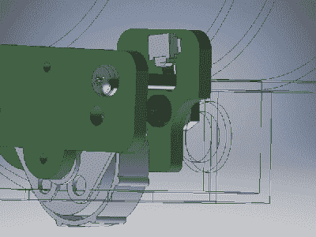

# 老式耳机蓝牙转换走得更远

> 原文：<https://hackaday.com/2018/07/09/vintage-headphones-bluetooth-conversion-goes-the-extra-mile/>

[KaZjjW]想要[改造一副漂亮的老式耳机，以便能够通过蓝牙](https://pickandplace.wordpress.com/2018/06/01/adding-bluetooth-to-vintage-headphones-part-1/)无线播放。原则上，这是一个简单的任务:只需将蓝牙音频接收器插在线路上，加上电池，一切就都准备好了。然而，[kazzjw]希望将耳机的美学变化保持在绝对最低限度，保留现有的外壳和音量控制，同时将电子设备完全塞在内部和外部。

由于耳机杯内固有的空间限制，这被证明是一个相当大的挑战。现有的音量电位计一半挂在外壳外面，被重新安装在由两个 PCB 制成的巧妙铰链上，电位计浮动在表面安装的开关旁边。这使得它不仅可以控制音量，还可以作为蓝牙的开关。外壳上仅有的其他切口是一个用于音频电缆的圆孔和一个用于电缆应力释放的狭缝。这些非常适合 LED 状态指示器和微型 USB 电池充电。

用于通过蓝牙接收音频的主要芯片是 Microchip 公司的 BM62。对于这类项目来说，这是一个非常棒的一体化解决方案，因为它内置电池充电、板载 DAC 和音频放大器以及串行控制接口。在项目日志的第 2 部分[中，记录了 BM62 的编程过程，这很痛苦——很遗憾软件支持让它失望了。但是黑客总会找到办法，我们已经看到一些相当不错的黑客为](https://pickandplace.wordpress.com/2018/06/24/adding-bluetooth-to-vintage-headphones-part-2/)[重新编程现成蓝牙耳机](https://hackaday.com/2017/01/30/reprogramming-bluetooth-headphones-for-great-justice/)中的现有芯片。

两个 PCB 用于 pot 按钮铰链，一个用于 LED 和 micro-USB 连接器，一个用于蓝牙接收器和 PIC。这是在一个非常小的空间内的四个 PCB，通过一些值得称赞的电子和机械设计努力来实现。这当然是值得的，因为成品看起来非常光滑。

 [https://www.youtube.com/embed/sw0Hv9QpD6A?version=3&rel=1&showsearch=0&showinfo=1&iv_load_policy=1&fs=1&hl=en-US&autohide=2&wmode=transparent](https://www.youtube.com/embed/sw0Hv9QpD6A?version=3&rel=1&showsearch=0&showinfo=1&iv_load_policy=1&fs=1&hl=en-US&autohide=2&wmode=transparent)

