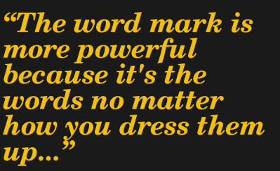
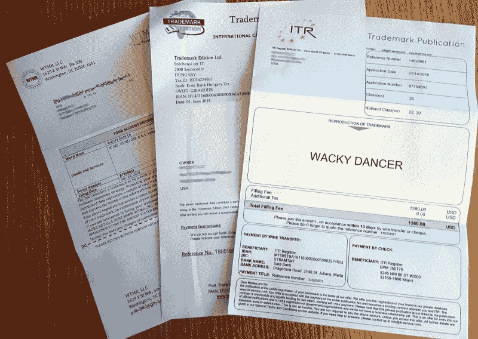

# 当你期待时，期待什么——商标

> 原文：<https://hackaday.com/2018/07/18/what-to-expect-when-youre-expecting-a-trademark/>

商标代表一个品牌，所以它可以是像“苹果”这样的词，包括像“纸巾”这样的造词。它可以是符号，比如耐克的标志。它也可以是各种颜色，比如 UPS 棕色，甚至是各种气味，比如威瑞森商店里的麝香花香。在美国申请商标出奇的容易。只需几百美元和几个小时，你就可以拥有自己的注册商标，并有权在你的商标上使用这个符号。你不需要律师，但你应该知道一些你可能会遇到的难题。美国专利商标局有一个奇妙的商标入门书，但是我们会 T1；那就博士吧。

## 了解注册商标是否适合你

美国专利商标局(USPTO)注册商标并颁发专利，但这并不总是花钱的最佳方式。一项专利的价值取决于一个人捍卫它的能力，因此，如果一家初创公司没有资源起诉侵犯它的人，那么他们花费有限的资源试图获得专利是没有意义的。商标也是如此。你可以用停止和终止信来虚张声势，人们可能会看到商标和专利而避开它，所以它不是毫无价值的，但它也不是对你的知识产权的绝对保护。

对于商标，可以完全跳过注册，但仍然可以通过标志获得保护。事实上，使用它不需要任何成本，你可以随意地将它洒在你创造并打算保护的任何标志或文字符号上。您也可以使用，直到您的注册为止。不利的一面是，这是一项“普通法”权利，没有那么强，因此更难捍卫。这就相当于在你的篱笆上放了一个牌子，上面写着“擅闯者将被射杀”

如果你在全国范围内做生意，如果需要，你有一些资源来保护你的，并且你有一个你想要保护的品牌，那么注册是一个好主意。

## 申请商标:如此简单，任何人都可以做到

申请商标的过程包括几个步骤。首先，也是绝对最重要的，是做一些尽职调查，通过寻找已经注册的类似商标，确保你有很高的成功可能性。美国专利商标局有权力的人会查看你的申请，然后寻找其他“令人困惑的相似”商标。这是一个模糊但强大的术语，所以远离灰色地带很重要。相似的拼写或发音的名字，翻译，视觉上相似的标志，所有这些都是危险区。

商标按类别备案，是按总类别组织的一种方式。这就是为什么你可以让[苹果唱片和苹果电脑同时并存](https://en.wikipedia.org/wiki/Apple_Corps_v_Apple_Computer)(理论上)。然而，随着品牌越来越大，它的影响力也越来越大。“可口可乐电子产品”不太可能发行，即使可口可乐本身没有注册版权，因为可口可乐是如此之大和众所周知，人们会混淆，认为他们是同一个实体。Arduino 的商标发生的[混乱正是 USPTO 试图帮助避免的。](https://hackaday.com/2015/04/15/arduino-vs-arduino-the-resellers-conundrum/)

一旦你确信你的钱不会被浪费，有一些你必须跳过的障碍，但它们相当容易。你必须有商标所有人、姓名和地址、申请费和签名。大约需要 2 分钟的工作时间。你得挑选商品或服务，这又是一分钟。你必须上传标记的描述。如果你正在做一个单词标记，那么这只是打出你的标记。否则就是上传一张图像，尽可能清晰。“标记”这个词更有力量，因为不管你怎么打扮，它都是单词，所以你在设计上有更多的自由。您的标志必须用于商业，并且您必须出示这方面的证据(一个网络商店前台的截图，只要它有标志并显示您正在商业中使用它)。然后你点击提交按钮，仔细检查，然后归档。这通常很简单，但这是 6 个月过程的开始。

## 等待和诈骗规避

在你等待的时候，你会通过广告得到进度通知。会有律所跟你说可以帮你各方面的忙。会有随机的互联网注册机构给你发送看起来像大额发票的广告。他们会祝贺你注册成功。他们大多是试图骗你钱的骗局，但他们会在 USPTO 找到你之前告诉你你的商标状态。很奇怪，但事情就是这样。

These are a ripoff. Do not give them money. They just send invoice-looking things and hope you’ll be scared into paying them for nothing.

一旦你提交了表格，需要几个月的时间，书记员才能收到你的申请，申请会被接受，或者他们会提交一个办公室行动，如果你搞砸了文书工作，可以要求澄清，或者如果申请侵犯了现有的商标，他们会拒绝申请。如果被接受，它会被公布，公众有时间投诉。如果你的申请通过了公告，没有任何投诉，那么你就可以注册。如果你从一开始就做对了，而且你对商标的权利没有任何疑问，也没有混淆的可能性，那么你除了等待什么都不用做。

## 你猜对了！

在你收到大量电子邮件和普通邮件告诉你之后，你会收到 USPTO 的正式通知，说你已经成功注册了你的商标。恭喜你！此时，你可以开始使用你的标记上的符号。从技术上来说(至少根据律师的说法)，你应该在任何使用你商标的地方使用这个。实际上，这看起来是自命不凡和愚蠢的，所以在重要的地方使用它是可以接受的，在其他地方就不要这么做了。

有了你新奇的新注册商标，你现在可以阻止其他人做侵犯你商标的事情(并获得三倍的侵权赔偿)，比如[阻止某人进口 2000 只万用表，因为他们有一张黑色的脸和黄色的边框](https://hackaday.com/2014/03/19/multimeters-without-a-country-flukes-broad-trademark-bans-yellow-multimeter-imports/)。但是，如果你不保护它，它就有可能成为不再受商标保护的通用名称。这就是发生在面巾纸上的事情，这给谷歌带来了风险——如果你像使用动词一样使用谷歌来表示搜索，而不管是哪种搜索引擎，你就是在稀释谷歌的注册商标。施乐公司开展了一场大规模的运动来鼓励人们使用影印这个术语。如果你不保护你的商标不受所有侵犯，你也有失去它的危险。这就是为什么迪士尼如此坚持己见，也是为什么 Velcro 公司给我们发了一份停止和终止我们(最近更名)关于钩环扣件的文章的原因。

## Makerspace

你可能还记得 Makerspace 这个术语的商标的惨败。先是一家德国加速器公司试图将它注册为防御商标，然后一家英国公司试图为他们的货架系列注册商标。在这两种情况下，他们都受到了很大的压力，他们的申请被拒绝，但这里有一些相关的问题值得一提。首先，商标的国际注册与美国并没有太大的不同，所以本文的大部分内容与其他国家相关。第二，没有防御性商标这种东西:你要么使用这个商标，要么失去它。最后，品牌是公司的象征，但它也是公司和公众之间关系的焦点。如果失去了人民的善意，品牌就没有价值。这就是为什么重要的是不仅要有一个强大的品牌，而且要有能力保护它，防止有人未经许可就抄袭和不当使用它。

## 结论

第一次申请商标可能会令人生畏。做起来出奇的容易，但是如果准备不充分也很容易搞砸。他们的办公室行动电子邮件是令人困惑的法律术语，需要几次尝试才能破译，但办公室本身是平易近人的，容易共事。到目前为止，我所有的注册都是成功的，我的一个错误是用稍微不同的名字和完全不同的地址更新了我的注册(你需要每 5 年更新一次注册)。他们竖起红旗声称没有所有权变更的证明我不能注册，这是对的，但一个友好的道歉回复足以让他们满意。我希望永远不需要展示我的注册肌肉，但我很高兴知道美国专利商标局在那里，并认真对待商标保护。你可以从 [USPTO 商标基础网站](https://www.uspto.gov/trademarks-getting-started/trademark-basics)上阅读更多有用的资料。