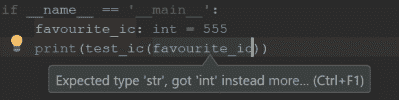

# Python 3.7 实践:最新版本中的新特性

> 原文：<https://hackaday.com/2018/07/23/hands-on-with-python-3-7-whats-new-in-the-latest-release/>

用于通用编程、数据科学、网站后端、图形用户界面和几乎所有其他东西；对于许多人来说，第一种编程语言当然是 Python，它被认为是世界上发展最快的编程语言。最新的[版本 3.7.0 最近刚刚发布](https://www.python.org/downloads/release/python-370/)。
自然，Python 的任何版本，不管多小，在开始任何开发之前都要经过精心的规划和设计。事实上，你可以[阅读 2016 年创建的](https://www.python.org/dev/peps/pep-0537/)Python 3.7 的 PEP (Python 增强提案)。

3.7 有什么新功能？为什么要升级？有没有什么实际有用的新东西？我将通过一些新特性的例子来回答这些问题。虽然这个版本对 Python 初学者来说没有太大的不同，但是对于经验丰富的程序员来说有很多小的变化，还有一些你想知道的主要特性。

## 断点现在是内置的

任何使用过 pdb (Python 调试器)的人都知道它有多强大。它使您能够暂停脚本的执行，允许您手动浏览程序内部并单步执行各个行。

但是，到目前为止，在编写程序时需要一些设置。当然，对你来说导入 pdb 和`set_trace()`几乎不需要任何时间，但是它并不像快速调试`print()`或日志那样方便。从 Python 3.7 开始，`breakpoint()`是一个内置的，让你可以随时轻松地进入调试器。同样值得注意的是，pdb 只是众多可用调试器中的一个，您可以通过设置新的`PYTHONBREAKPOINT`环境变量来配置您想要使用的调试器。

这里有一个我们遇到麻烦的程序的简单例子。用户被要求输入一个字符串，我们对它进行比较，看它是否与一个值匹配。

```

&quot;&quot;&quot;Test user's favourite Integrated Circuit.&quot;&quot;&quot;

def test_ic(favourite_ic):
    user_guess = input(&quot;Try to guess our favourite IC &gt;&gt;&gt; &quot;)

    if user_guess == favourite_ic:
        return &quot;Yup, that's our favourite!&quot;
    else:
        return &quot;Sorry, that's not our favourite IC&quot;

if __name__ == '__main__':
    favourite_ic = 555
    print(test_ic(favourite_ic))

```

不幸的是，无论输入什么，我们似乎永远无法匹配字符串。

```

$ python breakpoint_test.py
Try to guess our favourite IC &gt;&gt;&gt; 555
Sorry, that's not our favourite IC

```

为了弄清楚发生了什么，让我们插入一个断点——就像调用`breakpoint()`一样简单。

```

&quot;&quot;&quot;Test user's favourite Integrated Circuit.&quot;&quot;&quot;

def test_ic(favourite_ic):
    user_guess = input(&quot;Try to guess our favourite IC &gt;&gt;&gt; &quot;)
    breakpoint()

    if user_guess == favourite_ic:
        return &quot;Yup, that's our favourite!&quot;
    else:
        return &quot;Sorry, that's not our favourite IC&quot;

if __name__ == '__main__':
    favourite_ic = 555
    print(test_ic(favourite_ic))

```

在 pdb 提示符下，我们将调用`locals()`来转储当前的本地范围。pdb 有许多有用的命令，但是您也可以在其中运行普通的 Python。

```

$ python breakpoint_test.py
Try to guess our favourite IC &gt;&gt;&gt; 555
&gt; /home/ben/Hackaday/python37/breakpoint_test.py(8)test_ic()
-&gt; if user_guess == favourite_ic:
(Pdb) locals()
{'favourite_ic': 555, 'user_guess': '555'}
(Pdb)

```

啊哈！看起来`favourite_ic`是一个整数，而`user_guess`是一个字符串。因为在 Python 中，将一个字符串与一个 int 进行比较是完全有效的比较，所以没有抛出异常(但是这种比较并不是我们想要的)。`favourite_ic`应该被声明为字符串。这可以说是 Python 动态类型化的危险之一——在运行之前没有办法捕捉到这个错误。当然，除非你使用类型注释…

## 注释和键入

从 Python 3.5 开始，类型注释越来越受欢迎。对于那些不熟悉类型提示的人来说，这是一种完全**可选的**方式来注释代码以指定变量的类型。
类型提示只是[注释](https://www.python.org/dev/peps/pep-3107/)的一个应用(尽管是主要的一个)。什么是注释？它们是将元数据与变量相关联的语法支持。它们可以被认为是任意的表达式，Python 在运行时会对其求值，但会忽略它们。一个注释可以是任何有效的 Python 表达式。这是一个注释函数的例子，我们被无用的信息搞疯了。

```

# Without annotation
def foo(bar, baz):
# Annotated
def foo(bar: 'Describe the bar', baz: print('random')) -&gt; 'return thingy':

```

这一切都很酷，但有点没有意义，除非以标准方式使用注释。在 Python 3.5 ( [PEP 484](https://www.python.org/dev/peps/pep-0484/) )中，使用注释进行类型化的语法变得标准化了，从那以后，类型提示被 Python 社区广泛使用。它们纯粹是开发辅助工具，可以使用 PyCharm 之类的 IDE 或 Mypy 之类的第三方工具进行检查。

如果我们的字符串比较程序是用类型注释编写的，它应该是这样的:

```

&quot;&quot;&quot;Test user's favourite Integrated Circuit.&quot;&quot;&quot;

def test_ic(favourite_ic: str) -&gt; str:
    user_guess: str = input(&quot;Try to guess our favourite IC &gt;&gt;&gt; &quot;)
    breakpoint()

    if user_guess == favourite_ic:
        return &quot;Yup, that's our favourite!&quot;
    else:
        return &quot;Sorry, that's not our favourite IC&quot;

if __name__ == '__main__':
    favourite_ic: int = 555
    print(test_ic(favourite_ic))

```



您可以看到 PyCharm 已经提醒了我这里的错误，这可以防止它在运行时才被注意到。如果您的项目使用 CI(持续集成),您甚至可以配置您的管道在您的代码上运行 Mypy 或类似的第三方工具。

这就是注释和类型提示的基础。Python 3.7 有什么变化？正如[官方 Python 文档指出的](https://docs.python.org/3/whatsnew/3.7.html#whatsnew37-pep563)，当人们开始使用注释进行类型提示时，出现了两个主要问题:启动性能和前向引用。

*   不出所料，在定义时评估大量任意表达式对于启动性能来说是非常昂贵的，事实上`typing`模块非常慢
*   你不能用还没有声明的类型来注释

这种缺乏前向引用的情况似乎是合理的，但在实践中却变得相当麻烦。

```

class User:
    def __init__(self, name: str, prev_user: User) -&gt; None:
        pass

```

这将失败，因为`prev_user`不能被定义为类型`User`，因为`User`还没有被定义。
为了解决这两个问题，注释的评估被**推迟了。注释只是以字符串的形式存储，如果你真的需要的话，可以选择对它们进行求值。**

为了实现这种行为，必须使用一个`__future__`导入，因为在保持与以前版本兼容的同时，不能进行这种改变。

```

from __future__ import annotations

class User: 
    def __init__(self, name: str, prev_user: User) -&gt; None:
        pass

```

这现在执行起来没有问题，因为`User`类型只是不被评估。

打字模块如此缓慢的部分原因是，最初的设计目标是在不修改核心 CPython 解释器的情况下实现`typing`模块。然而，现在类型提示的使用变得越来越流行，这个限制已经被移除了，这意味着现在有了对`typing`的核心支持，这使得[能够进行一些优化](https://www.python.org/dev/peps/pep-0560/)。

## 时机

`time`模块有了一些新成员:现有的定时器函数也有了相应的纳秒风格，这意味着如果需要的话，可以获得更高的精度。[一些基准](https://www.python.org/dev/peps/pep-0564/#annex-clocks-resolution-in-python)显示`time.time()`的分辨率是`time.time_ns()`的三倍多。

说到计时，Python 本身在 3.7 中的速度也有所提升。这是一些低级的东西，所以我们现在不会深入讨论，但是[这里是优化的完整列表](https://docs.python.org/3.7/whatsnew/3.7.html#optimizations)。你只需要知道，在 Linux 上启动时间快了 10%，在 MacOS 上快了 30%，大量的方法调用快了 20%。

## 数据类

我们敢打赌，如果你曾经编写过面向对象的 Python，你会得到一个看起来像这样的类:

```

class User:

    def __init__(self, name: str, age: int, favourite_ic: str) -&gt; None:
        self.name = name
        self.age = age
        self.favourite_ic = favourite_ic

    def is_adult(self) -&gt; bool:
        &quot;&quot;&quot;Return True if user is an adult, else False.&quot;&quot;&quot;
        return self.age &gt;= 18

if __name__ == '__main__':
    john = User('John', 29, '555')
    print(john)
    # prints &quot;&lt;__main__.User object at 0x0076E610&gt;&quot;

```

当类被初始化时，在`__init__`中会收到大量不同的参数。这些只是被直接设置为类实例的属性，以备后用。在编写这类类时，这是一种非常常见的模式——但这是 Python，如果可以避免单调乏味，就应该避免。

从 3.7 开始，我们有了 dataclasses，这使得这种类型的类更容易声明，可读性更好。

简单的用`@dataclass`装饰一个类，分配给`self`的会自动处理。变量的声明如下所示，类型注释是必需的(尽管如果你想灵活一些，你仍然可以使用`Any`类型)。

```

from dataclasses import dataclass

@dataclass
class User:
    name: str
    age: int
    favourite_ic: str

    def is_adult(self) -&gt; bool:
        &quot;&quot;&quot;Return True if user is an adult, else False.&quot;&quot;&quot;
        return self.age &gt;= 18

if __name__ == '__main__': 
    john = User('John', 29, '555') 
    print(john) 
    # prints &quot;User(name='John', age=29, favourite_ic='555')&quot;

```

这个类不仅更容易设置，而且当我们创建一个实例并打印出来时，它还产生了一个可爱的字符串。与其他类实例相比，它的行为也很正常。这是因为除了自动生成`__init__`方法外，[还生成了其他特殊方法](https://www.python.org/dev/peps/pep-0557/)，如`__repr__`、`__eq__`和`__hash__`。当像这样正确定义一个类时，这些大大减少了所需的开销。

数据类使用字段来做它们要做的事情，手动构造一个`field()`可以访问非默认的附加选项。例如，这里字段的`default_factory`被设置为一个`lambda`函数，提示用户输入他们的名字。

```

from dataclasses import dataclass, field

class User:
    name: str = field(default_factory=lambda: input(&quot;enter name&quot;))

```

(我们不建议像这样直接将输入管道化到一个属性中——这只是一个字段能力的演示。)

## 其他的

在这个版本中还有很多其他的变化；我们在此仅列举几个最重要的例子:

*   字典现在保证保留插入顺序。这在 3.6 中是非正式实现的，但现在是官方语言规范。正常的`dict`现在应该可以在大多数情况下代替`collections.OrderedDict`。
*   新文档翻译成法语、日语和韩语。
*   控制对模块属性的访问现在容易多了，因为现在可以在模块级别定义`__getattr__`。这使得定制导入行为和实现弃用警告等特性变得容易得多。
*   CPython 的新[开发者模式。](https://docs.python.org/3/using/cmdline.html#id5)
*   。pyc 文件可以选择确定性，支持可重复的构建，也就是说，对于相同的输入文件，总是产生相同的逐字节输出。

## 结论

有一些非常简洁的语法快捷方式和性能改进，但这可能不足以鼓励每个人升级。总的来说，Python 3.7 实现了一些特性，这些特性将真正导致更少的杂乱的解决方案，并产生更干净的代码。我们当然期待用上，等不及 3.8 了！**