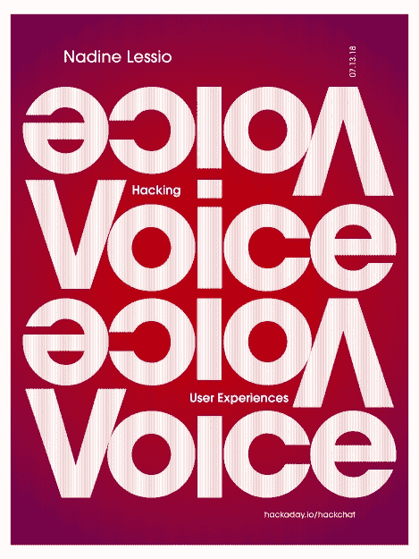

# 周五黑客聊天:黑客语音助手

> 原文：<https://hackaday.com/2018/07/11/friday-hack-chat-hacking-voice-assistants/>

消费电子的未来是电子语音助手，至少制造商是这么告诉我们的。从 Alexas 到 Google Homes 再到 Siris，一切都在入侵我们的生活，如果预测成立，你的下一辆新车可能会有一个语音助手。幸好我们有足够的 Majel Barrett 的声音样本来做一个优秀的虚拟助理。

 在本周的黑客聊天中，[我们将谈论所有关于语音界面的话题](https://hackaday.io/event/159092-hacking-voice-uis)。周围有数百个 Alexa 和 Google Home 黑客，但这只是冰山一角。我们还能用这些整洁的计算机硬件做些什么，我们如何让它做到这一点？

我们本周 Hack Chat 的嘉宾是 Nadine Lessio，她是来自多伦多的设计师和技术专家，具有视觉设计和 DIY 外设的背景。Nadine 拥有 OCADU 的医学博士学位，在那里她通过个人助理研究了物联网。目前，她在 OCADUs 适应性环境实验室工作，研究人类和设备如何协同工作。

在这次聊天中，Nadine 将谈论语音助手，并回答如下问题:

*   什么语言可以用来编写语音助手
*   语音和硬件怎么一起用？
*   语音助手的 UX 是什么样的？
*   这些助手如何与微控制器、pi 和其他电子平台接口？

当然，我们鼓励你在讨论中提出自己的问题。你可以在 [Hack Chat 活动页面](https://hackaday.io/event/159092-hacking-voice-uis)上发表评论，我们会将其放入 Hack Chat 讨论的队列中。【T2

我们的 Hack Chat 是在 [Hackaday.io Hack Chat 群发消息](https://hackaday.io/messages/room/2369)上的实时社区活动。本周和以往一样，我们将在太平洋时间 7 月 13 日星期五中午聚集在我们的视频终端前。需要倒计时器吗？[是的，你做了](https://www.timeanddate.com/countdown/generic?iso=20180713T12&p0=137&msg=Hacking+the+Voice&font=cursive)。

点击右边的语音气泡，你会被直接带到 Hackaday.io 上的黑客聊天群。

你不必等到星期五；随时加入，你可以看到社区在谈论什么。