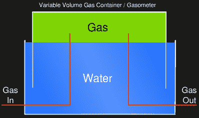

# 建造一个煤气表来储存木材气体和其他生物燃料

> 原文：<https://hackaday.com/2018/07/11/building-a-gasometer-to-store-wood-gas-and-other-bio-fuels/>

旧的解决方案往往如此优雅和有效，以至于它们不断卷土重来。煤气表或煤气柜就是这样一个例子。现在[NightHawkInLight] [已经建造了一个用来储存他一直在试验的木材气体](https://www.youtube.com/watch?v=5hfznunVzKY)，当他首先添加气体，然后将其烧掉时，看着它上升和下降是非常漂亮的。这个机制再简单不过了。

对于那些像我们一样第一次听说这种低技术的人来说，气量计是一种安全储存天然气的方法，起源于 18 世纪，当时天然气为王，电力只不过是绅士科学家的追求。最简单的形式是，一个盛水的容器和另一个装满气体的容器倒置在水中。气体压力由充气容器的重量控制，水提供密封，防止气体逸出。添加气体只会抬高充气容器，而移除或使用气体会降低充气容器。简单、安全、优雅。

我们将把他如何制作煤气表的细节留到下面的视频中，但可以说的是，他使用了原本打算作为炉子烟囱的双壁煤气管，这只是为整个黑客增添了更多的优雅。

[NightHawkInLight]很酷的项目以前也曾为 Hackaday 增光添彩。例如，仅在气体领域就有他的[丙烷动力等离子步枪](https://hackaday.com/2017/10/12/propane-powered-plasma-rifle/)，他的[透明混合火箭发动机](https://hackaday.com/2016/11/12/transparent-rocket-engine/)，以及他的[热枪，其温度足以熔化岩石](https://hackaday.com/2015/10/12/quick-and-easy-thermic-lance-is-hot-enough-to-melt-rocks/)。

 [https://www.youtube.com/embed/5hfznunVzKY?version=3&rel=1&showsearch=0&showinfo=1&iv_load_policy=1&fs=1&hl=en-US&autohide=2&wmode=transparent](https://www.youtube.com/embed/5hfznunVzKY?version=3&rel=1&showsearch=0&showinfo=1&iv_load_policy=1&fs=1&hl=en-US&autohide=2&wmode=transparent)

