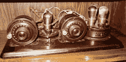
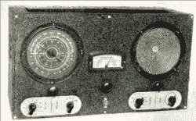
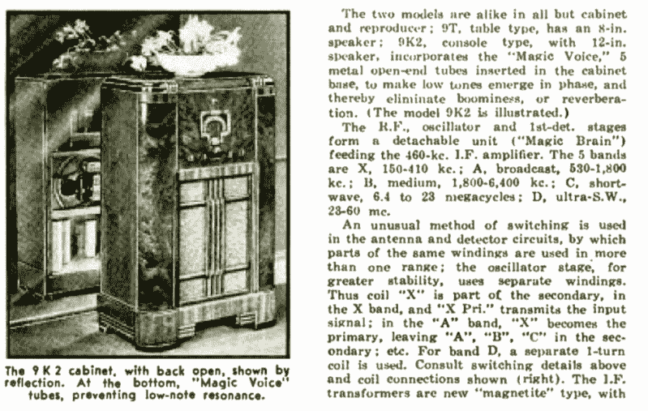
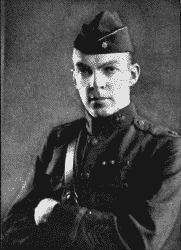

# 尖端无线电——被遗忘的高保真音响

> 原文：<https://hackaday.com/2018/07/31/retrotechtacular-apex-radio-the-forgotten-hifi/>

在过去的几十年里，广播发生了很大的变化。我们有卫星广播、互联网流媒体、高清广播，所有这些都挤掉了传统的 AM 和 FM 波段。FM 变得流行是因为更宽的频道和调制方案允许更少的静电干扰和更好的声音再现。如果你从来没有尝试过在雷雨交加的夜晚收听 AM 电台，你就不会明白这有多重要。但是你知道在 FM 之前还有一个美国广播乐队试图解决 AM 收音机的问题吗？你很少听说它，但 Apex 或摩天大楼广播出现在 1937 年至 1941 年之间，然后随着调频广播的冲击而消失。

如果你听说过 Apex 电台，或者如果你足够大，还记得它，那么你可能已经完成了这篇文章。对于其他人来说，想想 1936 年的无线电是什么样子。调幅波段在 550 到 1500 千赫之间有 96 个频道。由于这些频率在夜间传播距离很远，联邦通信委员会有一项复杂的工作，即确保电台之间不会相互干扰。诸如精心选择电台的位置、减少夜间电力供应，甚至在天黑后关闭电台等技巧都被用来控制干扰。

 此外，调幅收音机(就像这里的 1924 年阿特沃特肯特)听起来也不怎么样。狭窄的带宽不太适合音乐再现。幅度调制易受噪声和衰落的影响。相邻频道有互相干扰的趋势。当收音机出现的时候，能听到任何东西几乎是一个奇迹，所有这些似乎都不是很重要，但随着它成为社会不可或缺的一部分，这些东西都是负面的。

1932 年，FCC 创建了 1530、1550 和 1570 kHz 三个实验频率，允许比传统频率更宽的信号。然而，只有四个电视台在这些频道上运营。

## 工程

与此同时，工程师们正在寻找获得越来越高频率的方法。他们发现，在 20 MHz 以上，传播通常非常有限——大多数情况下几乎是在视线范围内。虽然您可能认为距离是通信系统所需要的，但从联邦通信委员会的角度来看，能够将广播公司限制在邻近区域是非常有吸引力的。

FCC 开始鼓励广播公司试验 20 MHz 以上的“超高频”，1934 年，W8XH(一家广播公司；不是火腿站)在纽约布法罗开始定期广播。作为 WBEN 的一部分，一个传统的调幅电台，任何想要收听的人都必须建造自己的设备，大多数节目都只是同伴调幅电台的重播。然而，1936 年密尔沃基的 W9XAZ 确实制作了正规的原创节目。

 由于大多数接收器的最高频率为 20 MHz，因此接收器问题尤为突出。您可以构建一个转换器，但这样会失去一些优势。在 1937 年，你还买不到像 Raco R-S-R Clipper(T4)(左)、RCA Magic Brain(见下面的广告示例)或 McMurdo Silver(见下面的视频)这样可以调到“超短波”波段的收音机。他们在这些频率上的表现往往不尽人意。

 [https://www.youtube.com/embed/E8gYk8vSYu0?version=3&rel=1&showsearch=0&showinfo=1&iv_load_policy=1&fs=1&hl=en-US&autohide=2&wmode=transparent](https://www.youtube.com/embed/E8gYk8vSYu0?version=3&rel=1&showsearch=0&showinfo=1&iv_load_policy=1&fs=1&hl=en-US&autohide=2&wmode=transparent)

任何一个业余爱好者都会告诉你，虽然 20 MHz 以上的传播通常是视线范围内的，但也不总是如此。联邦通信委员会指出，洛杉矶的 W6XKG 在亚洲和欧洲都听到了。W9XAZ 有时在澳大利亚和美国的其他电台都能听到。

## 亚历克斯乐队

1937 年，FCC 决定将 75 个频道置于 41.02 MHz，频道之间的间隔为 40 kHz，从而使高频广播频带成为官方频带。这是 AM 频道宽度的四倍，因此干扰更少，可以容纳听起来更好但仍然是 AM 的信号。大约有 50 个使用高频的电台不得不转移到新的波段。换句话说，Apex 是一个在更高频率上的 AM 电台，有着严格的波段计划。一点也不坏。

 但是这个新乐队只维持了大约四年。 [Edwin Armstrong 正在推动调频广播服务](https://hackaday.com/2018/07/24/edwin-armstrongs-battle-for-fm-radio/)，FCC 对该系统可能达到的音频质量感到惊讶。到 1939 年，委员会鼓励顶级广播公司转向调频。1940 年，他们重新分配了频带，支持 40 个调频频道，频率范围从 42 到 50 兆赫。RCA 后来游说再次移动乐队，虽然有一个辩论，如果这是出于技术原因或只是通过使他的设备过时来刁难阿姆斯特朗。

## 结束了

最后两个顶级电台是克利夫兰的 WBOE，于 1941 年 2 月转为调频电台。具有讽刺意味的是，在 1938 年，它成为第一个在为非商业教育电台和肯塔基州的 WBKY 保留的顶级频道中广播的电台，该电台于当年 6 月关闭。

为什么取这个名字？视线广播要求天线竖立在顶点或摩天大楼上。下次你看到有“Apex”乐队的旧收音机，你就知道为什么了。