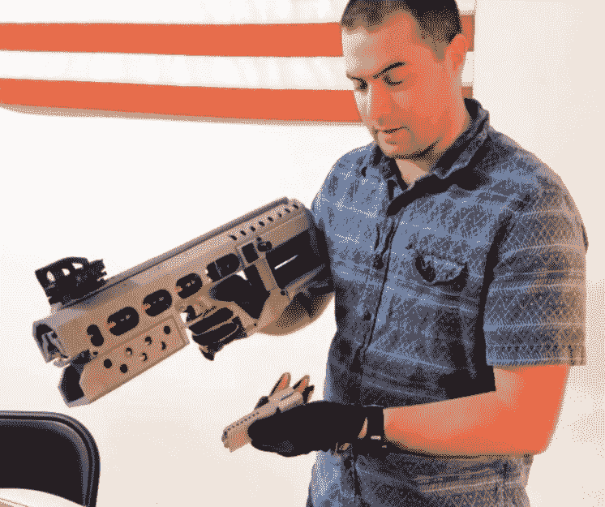

# 你现在可以买到实用的高斯枪了

> 原文：<https://hackaday.com/2018/07/12/you-can-now-buy-a-practical-gauss-gun/>

偶尔我们会遇到一条信息，它提醒我们，虽然飞行汽车仍无处可寻，但我们肯定生活在未来。通常是关于人工智能的一些新应用，或者可能是在快速发展的私人航天领域的另一个成功。但有时当你看着一个网站，对自己说:“哦，太酷了，他们有 1.5 千瓦的电磁加速器库存。”

【David Wirth】和【Jason Murray】[合作的 Arcflash Labs 已经将他们的 EMG-01A 高斯枪出售给](https://arcflashlabs.com/product/emg-01a/)任何足够勇敢并愿意花 1000 美元购买这种本质上是高科技 BB 枪的人。创造者声称，它的 RC 式 6S LiPo 电池组的效率为 6.5%，这使得它可以在需要充电之前发射 100 多发子弹。以相当慢的 45 米/秒发射 4.6 克钢弹，这种未来武器将更适合锡罐而不是入侵的外星人部队，但至少你将从最高技术优势的位置爆破那些罐子。

EMG-01A 建立在团队之前实验的基础上，[比如我们去年报道的半自动轨道炮](https://hackaday.com/2017/10/14/semi-automatic-rail-gun-is-a-laptop-killer/)。他们将该装置做得比以前的枪更小更轻，并致力于使它们更安全更可靠。也就是说，EMG-01A 的页面上有一些警告和说明，你不会在红色莱德 BB 枪盒子的背面看到；它当然不是玩具，任何拥有它的人都需要尊重他们所承担的责任。

说到这里，谁能真正买到这些东西呢？Arcflash 实验室网站明确表示，他们将只运送到美国，并进一步给出了他们不能发送完整枪支的州和城市的列表。从本质上讲，他们遵循的是在美国运输气枪的相同法律和准则，因为他们认为这是他们电磁枪的公平分类。ATF 是否有同样的感觉还不清楚，如果 Arcflash Labs 开始移动足够多的单元，看看会有什么样的法律反应应该会很有趣。

如果你想在不花太多钱的情况下对你的可回收物发起战争，[你可以花更少的钱建造你自己的](https://hackaday.com/2017/08/16/making-a-coil-gun-without-giant-caps/)。或者几乎没有，[如果你想走完整的 MacGyver 路线](https://hackaday.com/2017/01/07/disposable-camera-coil-gun/)。

 [https://www.youtube.com/embed/9ZlOHUYGBGk?version=3&rel=1&showsearch=0&showinfo=1&iv_load_policy=1&fs=1&hl=en-US&autohide=2&wmode=transparent](https://www.youtube.com/embed/9ZlOHUYGBGk?version=3&rel=1&showsearch=0&showinfo=1&iv_load_policy=1&fs=1&hl=en-US&autohide=2&wmode=transparent)

