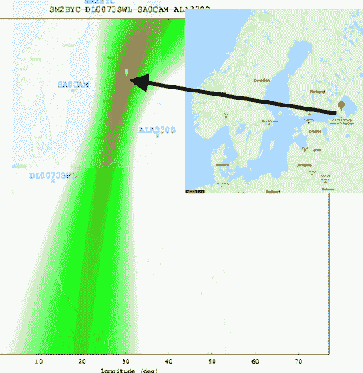

# 浏览器中的全球无线电测向

> 原文：<https://hackaday.com/2018/07/16/global-radio-direction-finding-in-your-browser/>

无线电测向是大多数黑客读者可能至少在概念层面上熟悉的事情之一，但可能没有太多的第一手经验。毕竟，你并不是每天都需要追踪一个流氓信号，更不用说访问必要的基础设施来三角定位它的位置。但是感谢互联网的奇迹，至少后一个借口现在有点站不住脚了。

Triangulated location of “The Buzzer”

RTL-SDR 博客发表了一篇非常有趣的文章，描述了[连接互联网的 KiwiSDR 无线电全球网络如何用于全球无线电测向](https://www.rtl-sdr.com/kiwisdr-tdoa-direction-finding-now-freely-available-for-public-use/)。如果你心中有一个目标，并且有时间摆弄基于网络的 SDR 用户界面，那么你现在可以接触到通常为世界超级大国保留的那种技术。事实上，这篇博客文章声称这是第一次这样的能力被放在无知的大众手中。让我们试着不要搞砸了。

首先，您应该大致了解信号的来源。不一定要精确，但你至少要知道该去哪个国家看看。然后你选择一个附近的公共电台，调整你想要的频率。对另外几个站点重复该过程。理论上来说，你拥有的电台越多越好，但是从技术上来说，三个应该足够让你接近了。

选择接收站后，系统将开始时差(TDoA)采样。这项技术将信号到达每个站点的时间与 KiwiSDR 的 GPS 同步时钟进行比较。有了足够多的来自多个站点的数据，它就可以根据信号到达全球不同地区所需的时间来估计信号的来源。

这并不完美，但对于一个社区运营的项目来说，这已经相当不错了。这篇博客文章接着给出了已知和未知信号的例子，他们能够以惊人的精度进行三角测量:从美国海军在华盛顿州西雅图的甚低频潜艇发射机到隐藏在俄罗斯某处的神秘的“蜂鸣器”数字站。

我们已经报道了使用 Wi-Fi 的小规模三角测量，甚至还有一个旨在让 T2 使用无人机追踪救援信标的项目，但是 KiwiSDR TDoA 系统的规模真的达到了一个全新的水平。明智地使用它。