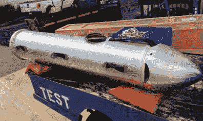
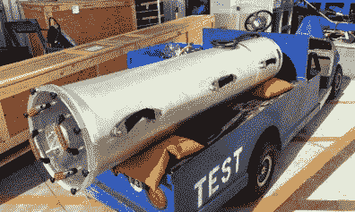
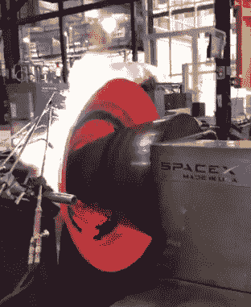
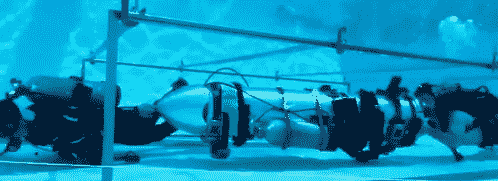

# 再来说说埃隆·马斯克的潜艇

> 原文：<https://hackaday.com/2018/07/17/lets-talk-about-elon-musks-submarine/>

当有消息称，埃隆·马斯克(Elon Musk)正在设计一艘儿童尺寸的潜艇，以帮助营救被困在泰国 Tham Luang 洞穴中的儿童时，Hackaday 进行报道似乎是合乎逻辑的事情。一个古怪的火箭和火箭发射电动跑车制造商，推动他的工程团队和相当大的财政资源采取行动拯救儿童？所有关于伊隆是真实生活的谈论，托尼·斯塔克即将从迷因变成现实；如果这个策略成功了，这个世界可能会有第一个真正的超级英雄。

人命关天，救援行动的成功还远未确定(不管伊隆是否参与)，我们当时不想扮演扶手椅工程师。Hackaday 的每个人都很感激，由于救援人员的英勇行为，包括一名付出了最大代价的人，所有 13 条生命都得到了拯救。

许多人说这不可能，其他人说即使能救一半的孩子也是个奇迹。但是，当一些孩子还在等待救援的时候，埃隆以极快的速度设计和建造的潜艇被带到了泰国，并没有被使用。并不是伊隆的先进技术使营救成为可能，而是人类精神的坚韧。

现在，营救工作已经完成，孩子们也在回家的路上，人们对伊隆的潜艇感到疑惑。有可能成功吗？

## 野猪

首先，让我们看看我们对伊隆的创作有什么了解。以儿童足球队的名字命名为“野猪”,称这艘船为潜艇可能有些过分了。从本质上来说，野猪是一个密封的管道，潜水员可以拉着它穿过洞穴系统。它没有推进器，事实上也没有任何主动控制系统。压舱物由潜水员的负重带提供，负重带会根据乘员的体重进行增减。

    

船体是猎鹰 9 号火箭中使用的液氧(LOX)传输管的一个五英尺长的部分。对于那些可能在“轨道助推器 101”中睡觉的人来说:转移管用于将过冷的 LOX 从火箭第一级顶部的油箱中转移出来，向下*通过*位于该级下部的燃料箱，进入歧管，将它分配给九个梅林发动机。

当被冷却到-207℃的液氧以大约每秒 380 美制加仑的速度通过它时，液氧输送管自然相当大并且异常坚固。当然，作为火箭的一个组件，它也很轻——这一事实得到了伊隆的支持，他提到整只野猪只有 90 磅左右。这一点很重要，因为并非洞穴的所有部分都被淹没，救援人员有时需要搬运或拖动它。

Spin forming a Merlin nozzle

野猪的前部有一个鼻锥来保护气管的连接点。这个零件可能是在短时间内通过采用 SpaceX 公司用于制造梅林发动机排气喷嘴的相同旋转成型技术制造的。除了保护空气管道之外，尖尖的鼻子还可以帮助野猪穿过狭窄的洞穴通道，因为它可以扫视障碍物。

野猪的后“舱口”是由一个丙烯酸圆盘制成的，用八个翼形螺钉固定，并用一个 o 形环密封。Elon 说，这一点很清楚，所以潜水员可以看到居住者的头部，大概是为了通过手势进行某种程度的交流。

至于野猪里面的*是什么，那就有点难说了。在整个快速开发和建设的过程中，埃隆提到内部将有从氯丁橡胶绝缘到音响系统的一切，以便乘客可以在旅途中听音乐。目前还不清楚这些“奢华”的特征在抵达 Tham Luang 洞穴时已经完成了多少。*

## 实际问题

 野猪能在水下安全地抓住一个人类居住者，这是不容置疑的。不仅设计非常简单，而且在运往泰国之前，它至少完成了一次载人潜水测试。

不太确定的是，它是否能安全地穿过曲折的洞穴，同样重要的是，一个孩子是否真的能忍受这一旅程。据多家新闻机构报道，救援行动的负责人 Narongsak Osatanakorn 称，野猪“不适合这项任务”。

最主要的担心是野猪太大了，够不着被困的孩子们，因为它的直径比洞穴最紧密的地方小两英寸。它的长度和刚性结构也会使它难以通过一些急转弯，如果它卡住并阻塞了通道，结果可能是灾难性的。

即使野猪能找到孩子们，许多人质疑一个已经处于虚弱的精神和身体状态的孩子是否能在五个小时的洞穴旅行中在本质上是一个金属棺材里保持冷静。由于飞船内没有活动空间，一些人猜测，如果孩子们有希望完成这次旅程，他们需要服用镇静剂。

## 最好的意图

T2 埃隆坚持说，在野猪的设计和建造过程中，他与有第一手经验的潜水员有过密切接触，他认为如果当局认为有必要，野猪可以到达孩子们那里。他甚至在推特上声称，他将亲自带着野猪返回洞穴，并证明它可以到达孩子们被困的位置，但后来他删除了这条消息。

很明显，野猪是不需要的，因为每个人都是在没有野猪的情况下获救的。同样真实的是，使用野猪会给潜水员和孩子们带来固有的风险，尽管情况是否会变得如此可怕，以至于这些风险是否值得冒仍有争议。如果雨一直下，或者孩子们太虚弱而无法走出洞穴，事情可能会有很大的不同。我们永远不会知道。

野猪既聪明又天真，这是一种认真的姿态，对它自己来说太复杂了。这是一个人的创造，他多次把不可能变成可能，以至于他现在把每一个问题都视为建造每个人都说不可能建造的东西的借口——也许是工程师救星陷阱的受害者。毫无疑问，埃隆的团队有梦想伟大想法的天赋，这只是一个没人想要的梦想。