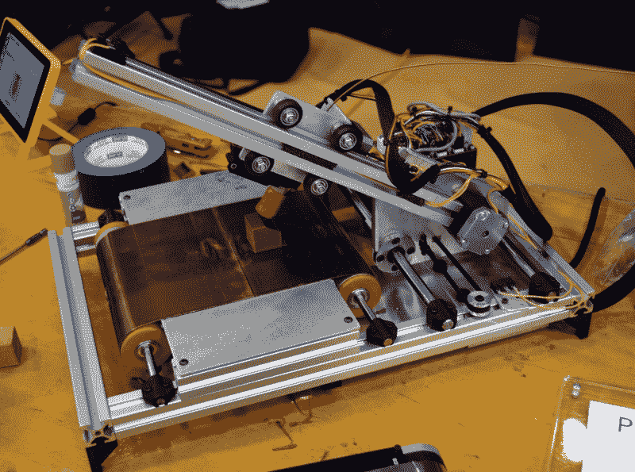

# 永别了，印刷机器人

> 原文：<https://hackaday.com/2018/07/19/a-farewell-to-printrbot/>

我们怀着沉重的心情宣布 Printrbot 公司已经宣布停止运营。该公司成立于 2011 年，在 Kickstarter 活动取得巨大成功后，开始让 3D 打印更便宜、更容易。他们的第一台打印机是印刷零件和木材的混合体，在当时提供了一个令人难以置信的交易；当 Makerbot 纸杯蛋糕售价为 750 美元，需要 20 多个小时组装时，[Printrbot 套件只需 500 美元，不到一个小时就可以完成](https://hackaday.com/2011/11/18/the-cheapest-and-easiest-3d-printer-weve-seen-so-far/)。

Brook Drumm, Founder of Printrbot

Printrbot 很早就迈出了第一步，但竞争也紧随其后。《星际迷航》风格的复制品的梦想推动了大规模投资，有一段时间，似乎每个人都进入了 3D 打印游戏。成套制造的机器让位于交钥匙打印机，价格开始下降。Printrbot 的产品也在发展，放弃了木材，转而采用折叠钢，并开创了自动调平等令人印象深刻的功能。[2014 年，他们发布了 Printbot Simple Metal](https://hackaday.com/2015/04/17/review-printrbot-assembled-simple-metal/) ，这最终成为他们的旗舰产品，并在许多方面代表了公司的高水位线。

最终，海外制造商看到了机会，开始用比几年前许多人认为可能的价格更便宜的 3D 打印机充斥市场。今天，你可以在网上花不到 200 美元买到一台非常好用的入门打印机，如果你仍然愿意自己动手制作，价格甚至会更低。对于像 Printrbot 这样的美国公司来说，在这个价位竞争简直是不可能的。

布鲁克没有放弃，而是决定改变方向。如果他不能在价格上与进口机器竞争，他将开始制造高端打印机。[新版本的简单金属于 2016 年推出](https://hackaday.com/2016/12/16/inside-the-printrbot-printrhub/),具有优质功能，如线性轨道和基于云的切片，价格也很高。从那时起，大多数新的 Printrbot 产品都会以超过 1000 美元的价格发布；使它们更符合 Ultimaker 等公司的“prosumer”机器。对于得益于一个廉价的木制 Printrbot 工具包而初次体验 3D 打印的黑客来说，这是一个苦乐参半的时刻。

 与此同时，布鲁克天生的黑客精神和对开源社区的热爱导致了许多有趣的副业项目，这些项目从未*相当*起步。[最近，他一直在对 Printrbelt](https://hackaday.com/2017/06/30/printrbot-teases-infinite-build-volume-printer/) 进行最后的润色，这是一台用传送带代替传统床的 3D 打印机。这种机器最终可以弥合桌面 3D 打印和真正的小规模生产能力之间的差距。

当我们在东海岸说唱音乐节上看到布鲁克时，他带来了一台新机器，更愤世嫉俗的观察者可能会认为这是一个预兆。Printrbot Easy 将是一款经过修改和更名的 FlashForge Finder ，这是对与中国制造的 3D 打印机竞争的唯一方式的最终承认，那就是出售自己的 3D 打印机。

看到一家科技公司倒闭总是令人难过，但看到 Printrbot 的末日尤其令人难过。这家来自加利福尼亚州林肯市的勇敢的小型 3D 打印机公司在美国制造，使用当地采购的组件，并承诺保持他们的机器开源，有很多值得喜欢的地方。Printrbot 是典型的黑客成功故事，我们可以自豪地说，我们从一开始就站在他们一边。祝 Brook Drumm 和整个 Printrbot 团队在未来的努力中取得成功；我们会留意的。