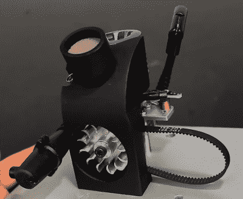

# 你的手电筒没电了？只需使用一个迷你硝基发动机

> 原文：<https://hackaday.com/2018/07/22/out-of-batteries-for-your-torch-just-use-a-mini-nitro-engine/>

我们当然可以联想到一个未完成的项目为更好的项目播下种子，而这正是[Johnny 90]最新视频中发生的事情。他最初着手制造一台由硝基发动机驱动的空气压缩机，并取得了部分成功——空气被压缩了，但远远不够有用。

相反，他改变了策略，决定用 1 立方厘米的发动机来制造一台小型发电机。【johnnyq 90】当然对硝基发动机并不陌生，之前为我们带来了[微型链锯改装](https://hackaday.com/2018/04/10/micro-chainsaw-gets-a-much-needed-nitro-power-boost/)，以及[硝基动力旋转工具](https://hackaday.com/2017/05/30/nitro-powered-rotary-tool/)。这一次，构建是一个概念上简单的任务:将一个引擎连接到 DC 发动机上，你就完成了。但是以一种优雅的方式在物理上实现它是一个不同的故事，这总是[JohnnyQ90]闪耀的地方；我们永远不会厌倦看他在车床上生产精密零件。油箱是由改良的 Zippo 罐制成的，借助数控铣削风扇和 3D 打印护罩，发动机空气可以自行冷却。

在视频快结束时，[Johnny 90]稍微玩了一下油门，导致连接到发电机的灯泡相应变亮。用伺服控制油门，并在不同的负载条件下调节输出电压，这可能会很有趣。

我们喜欢新奇的发电方式；之前我们已经写过[如何从可乐罐](https://hackaday.com/2017/05/18/coke-can-fueled-power-generator/)中发电，以及[这个 120 W 热电发电机(TEG)的设置](https://hackaday.com/2018/03/31/thermoelectric-generator-shines-where-the-sun-doesnt/)。

 [https://www.youtube.com/embed/l4KZaN6MjU4?version=3&rel=1&showsearch=0&showinfo=1&iv_load_policy=1&fs=1&hl=en-US&autohide=2&wmode=transparent](https://www.youtube.com/embed/l4KZaN6MjU4?version=3&rel=1&showsearch=0&showinfo=1&iv_load_policy=1&fs=1&hl=en-US&autohide=2&wmode=transparent)

