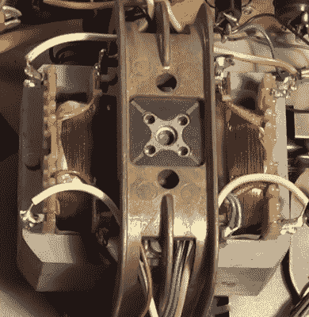

# 不到 5 美元的立体声电子管放大器

> 原文：<https://hackaday.com/2018/07/30/a-stereo-tube-amp-for-less-than-5/>

我们许多人都渴望拥有一个电子管放大器。不管关于电子管音频是否更好听的争论，或者即使你能听到其中的区别，它们看起来都很棒。然而，购买一个来看看它是否能让你的船漂浮起来的价格往往太高，不值得购买。

A motor transformer

[后启示录发明家]已经按照辐射视频游戏的风格建造了一个立体声电子管放大器。当他意识到 Grundig 制造的 TK 125 录音机在 60 年代后期仍在使用电子管音频时，他产生了这个想法。更有甚者，他们经常在易贝上出售德国 1-10€。[TPAI]能够从其中一个模型中抢救出主功率放大器，并恢复它，以便它可以被重新利用并再次看到用途。

原始盒式录音机的拆卸产生了一些有趣的部分。首先是集成式电机变压器——感应电机，其定子充当变压器的磁芯，负责电子管电子设备。还有一个集成电容器，其中包含三个独立的电解。休息后的视频非常值得一看(我们总是觉得[TPAI]的视频很有趣)。

一个新的底盘由钢底板和铝角制成，一些电机变压器的整洁框架由弯曲的废铜线焊接而成。它看起来很棒，尽管总是有使用蛋糕烤盘的选择。

如果你对电子管放大器的设计感兴趣，我们已经介绍了很多很酷的设计:从[这种低压设计](https://hackaday.com/2014/11/03/low-voltage-tube-amp-is-great-for-beginners/)到[这种微型吉他放大器](https://hackaday.com/2018/02/19/tiny-guitar-amp-rebuilt-with-tiny-tubes/)，甚至是那些使用扁平电子管的[。](https://hackaday.io/project/15023-amplifier-project-by-nutube-a-new-vacuum-tube)

 [https://www.youtube.com/embed/Hn57hbV_b4s?version=3&rel=1&showsearch=0&showinfo=1&iv_load_policy=1&fs=1&hl=en-US&autohide=2&wmode=transparent](https://www.youtube.com/embed/Hn57hbV_b4s?version=3&rel=1&showsearch=0&showinfo=1&iv_load_policy=1&fs=1&hl=en-US&autohide=2&wmode=transparent)

