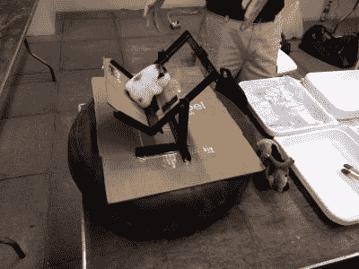
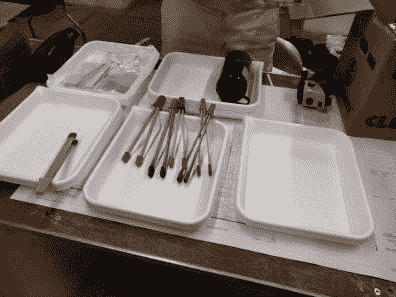
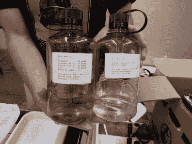
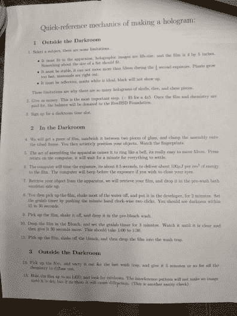
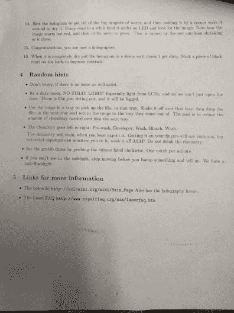

# 希望十二:制作你自己的全息图

> 原文：<https://hackaday.com/2018/07/23/hope-xii-make-your-own-holograms/>

在这个周末之前，我认为制作全息图超出了普通黑客的能力，无论是技能还是财富。一个装满电子产品的俱乐部伙伴盒子和一个停在汽车内胎上的丙烯酸夹具证明了我是错的。在 Hope 会议上，托米·约翰逊在一个研讨会上分享了他的黑客全息摄影技术，一些幸运的与会者可以在现场制作他们自己的全息图。

这里使用的技术依赖于干涉图样，而不是光束分裂。一束扩散的激光束通过全息胶片投射到全息图的主体上——比如下面视频中的一束花。光束中的光子从花束反射回来，并第二次穿过薄膜。由于光是一种以波的形式传播的电磁辐射，所以在胶片上两个峰(一个来自光束，另一个来自反射光)对齐的任何地方，都会发生曝光。只需 1/2 秒的曝光时间，胶卷就可以被冲洗出来了，如果一切顺利，你就已经制作出了全息图。

简单吧？至少在理论上是这样。在实践中，Tommy 已经这样做了将近 30 年，并在此过程中获得了许多技巧。让我们看看他为车间带来的硬件。

## 激光和电影

汤米正在使用一台 100 兆瓦的激光器，这台激光器是为胶印机蚀刻铝印版而设计的。他形容这是“类固醇激光打印机”。很明显，一批这样的车进入了二手市场，价格也很合理。我没有得到比这更多的信息，我的易贝-傅辜负了我，但如果你有更多的信息，请在下面留下评论。

在这里，我们看到它的纸板外壳内的激光器(点击全尺寸图像)。激光模块是右边的金色盒子。光束照射到左侧，穿过上面贴有电工胶带的白色盒子，穿过两个扩大光束大小的透镜，从盒子上刚好在框架外的一个孔(本图的上边缘)射出。中间的模块连接到激光器的控制电路，左边是电源板。

 这里你可以看到装有激光快门系统的白色盒子的内部。它需要大约 10 分钟的时间来充分预热，并且二极管一直处于开启状态。快门是必要的，以确保只有当~~死星~~光束达到最大功率时胶片才曝光。

这个快门是一个极好的黑客。汤米从模拟电压表中拉出指针装置，并在指针上安装了一面镜子。镜子本身就是一个黑客；他使用了那种闪闪发光的银色材料，你可以在拆开零售商店的防盗标签时找到这种材料。这是一个非常酷的选择，因为它既有足够的光泽又很轻。只要注入一点电压，仪表的指针就可以移到一边。

当快门打开时，光束穿过两个透镜。它们负责引导光束并使其扩散。我想知道光束是否需要扫过被拍摄的主体。但在大约 30 英尺的范围内，光束将覆盖整个胶片，一次曝光。

 电影设备本身就是另一套很酷的黑客工具。光学元件极易振动，任何超过 1/4 波长的移动都足以模糊曝光。考虑到这一点，固定薄膜的夹具位于汽车内胎的顶部，这是一种气垫，可以将夹具与通过地板和桌子传递的任何振动隔离开来。

这里的照片显示了一个填充动物作为全息图的主题，但它没有显示电影本身，电影通常是靠着主题右边的玻璃。这与入射光束成一个角度，称之为 45 度。角度并不重要，你可以直接曝光。但如果你这样做了，在最终产品中显示全息图所需的光源也需要直射过来。角度曝光可以让你直接看着胶片，把光源放在与胶片成一定角度的地方，这样你的头就不会挡住光线。这就是 Tommy 在本文顶部的图片中所展示的内容。

 [https://www.youtube.com/embed/cXgN5smftAE?version=3&rel=1&showsearch=0&showinfo=1&iv_load_policy=1&fs=1&hl=en-US&autohide=2&wmode=transparent](https://www.youtube.com/embed/cXgN5smftAE?version=3&rel=1&showsearch=0&showinfo=1&iv_load_policy=1&fs=1&hl=en-US&autohide=2&wmode=transparent)

## 冲洗胶卷

汤米从一个以全息摄影为生的人那里购买了他的胶片，这种胶片的分辨率比传统的全息摄影胶片高得多，他还将胶片作为副业出售。显影过程类似于传统的摄影，在暗室中使用化学浴进行。

    

不幸的是，汤米以前没有写过关于这种全息设备的文章，但是他计划在他的主页上写一篇。已经有一个令人愉快的收藏，是他的其他更复杂的全息摄影实验。我也喜欢检查他商店的网络摄像头，它有一种令人愉快的疯狂科学家的感觉！我将继续关注这个链接以了解更多细节。在那之前，看看他为研讨会准备的两页指南。

   