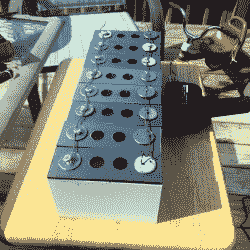

# 微生物释放了生物电池中的电压

> 原文：<https://hackaday.com/2018/07/27/micro-organisms-give-up-the-volts-in-this-biological-battery/>

电池通过化学反应工作，由 Josh Starnes 设计的令人着迷的混合微生物燃料电池也不例外。没错，电池通常不包含*寿命*，但是这个过程仍然会咳出有用的电子；准确地说，在[Josh]的设计中，每个电池 1.7 V。他的概念证明由八个并联的电池组成，足以通过 DC-DC 升压转换器给他的手机充电。他说，不知道在电压下降到无法使用的水平之前，这种情况会持续多久，但它确实有效！

Eight-cell, 3D printed proof of concept.

在[Josh]的设计中，每个单元都有两个互补的方面。阴极一侧是浮游植物；吸收二氧化碳和阳光的绿色微藻。在阳极一侧是细菌，它们将有机物质(如食物垃圾)分解成硝酸盐，并排出二氧化碳。该设计的第二版将在细胞之间加入一层半透膜，允许氧气和二氧化碳交换，同时保持微生物种群的分离；这将使生物过程更加互补。

一个由 24 个电池组成的电池和一个循环并照顾藻类和细菌的管道系统是最终目标，我们希望[Josh]能够更接近这个目标，因为他的项目赢得了 1000 美元的现金奖，成为 Hackaday 奖*电力采集挑战*部分的二十名决赛选手之一。(接下来是[人机界面挑战赛](https://hackaday.io/prize/details#four)，就像你知道的那样。)

The [HackadayPrize2018](https://hackaday.io/prize) is Sponsored by:     