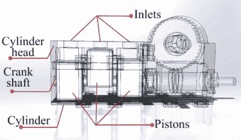

# 一种 MRI 安全的 3D 打印气动步进电机

> 原文：<https://hackaday.com/2018/07/26/an-mri-safe-3d-printed-pneumatic-stepper-motor/>

毫无疑问，你一定看过那些视频，在那里核磁共振成像仪会吸走各种金属物体，带来令人捧腹的灾难性后果。其中一台机器的磁场可以轻易地将金属物体从房间的另一端拉进来，对任何不幸靠得太近的含铁物体施加几百磅的力。正如你可能想象的那样，设计能在如此强的磁场中运行的机械设备是异常困难的。

 但是这个由【Foad Sojoodi Farimani】设计的全 3D 打印气动步进电机可能有一天会改变这种情况。他在最近于澳洲布里斯班举行的国际机器人和自动化会议(ICRA)上展示的 PneuAct，通过使用空气脉冲而不是电子脉冲进行全位置控制，能够以高达 850 RPM 的速度运行。PneuAct 完全由塑料制成，没有任何电子元件，不仅可以在强磁场中工作，还可以在火花可能导致爆炸的易燃气体区域工作。

我们常说设计是“完全”3D 打印的，即使它可能需要螺丝或其他硬件。但是在 PneuAct 的情况下，它真的是完全打印出来的。一定是，否则当它靠近核磁共振机时，整个东西就会被撕裂。电机的每一个零件都是用 ABS 印刷的，不需要任何额外的加工或清理就可以使用。不需要润滑，而且[Foad]提到整个东西非常便宜，可以一次性使用。这在存在污染问题的医疗环境中是一个巨大的优势。

从设计角度来看，PneuAct 本质上是我们之前见过的 [3D 打印空气马达的扩展版本](http://hackaday.com/2017/11/20/acetone-smoothing-results-in-working-motor/)，但公平地说，以前从未对其进行过如此近距离的研究。

 [https://www.youtube.com/embed/YaAEoC46jfk?version=3&rel=1&showsearch=0&showinfo=1&iv_load_policy=1&fs=1&hl=en-US&autohide=2&wmode=transparent](https://www.youtube.com/embed/YaAEoC46jfk?version=3&rel=1&showsearch=0&showinfo=1&iv_load_policy=1&fs=1&hl=en-US&autohide=2&wmode=transparent)

