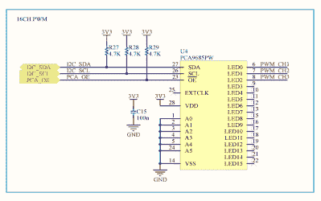

# ESP8266 互联网控制的 led 调光器

> 原文：<https://hackaday.com/2018/07/27/esp8266-internet-controlled-led-dimmer/>

关于“物联网”的辩论从来都不缺乏，主要集中在安全性以及人们到底有多需要从地球的另一端打开门廊灯的问题上。但是，尽管我们中的许多人仍在努力应对物联网设备的现实应用，但毫无疑问，我们中的一些人已经找到了让这项技术为他们服务的方法。

 一位物联网爱好者是【马赛丽·卡拉诺维奇】，他写信告诉我们他基于 ESP8266 的令人印象深刻的[定制物联网 LED 调光器。他没有依赖商业照明控制器，而是设计了自己的硬件和软件来满足他的特定需求。现在，他的网络上的任何设备都可以控制 LED 灯，他开始编写 Python 脚本，该脚本可以检测他在计算机上做的事情，并做出相应的反应。例如，如果他在看电影，灯光会自动变暗，当他看完电影后，灯光会自动亮起。](https://sasakaranovic.com/projects/iot-led-dimmer/)

[马赛丽]提供了跟随他的脚步所需的所有文件，从他 PCB 的 Gerber 文件到他在 ESP 上运行的 Arduino 代码。源代码尤其值得一看，因为他做了很多我们在 DIY 项目中不常看到的细节。从确保 ESP8266 在网络上获得可解析的 DNS 主机名到使用 websockets 实时更新所有连接的客户端的状态信息，他真的做了大量工作来尽可能完善体验。

他在他的博客文章中解释了在你自己的环境中需要编辑哪些代码，甚至在代码中有一些描述性的注释和一个有用的调试模式，所以你可以看到一切是如何工作的。考虑到其他人可能正在使用你的代码总是一个好主意；花几分钟把事情说清楚，可以节省他们在黑暗中跌跌撞撞几个小时的时间。

如果你的 ESP8266 照明项目需要更多灵感，请查看这款[儿童房环境照明控制器](https://hackaday.com/2018/06/07/ambient-lighting-for-baby-with-the-esp8266/)，或者这款[专业橱柜下照明控制器](https://hackaday.com/2016/09/27/hackaday-prize-entry-under-cabinet-led-lighting-controller/)。