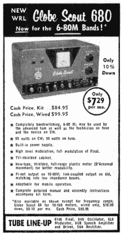

# 1950 年代的调幅发射机有趣但危险

> 原文：<https://hackaday.com/2018/07/29/1950s-am-transmitter-is-fun-but-dangerous/>

Carlson 先生]在一个集市上买了一个环球童子军 40A 型业余无线电发射机。40A 是一个巨大的老式发射机，充满了电子管、高压和一个巨大的变压器。看到这些年来事情发生了多大的变化真的很有趣。发射机很大，但部件相对较少。你需要一块水晶来控制你想要通话的频率。有两个小模块是混合电路(IC 的前身)的前身，通常被称为 pec 或 coupletss(不是 couplet ),但除此之外，它都是完美点对点布线的电子管和分立元件。

然而，真正令人惊讶的是后面板。有一个螺丝端子来驱动外部同轴继电器的线圈，该线圈上有线电压。背面还有一个插头，带有暴露的端子，上面有相当大的板电压。在 20 世纪 50 年代，你认为操作这种设备的人会小心不去接触暴露在外的高压。

【Carlson 先生】出色地完成了原理图的浏览，当然，他还启动了无线电，并通过通信监视器查看输出。我们已经有很长一段时间没有装上电子管发射机了，看着它完成，看着它的输出非常怀旧。

令我们惊讶的是，这个小小的发射器只能输出大约 20 瓦。单个 6146 应该可以到 50 瓦，但是可能最后是用坏了。右边的广告来自[1957 年一期的《大众电子》](https://docs.google.com/viewer?url=http%3A%2F%2Fwww.americanradiohistory.com%2Fhd2%2FIDX-Consumer%2FArchive-Poptronics-IDX%2FIDX%2F50s%2F57%2FPop-1957-07-OCR-Page-0119.pdf%23search%3D%2522globe%2520scout%2522)是一个类似的型号。它声称输出功率为 60 瓦。你应该注意，100 美元的价格不包括你可以为每个波段购买的线圈，也不包括晶体，麦克风或钥匙。1955 年的一篇文章引用了这个模型:

> Globe Scout 型号 40A:这是一个通用的 50 瓦 c.w .，40 瓦电话波段转换发射机，工作范围为 10 到 160 米。它旨在满足固定站或移动使用的低功率领域对紧凑单元的需求。该装置包含六个电子管，包括整流器。它由晶体控制，或者可以由任何外部可变频率振荡器(v.f.o .)驱动。内置天线调谐器允许使用任何标准类型的天线。移动使用时，通过辅助插座连接合适的[发电机](https://hackaday.com/2017/07/04/retrotechtacular-dc-to-dc-conversion-rotary-style/)或[振动器](https://hackaday.com/2016/07/04/retrotechtacular-dc-to-dc-conversion-by-vibrator/)电源。
> 尺寸为 8 x 16 x 8 英寸。套件形式，89.95 美元；工厂连线，99.95 美元。

确实紧凑。电源连接是背板上暴露高压的连接。收音机已经更换了它的电解质——这是最近热议的话题。如果你想建立自己的电子管调幅发射机，你可能想[午餐喝汤](https://hackaday.com/2017/05/28/a-tube-am-transmitter-in-a-soup-can/)。

 [https://www.youtube.com/embed/VtsyKXl-nwU?version=3&rel=1&showsearch=0&showinfo=1&iv_load_policy=1&fs=1&hl=en-US&autohide=2&wmode=transparent](https://www.youtube.com/embed/VtsyKXl-nwU?version=3&rel=1&showsearch=0&showinfo=1&iv_load_policy=1&fs=1&hl=en-US&autohide=2&wmode=transparent)

[主图环球侦察照片通过[船锚图片](https://people.ohio.edu/postr/bapix/GS680A.htm)