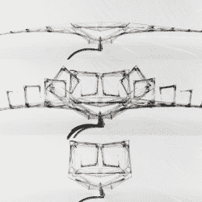

# 热致动器:依靠温度变化的液压马达

> 原文：<https://hackaday.com/2018/08/02/thermal-actuators-hydraulic-motors-that-feed-on-temperature-changes/>

由[Andrew Benson]设计的这些[流体位移热致动器](https://hackaday.io/project/159753)是 Hackaday 奖的能量收集挑战部分的一种令人愉快且完全不同的方法。虽然大多数项目都专注于电力，但[Andrew]的设计本质上是一个机械马达，它利用了相变材料(PCM)在从液态变成固态时改变体积的事实，反之亦然；该特性用于提供有用的液压力。简而言之，它是一个线性致动器，随着 PCM 冻结或融化而收缩和膨胀。通过选择熔点和凝固温度适合操作环境的材料，致动器几乎可以免费可靠地操作。概念验证是这里显示的设备；一种遮阳模型，在达到一定温度时展开，冷却后收回。

Sunshade concept, from deployed (top) to retracted (bottom).

将温度变化转化为有用的物理功是像[蜡马达](https://hackaday.com/2018/06/18/dissecting-the-elusive-wax-motor/)甚至一些[自动上弦时钟](https://hackaday.com/2018/02/25/mechanical-clocks-that-never-need-winding/)背后的原理，但【安德鲁】所做的是设计一种直接与流体接口的有用方法；抽走材料本身，以便在另一端提供机械动力。一般来说，这些设备可能不是特别有效，但它们只有很少的活动部件，非常可靠，几乎可以在任何规模下运行。[Andrew]一直在想大事，他的许多应用程序想法本质上都是架构性的。

[Andrew]受到启发参加了 Hackaday 奖的设计，我们很高兴他这样做了，因为它被选为*电力收集挑战赛*的决赛选手之一，并将角逐 5 万美元的大奖。如果你也有一个想法在等待一个机会，现在就是时候了。接下来是[人机界面挑战赛](https://hackaday.io/prize/details#four)，接着是[乐器挑战赛](https://hackaday.io/prize/details#five)。你真正需要输入的是一个记录在案的概念，所以削尖你的铅笔，给你的想法一个达到下一个水平的机会。

The [HackadayPrize2018](https://hackaday.io/prize) is Sponsored by:     