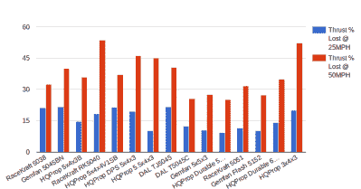

# 四轴飞行器硬件获得经典湖床测试

> 原文：<https://hackaday.com/2018/08/01/quadcopter-hardware-gets-classic-lake-bed-test/>

你很难找到一架飞机不是在没有大量使用模拟的情况下设计和测试的。无论是在风洞中使用比例模型的经典方法，还是更现代的技术，如计算流体动力学，在任何实际的硬件连接在一起之前都会进行大量的测试。但在某些时候，真正的交易需要进行试航，历史上最受欢迎的试验场是美国西部的大规模干湖床。天气总是晴朗，地面平坦，方圆几英里都没有人。

 多亏了 Propwashed 的[James]和[Tyler]，同样的经典湖床现实世界测试方法现在已经被带到了高性能四轴飞行器装置的世界。通过在他们的皮卡车后面安装一个计算机控制的推力支架，并穿过莫哈韦沙漠的 El Mirage 干湖床，[他们能够在飞行中对不同的螺旋桨如何操作进行逼真的测试](https://www.propwashed.com/prop-tests-truck-results-part-1/)。收集的数据提供了一个有趣的例子，说明空速与产生的推力之间的反比关系，但也表明并非所有的推进器都是一样的。

[该系列的第一篇文章](https://www.propwashed.com/miniquad-propeller-thrust-tests-part-1-set-up/)介绍了他们的测试设置和整体流程。在卡车底座的一个塔上，EFAW 2407 2500kV 电机安装在 1520 系列推力袖手旁观 RCBenchmark 上。这个支架连接到计算机，并提供一个脚本化的环境，不仅可以用来控制电机，还可以监控功耗、转速等变量，当然还有推力。虽然有一些想法考虑从卡车的电力系统为钻机供电，但最终他们使用了 Turnigy 6000mAh 4S 电池组，以保持简单。

为推力支架编写了一个脚本，它将在 30 秒内将油门从 0%升至 70%，然后保持在该水平 5 秒。这个脚本在卡车处于静止状态时运行，然后在卡车以越来越快的速度行驶到 90 英里/小时时重复运行。对 15 个被测试的道具中的每一个都重复这一过程，并将结果数据制成图表，以比较它们的性能。

 最终结果是，叶片较少的低音道具似乎是整体表现最好的。考虑到社区通过反复试验发现的东西，这并不令人惊讶，但是有硬数据来支持轶事发现总是好的。然而，有几个突出的道具在高速时比其他道具表现得更好，如果你真的想在空速方面突破极限，这可能值得一看。

随着四轴飞行器(或者“无人机”，如果你一定要的话)的流行，我们开始看到越来越多的研究和实验用 RC 硬件完成。从对业余爱好电机的详细电气分析到量化不同发射器延迟的 T2。