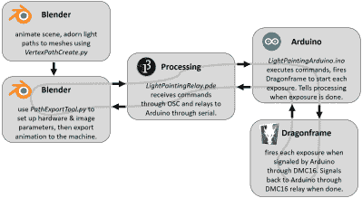

# 直接来自 Blender 的灯光绘画动画

> 原文：<https://hackaday.com/2018/07/30/light-painting-animations-directly-from-blender/>

光绘:在长时间曝光的照片中，有一种东西永远不会过时。虽然大多数光绘都是单幅拍摄，但一些艺术家会煞费苦心地制作一帧一帧的动画。当用手移动灯光时，这很难做到:这主要是猜测，因为在照片拍摄完成之前很难看到你努力的结果。但是如果你能让模式变得非常精确呢？如果你可以用 3D 建模会怎么样？

【乔希·谢尔登】已经做了，通过创建一个过程，允许在 Blender 中形成的动画在 3D 中被描绘成光画。在 Blender 中创建动画，然后自动导出每一帧，并通过 3D 机架上的 RGB LED 进行跟踪。这个项目是大量软件、电子和机械工作的高潮，所有这些工作都在严格的公差下完成，[乔希]的技能真的闪闪发光。

第一步是从 Blender 中导出动画。由于它的开源特性，Python Blender 插件被编写来创建光路，并将它们转换成硬件可以执行的有效序列。为了在动画过程中适应平滑滑动的摄像机运动，还编写了一个[运动控制器附件](https://github.com/Defaultio/BlenderMoco/)。

承载主 LED 的门架是手工制作的。我们很想买一台 3D 打印机，并为此进行改装，但[Josh]在机械制造方面做得非常出色，获得了一个结构坚固、范围很大的机架。驱动电子设备也执行得很巧妙，定制的机架安装单元与用于动画的 DragonFrame 控制器集成在一起。

视频以行动号召结束:由于搬出去，[Josh]无法继续这个项目，但已经做了很多必要的跑腿工作。我们很乐意看到这个项目继续下去，并且它已经为任何希望这样做的人记录在案。如果你想了解更多【乔希】的作品，我们之前写过他为音乐盒线轴制作了一个[自动打孔机](https://hackaday.com/2017/09/19/music-box-plays-still-alive-thanks-to-automated-hole-puncher/)。

谢谢你的提示，[尼克]。

 [https://www.youtube.com/embed/O1bY66X1JKA?version=3&rel=1&showsearch=0&showinfo=1&iv_load_policy=1&fs=1&hl=en-US&autohide=2&wmode=transparent](https://www.youtube.com/embed/O1bY66X1JKA?version=3&rel=1&showsearch=0&showinfo=1&iv_load_policy=1&fs=1&hl=en-US&autohide=2&wmode=transparent)

