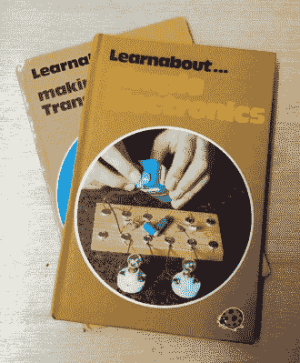
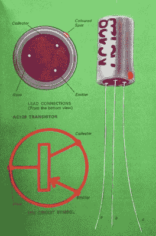
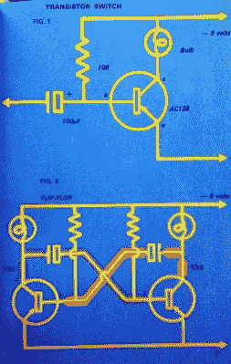
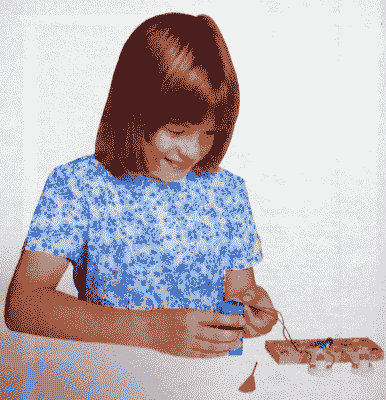

# 虚度青春的回忆:学习简单的电子学

> 原文：<https://hackaday.com/2018/08/08/memories-of-a-mis-spent-youth-learnabout-simple-electronics/>

Heaven, for tech-inclined late-1970s British kids.

去年初春，我们推出了一篇书评，作为你应该阅读的系列的*书的一部分。通常这些都是影响深远的书，那些真正有用的书会伴随你一生，成为你经常翻阅的书籍，但在这种情况下，它是一本儿童书籍。 [*制作晶体管收音机*](https://hackaday.com/2017/02/03/books-you-should-read-making-a-transistor-radio/) ，作者【乔治·多布斯(George Dobbs)，G3RJV】，是教育、娱乐和吸引 20 世纪中期英国孩子的瓢虫系列图书的一部分，其主题是构建一个 3 晶体管再生 AM 接收器。如果你和某个年龄的英国电子工程师交谈，很有可能是这本书第一次让他们接触到他们的艺术，他们甚至可能仍然在某个地方保存着他们珍贵的收音机。*

制造晶体管收音机是一个成功的故事，但不太为人所知的是，几年后在 1979 年出版了一本书。*简单电子*是 imprint 的 *Learnabout* 系列的一部分，它将它的前身的基本前提从无线电领域带到了其他晶体管电路中。涵盖了晶体管定时器和多谐振荡器，莫尔斯电码，最后是一个雄心勃勃的项目，电子琴。

翻开这本书，很明显，自第一卷出版以来，文化发生了轻微的转变。这种版式在感觉上更加现代，封面内侧的儿童实验者的照片是一个 70 年代末的年轻女孩的照片，而不是 20 世纪 50 年代风格的戴着领带建造收音机的男孩。虽然写作的实际性质没有改变，但它指出，从*制作晶体管收音机*开始，一些背景信息没有重复。我们直接进入了深水区，有一节介绍了使用该系列的“木制基板上的签名螺旋杯构造技术”所需的工具。

Construction was so much easier when transistors came with long leads.

原著使用了 Mullard OC 系列的锗晶体管、OC71s 和 OC44。这些是一些最早的英国晶体管，正如我在那个时期建造我的收音机时可以证明的那样，在 20 世纪 70 年代后期很难获得。这本书因此转向了更晚的设计，AC128。仍然是锗 PNP 设备，但这一次是在金属罐中，而且重要的是在当时仍然可以使用，因为它已经被用于不止一台 70 年代中期的彩色电视机中。我们对该器件进行了简单的介绍，了解了其封装、引脚排列和原理图。令人耳目一新的是，在一本儿童读物中，孩子被介绍了这样一个成人主题，而没有不断地被提醒他们是一个孩子。

然后，我们花了几页纸来看晶体管作为开关。10K 基极电阻用于偏置 AC128，手电筒灯泡作为其集电极负载，跨线连接到负电源(记住这是一个 PNP 晶体管！)灯泡可以开关。在典型的形式中，我们展示了如何用一个回形针制作一个灯座，如果我们不能找到一个专用的组件。然后用电解电容扩展基本开关，形成简单的时间延迟开关，最后我们看到两个这样的电路如何组合成一个非稳态多谐振荡器，并使一对灯泡闪烁。

The astable multivibrator, explained for kids.

对我来说，大约在 1979 年或 1980 年，这是一个惊天动地的时刻。第一次，我*明白了*振荡器是如何工作的。该晶体管导通，延迟一段时间后触发另一个晶体管，再延迟一段时间后触发第一个晶体管，以此类推。这是一个足够简单的电路，但对于一个最近才接触电子产品的孩子来说，这是一个*惊人的*时刻，让他了解它是如何工作的。这可能给了我一生的坏习惯，当我需要一个快速而肮脏的方波时，双管无稳态电路成了我的首选电路。它们可以在几分钟内由一些 PCB 或马口铁上常见的可拆焊的废弃元件组装而成，我已经将它们用于讨厌的逻辑时钟、谐波丰富的信号源、PWM 振荡器、[开关电源](https://hackaday.com/2016/10/04/a-quickly-hacked-together-avalanche-pulse-generator/)以及许多其他应用，这一切都是因为这本书。

足够的回忆，和时间来翻过这一页。为了好玩，我们把闪光器展示为一个有闪光眼睛的机器人，然后替换一些组件，并为音频振荡器添加一个水晶耳机。这是本书的第一部分，因为它构成了所有后续项目的基础。这也是我小时候对这本书的最大收获，因为缺少足够的 AC128s 来完成器官工程，也缺少音乐天赋。有人向我展示了如何使用烙铁，我发现垃圾箱里的废电视机包含了一座零件金矿，我再也没有回头看。

[乔治·多布斯]是一个无线电爱好者，所以当然，一旦他有了一个拥有音频振荡器的英国孩子军团，他就会带领他们用马口铁制成的过滤器和钥匙制作一个莫尔斯电码练习振荡器。在典型的严肃风格中，我们了解了业余无线电、代码和基本操作程序。甚至还有使用三芯电源 flex 进行双站设置的说明，有多少建造这种设备的孩子后来有了自己的呼号？

风琴项目正在等待，但在此之前，我们有时间让更多的电路来适应振荡器的音高变化。使用电位计的“小提琴”和光电管都有自己的页面，之后你会想:有多少孩子设法让他们的父母为 ORP12 CdS 电池付钱？

Never lose the fascination you gain from your first project!

风琴属于“唱针”类型，用唱针在键盘上的导电垫上弹奏音符。骨架预置电位计用于调谐，替代填充碳电阻器中的凹口。在 1979 年，以零花钱的预算来说，这根本不是一个便宜的项目，有读者建造它吗？如果他们去了最后两页，与晶体管收音机中使用的相同的 1 晶体管扬声器放大器，以及使用多谐振荡器低频版本的颤音电路，那么零花钱将会非常短缺。

但是这样看可能会错过这本书的重点。前一本书都是分阶段介绍一个项目，而这本书更多的是分阶段教授一些基本的晶体管电路。当我得到一份副本时，我对收音机中 OC71s 的晶体管有了一个基本的想法，但当我读了这份副本并构建了一些电路后，我对固态电子学有了更广泛的理解。我知道 RC 电路和振荡器，以及改变 RC 电路的值对频率的影响。我从这本书中学到的一些东西今天仍在使用，在我读完这本书近十年后，当我还是一名电子工程本科一年级学生时，我因为它在我们的晶体管电路课程中一鸣惊人。

《简单电子产品》已经绝版三十多年了，但是如果你想要一本，你可以在网上二手书店找到。如果你想快速浏览的话，这里还有至少一个 PDF 版本的。