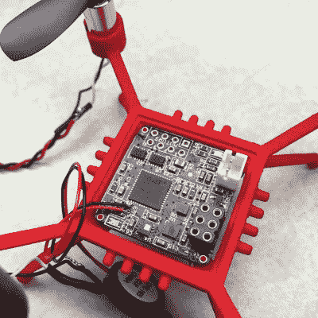

# 平方英寸项目再次骑行！

> 原文：<https://hackaday.com/2018/08/07/the-square-inch-project-rides-again/>

想玩游戏吗？你的挑战是用一块不超过一英寸乘一英寸的印刷电路板做一些不可思议的事情。这是[一平方英寸项目](https://hackaday.io/contest/160135-the-return-of-the-square-inch-project)的回归，将会令人惊叹！

我们真不敢相信已经三年了！最初的[一平方英寸项目](https://hackaday.io/project/7813-the-square-inch-project)是由 Hackaday.io 用户[alpha_ninja]在 2015 年构思的一个竞赛，我们认为这是一个非常棒的想法，所以我们设立了一些奖项。坦率地说，参赛作品是我们见过的最好的。所以我们又来了！

上一次，尺寸限制集中了人们的思想，激发了 Hackaday.io 中一些最优秀和最聪明的产品的创造力。在一个边长仅 25 毫米多一点的方形 PCB 中，您能装入哪些功能或简单的娱乐功能？我们想看看。

我们将在整个比赛中展示参赛作品。我们认为极客的信誉是最好的奖励，但如果你想要更多的东西来增加甜头，你可以这样做:

*   ### **Grand Prize:**

    *   500 美元现金！
*   ### **The top four won Tindie gift certificate:**

    *   最佳项目——100 美元
    *   最佳艺术 PCB 设计——100 美元
    *   最佳项目文档——100 美元
    *   最佳社交媒体图片或视频——100 美元
*   ### **Five runner-up works:**

    *   价值 100 美元的奥什公园礼品卡

[Quadcopter in One Inch](https://hackaday.io/project/7947-quadcopter-in-one-inch)

想要点灵感吗？上次的获胜者是一平方英寸的四轴飞行器，但是有许多有用和有趣的项目挤在狭小的空间里，其中许多超越了它们的限制。高保真声卡不是一个而是两个:[一个用于你的笔记本电脑的 USB 端口](https://hackaday.io/project/8545-square-inch-usb-sound-card)和[一个用于你的微控制器项目](https://hackaday.io/project/8567-hifi-audio-codec-module)，现在由 Teensy 音频库正式支持。小型太阳能项目需要一个 [MPPT 电源转换器](https://hackaday.io/project/8558-1-square-inch-of-power)？安装在美国电源插头或 [I2C 到 WS2818 转换器](https://hackaday.io/project/8516-picopixel)上的[插头负载测量仪如何让闪烁更容易？](https://hackaday.io/project/7979-powerblade)

几乎所有能想到的芯片都有分线板，[一个来自我们自己的【Jenny List】的无线电下变频器](https://hackaday.io/project/8486-hf-receive-converter-for-rtl-sdrs-and-similar)，还有一个[大磁旋转编码器](https://hackaday.io/project/8418-magnetic-incremental-rotary-encoder)设计。[钥匙通行证](https://hackaday.io/project/8199-key-pass)，一个[DIP-8](https://hackaday.io/project/8301-dil-duino)大小的 Arduino，当然还有一个[蝙蝠探测器](https://hackaday.io/project/8353-worlds-smallest-bat-detector)，一个[气泡显示电压表](https://hackaday.io/project/8010-small-voltmeter)，一个[智能手表](https://hackaday.io/project/6833-open-source-smart-watch)，一个[电容触摸滚轮](https://hackaday.io/project/7940-capacitive-touch-wheel)。

三年过去了，零件变得更便宜、更小、功能更强。在 2015 年并不遥远的地方，一平方英寸内有什么新的可行性？[让我们看看你有什么](https://hackaday.io/contest/160135-the-return-of-the-square-inch-project)。