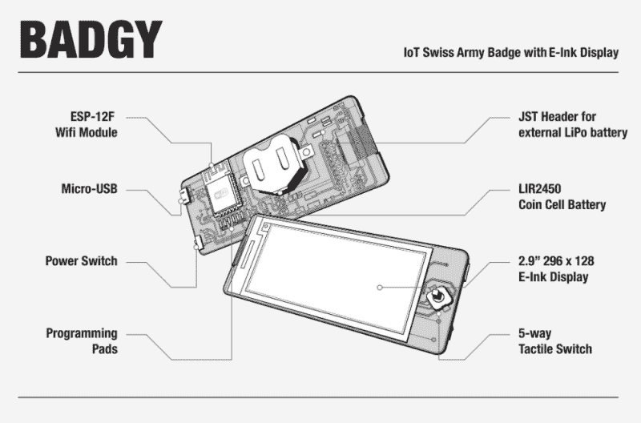

# 可编程徽章使用 E-Ink 和 ESP8266

> 原文：<https://hackaday.com/2018/08/08/programmable-badge-uses-e-ink-and-esp8266/>

你可能已经注意到黑客世界有点迷恋过于复杂的电子事件徽章。沿着这条线的某个地方，我们从使用挂绳上的一张层压纸发展到定制设计的小工具，这些小工具包含足够的硬件，不久前它们还可以被当作 PDA。但是，如果有一种方法可以将这种对称重的热爱与硅首饰和老派的“你好，我的名字是……”贴纸结合起来呢？

【Squaro Engineering】可能有 [Badgy 的解决方案，他们的多功能 e-ink 名字……嗯，徽章](https://github.com/sqfmi/badgy)。它与 Arduino SDK 兼容，可以用作天气显示器和智能家居遥控器等任何东西。哦，我们认为在绝对紧急的情况下，它可以用来避免尴尬的向陌生人介绍自己。

Badgy 由 ESP-12F 提供动力，具有 2.9 英寸 296×128 E-Ink 显示器和一个用于用户输入的五向战术开关。默认固件包括对 WiFiManager 和 OTA 更新的支持，以使上传您自己的二进制文件尽可能容易，并且提供了许多示例草图来向您展示诀窍。它由 LIR2450 3.6 V 锂离子充电硬币电池供电，可以在深度睡眠中运行长达 35 天，或在大量使用情况下运行约 5 小时。

如果你想试着自己动手制作，原理图、源代码和材料清单都可以在麻省理工学院的许可下获得，并且在 Tindie 上可以获得[组装徽章。虽然它可能没有挂在你脖子上的](https://www.tindie.com/products/squarofumi/badgy-iot-badge/)[复古电脑](https://hackaday.com/2018/05/15/retro-computer-badge-for-hackaday-belgrade-has-everything-you-wished-for-back-in-the-day/)那么令人印象深刻，但它看起来绝对是一个有趣的黑客平台。