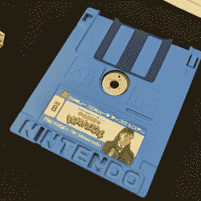
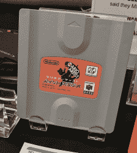
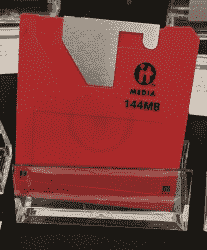
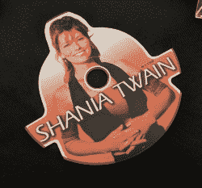
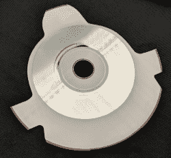
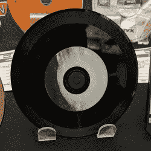

# VCF·韦斯特:所有的软盘

> 原文：<https://hackaday.com/2018/08/06/vfc-west-all-the-floptical-disks/>

现在，如果你想把一个文件从一台电脑传送到另一台电脑，你只要通过网络就可以了。在那些不太可能的情况下，USB 闪存盘就可以了。它并不总是这样，它更令人困惑；回到我们有软驱的时候。我们有软盘驱动器。一张未标记的 3.5 英寸软盘可以格式化为 360、720 或 1440k IBM 驱动器、400、800 或 1440k Macintosh 驱动器、Apple II 卷、Amiga、Acorn 或许多其他逻辑格式。那只是软盘的一种物理格式，还有几十种。

对于今年的 VCF 西部，硬件死灵法师和稀有深奥的可移动存储格式的收藏家[ [Foone](https://twitter.com/foone) ]带来了商品。他有可能是这个星球上最完整的不同软驱格式的收藏，它们都在本周末展出。

### 任天堂软盘

A Famicom Disk Card. Note the indentations/molding of the ‘I’ and ‘N’ in Nintendo

A 64DD game pack

是的，不同的任天堂游戏机有软驱。最著名的，但在美国仍然极其罕见的，是任天堂 64 的附加设备 [64DD](https://en.wikipedia.org/wiki/64DD) drive。这次驱动器是一次商业上的失败，最值得记住的是我们没有得到*母亲 3 的原因。*

展出的另一张任天堂软盘是 Famicom 磁盘卡。这种仅限日本的媒体是为 Famicom 设计的，包括一个独特的商标保护方案。当时，任天堂游戏的台湾复制品非常猖獗，原因很简单，台湾不承认日本版权，但他们尊重日本商标。这个问题的解决方案是让每个 Famicom 磁盘卡上的“任天堂”标志成为一个实体钥匙。每个磁盘卡中的“I”和第二个“N”比标识的其余部分压印得更深，形成了一个基本的基于商标的防复制方案。

### 佛光镜

在 80 年代早期，你可以很容易地在一张 3.5 英寸的软盘上安装整个操作系统。到了 90 年代中期，文件变得越来越大，甚至到了一张软盘都装不下一个 Photoshop 文件的地步。解决方案以 Zip 磁盘的形式出现，但还有另一种选择:光学驱动器。这些磁盘看起来就像一个标准的 3.5 英寸磁盘，但使用 led 或激光来精确地将驱动器的磁头与轨道对齐。结果是每英寸有更多的磁道，大大增加了存储空间。例如，在硬盘容量还不到 10 亿字节的时代，Imation SuperDisk 可以容纳 120 兆字节。

### 史上最蠢的音频 CD

你会发现 99%的音频 CD 都是圆形的，理由很充分:它们旋转得非常快。很少，你会发现一些奇怪形状的光盘，在 21 世纪初，你可以找到菱形的“名片”光盘。所有这些都可以放入 CD 驱动器，而不会爆炸。当然，并不是所有的音频 CD 都遵循这个显而易见的标准。我向你展示你所见过的最蠢的音乐 CD:

The ‘vinyl’ CD. It’s a standard CD single, but phonograph tracks are also carved into the black part of the disk.

这是一首仙妮娅·唐恩单曲，[Foone]说它确实可以在标准的 Diskman 上播放。没有人会建议将此磁盘放入 52x 速度的驱动器中。它很可能会解体。

制造是一种艺术形式，有时你会偶然发现一个很好的想法，但仍然非常酷。来自 Optimal Media Production 的一种半 CD、半记录的发明乙烯基盘就是这些发明中的一个。发行于 2007 年，乙烯基盘的一面是 3 分钟长的唱片，另一面是 70 分钟长的 CD。只有一家工厂生产这些东西，所以如果你想要一座科技之间的奇异桥梁，那就去吧。

这是由[Foone]组织的一个巨大的展览，将会在今年 VCF 西部展的举办地计算机历史博物馆的一个陈列柜中展出。