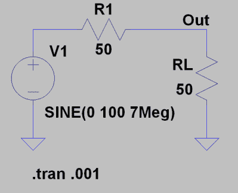
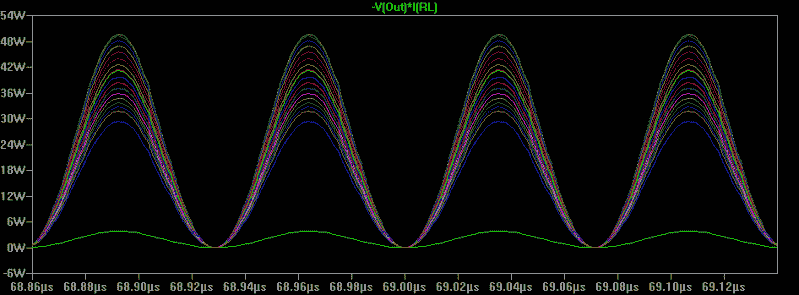
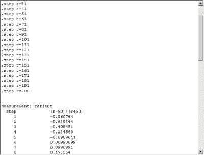
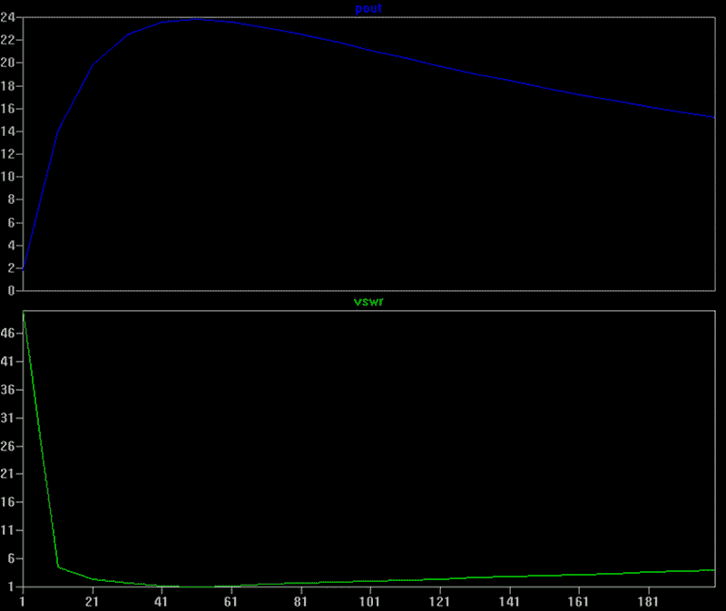
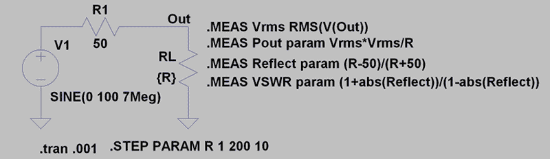

# 电路 VR:使用 LTSpice 测量

> 原文：<https://hackaday.com/2018/08/23/circuit-vr-measuring-with-ltspice/>

通常，在 Circuit VR 中，我们会通过仿真详细了解一些电路，通常是 LTSpice。这一个将有点元，因为我想看看 LTSpice 中的一个功能，讽刺的是它非常有用，但不经常使用。不过，在这个过程中，我们将了解当源阻抗与负载阻抗匹配时，为什么能获得最大的功率传输。这一点你可能已经知道了，但是如果你知道如何哄骗 lt spice——没有双关语的意思——向你展示一个有意义的图形，那么在模拟中观察是很有趣的。

电路超级简单。一个交流电源和一个 50 欧姆电阻替代 40 米的火腿发射机。把 100 伏的电压加到 50 欧姆的负载上。到目前为止，一切顺利。

如果观察峰值输出电压和电流，会发现负载为 50V(电源的一半),当然，对于 50 欧姆的负载，1A 电流总计为 50 瓦。如果你计算均方根电压，你可以很容易地找到均方根功率，以及(25 瓦)。如果您在原理图上使用 Alt+Click，Spice 甚至会为您绘制功率图——这需要在一些 Linux 设置上进行一些重新配置，Alt+Click 会执行其他操作。您也可以绘制一个表达式，如下所示:

`V(Out)*I(RL)`

不好的部分是结果图有一个非常固定的格式:一些参数对时间。当然，你可以在 Y 轴上做数学运算，但是你总是在和时间赛跑。当您只有一个模拟时，这并不坏，但如果您想要查看不同值之间的天线负载呢？

## 比较模拟

很容易设置 Spice 来进行多次模拟以进行比较。只需将 RL 的值从 50 更改为{R}，并将以下行作为 Spice 指令添加到原理图的某个位置(您可以按 S 键或从“编辑”菜单或工具栏中选择它来完成此操作) :

`.STEP PARAM R 1 200 10`

这告诉 Spice 以 10 欧姆的步长从 1 到 200 改变 R。现在剧情一塌糊涂，就算放大看。

在 LTSpice 中，你可以右键单击图形，选择一个或多个步骤来完成，但是当你有很多步骤时，那就是一个噩梦。此外，这是一个容易发现的趋势，但最好有一个功率与 RL 的关系图。

答案是。MEAS 或。MEASURE 语句(喜欢的话可以缩写，但也可以用全词)。实际上有两种形式的。MEAS 命令。第一个函数计算单个值。如果你使用一个模拟值，它只会拉最新的一个，但因为只有一个值可能不是你想要的。但是，在我们的例子中，我想知道 SWR 是什么。MEAS 命令正适合这种情况。

## SWR:驻波比

反射系数取这个命令:

`.MEAS Reflect param (R-50)/(R+50)`

这是可行的，因为 R 在一次模拟运行中不会改变，param 关键字告诉 Spice 寻找这种变量。反射就像一个变量名。可能是任何事。

那么计算 VSWR(电压驻波比)就很容易了:

`.MEAS VSWR param (1+abs(Reflect))/(1-abs(Reflect))`

这些测量数据(反射和 VSWR)将显示在 Spice 错误日志中，即使它们不是错误。您可以从“视图”菜单中查看它，或者只需按 Control+L。

你可以看到 r 的每一步都有一个值，这不是一个很方便的格式，但是我们马上会做得更好。

## 香料力量

为了比较功率，我们将得到每次运行的均方根功率。这是. MEAS 的第二种形式。您可以进行某些操作来查看运行的所有模拟数据，并对其进行计算，再次将其压缩为一个数字。在我们的例子中，我们将使用 RMS:

`.MEAS Vrms RMS(V(Out))`

`.MEAS Pout param Vrms*Vrms/R`

注意，您可以使用 Spice 指令命令同时输入这两个参数。只需按 Control+Enter 为每个指令开始一个新行。如果您愿意，也可以一次输入一个。此外，不要忘记在你设置好文本后，你还必须把它放在原理图上。现在，如果你运行模拟，你会有一个 Vrms 和 Pout 的数据表，以及反射和 VSWR。

## 事情变得复杂了

现在你真正想要的是得到一个权力和 VSWR 对抗抵抗的情节。为此，您必须调出错误日志(Control+L)。然后右键单击日志。如果你有。MEAS 语句，将出现一个菜单项，显示“绘图”。迈步走了。meas 数据。”打开它会给你一个空白的绘图窗口。

你可以右键点击添加跟踪，你会看到那里的数据:反射，VSWR，Pout，和 Vrms。您可以像添加任何其他情节一样添加它们，并使用它们做通常的事情。但是 X 轴将是步长值，就像我们想要的那样。这是一个分成两个窗格的图，显示了 VSWR 和功率。正如您所料，在 50 欧姆时，VSWR 为 1(表示 1:1)，这也是您获得峰值功率的地方。

有一个警告。与普通图不同，以这种方式生成的图在重新运行模拟时不会更新。如果您重新运行模拟，您必须手动重新创建情节。顺便说一句如果你只是想。测量数据，并且您正在执行许多步骤，您可以通过[不保存所有数据](http://ltwiki.org/index.php?title=SAVE_Limit_the_amount_of_saved_data)来减少等待时间。如果您清除了正常的绘图窗格，这样就不会花太多时间来重画，这也会有所帮助。

这是最终的原理图。你可以照常从 [GitHub](https://github.com/wd5gnr/circuitvr/tree/master/measure) :  下载文件

## 然后…

还有很多关于。MEAS 命令。您可以让它在满足特定条件时选择一个值，或者选择一个值范围。除均方根值外，您还可以获得平均值、最小值、最大值和峰峰值。您还可以打印出单个值，这在您需要某个值时非常有用。您也可以使测量只对特定类型的分析有效(如 DC 或 TRANS)。你可以在帮助页面的[上阅读所有细节。但是我发现我很少使用这些功能，因为现在所有的东西都在屏幕上绘制。](http://ltwiki.org/LTspiceHelpXVII/LTspiceHelp/html/DotMeasure.htm)

顺便说一下，我们之前已经讨论过一些关于阻抗匹配的内容。在这种情况下，结果不如让 LTSpice 创建正确情节的方式有趣。我们之前看了[基本相同的电路](https://hackaday.com/2016/02/29/spice-power/)(在 DC，没有漂亮的图形)，很久以前讨论过戴维宁等效(这是一个例子)。