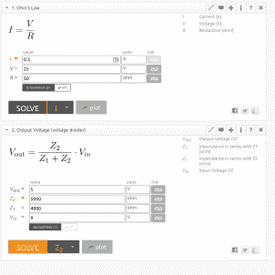
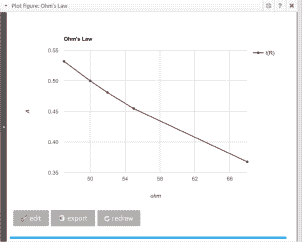
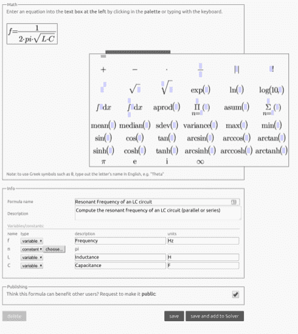

# FxSolver 是工程师的数学笔记本

> 原文：<https://hackaday.com/2018/08/06/fxsolver-is-a-math-notebook-for-engineers/>

如果你喜欢依靠网络来做你的电子和计算机数学，你会想要书签 [FxSolver](https://www.fxsolver.com) 。它从电子学、计算机科学、物理学、化学和力学等学科收集了大量的公式。也有经典的数学公式。

当你第一次点击该页面时，你会看到一条消息，提示你的求解器当前为空。左边有一个侧边栏和一个搜索框。首先，试着搜索一些你知道会用到的东西。我们做了欧姆定律和分压器，最后得到了一页自定义的计算器。

计算器可以以表格或类似电子表格的格式获取数值。您可以保存工作表并在以后恢复它。如果您提供一个值列表，它可以为您绘制结果。例如，下图显示了在 25V 电压下改变 50 欧姆左右的电阻时的情况。

      

图表左侧的箭头打开一个菜单，您可以在其中自定义图。尽管单位下拉列表显示的是 MA(毫安)和 mA(兆安培)，但每次我们尝试毫安时，它都会恢复为兆安培。另一方面，您可以将计算器分组，并显示或隐藏分组。

然而，真正有趣的是，如果你愿意，你可以创建自己的公式。例如，我们没有看到 LC 电路的谐振频率，所以我们编造了一个。

一旦创建了公式，您就可以让它求解任何值。另一件有趣的事情是，你可以将一个公式的结果与另一个公式联系起来。然而，实验导致了一些奇怪的结果。即使在断开公式后，似乎仍有一些事情在进行。

然而，我们找不到一种方法来创建一个可以轻松创建列表的公式，尽管我们可能只是错过了它。例如，最好有一个公式，以 100 Hz 为步长生成 100 Hz 到 10000 Hz 的频率，而不必键入整个列表。然后你可以用墨水把那个公式涂到另一个公式上。另一方面，在电子表格模式下，您可以将电子表格中的数据复制到计算器中。

这不会和 [Wolfram Alpha](https://hackaday.com/2018/08/01/wolfram-alpha-electronic-tips/) 竞争，但还是有用的。当然，如果你想[把你的旧 TI 计算器转到网上](https://hackaday.com/2013/01/03/web-based-ti-graphing-calculator-emulator/)，也有一种方法可以做到。