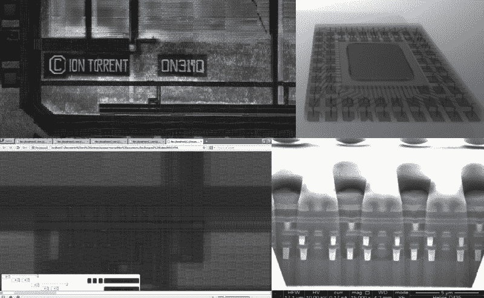

# DNA 测序仪的逆向工程

> 原文：<https://hackaday.com/2018/08/09/reverse-engineering-a-dna-sequencer/>

在过去的十年中，方法学的改进大大降低了 DNA 测序的成本。2007 年，为一个基因组测序花费了大约 1000 万美元。今天，有些服务只需 1000 美元就能做到。如果你只是想检查自己的 DNA，这还不错，但如果你想在家庭实验室里用 DNA 做实验，这就太贵了。你可以购买自己的桌面测序仪，省去中间人，但它们的价格在 50，000 美元左右。有点超出实验者的预算，除非你是托尼·斯塔克。

 但是多亏了【亚历山大·索科洛夫】令人难以置信的工作，无畏的黑客也许有一天能够[在他们的实验室里放一个 DNA 测序仪，只需要一个像样的示波器](https://hackaday.io/project/160183-dna-sequencer-in-the-home)。这一突破是黑客两个经典消遣的结果:逆向工程和翻垃圾箱。他意识到，台式基因组测序仪的繁重工作是在制造商认为是一次性的传感器矩阵中完成的。在找到一个废弃传感器的来源进行实验后，他不仅能找出如何读取它们，还能让它们恢复活力，这样他就可以引入新的样本。

首先，[亚历山大]必须弄清楚这些“一次性”传感器是如何工作的。他知道它们在原理上类似于数码相机的 CCD 传感器；但是，它们并没有对光做出反应的细胞，而是读取 pH 值的变化。该芯片包含 1000 万个这样的 pH 细胞，每一个都需要被单独读取数百次，以获取完整的 DNA 序列。

在一些有硅逆向工程经验的朋友的帮助下，借助 x 光机和合适的光学显微镜，他最终弄清楚了传感器矩阵的电学工作原理。然后，他设计了一个板来读取传感器，并通过串口将 DNA 样本的“图片”转储到他的计算机中。

一旦他能够可靠地读取传感器，项目的下一阶段是找到一种方法来清洗旧样本，以便可以重新加载。[Alexander]尝试了不同的方法，经过几次清洗和读取循环后，他确定了更新传感器的过程，使其性能基本上与新的传感器相匹配。他目前正在开发他的下一代阅读器硬件，我们非常有兴趣了解这个项目的进展。

这不是我们[在 Hackaday](https://hackaday.com/2017/08/28/cheap-and-easy-magnetic-dna-separation-method-needs-your-help/) 上看到的第一件 [DIY DNA 硬件](https://hackaday.com/2016/05/03/dna-extraction-with-a-3d-printed-centrifuge/)，当然也不会是最后一件。不管你喜不喜欢，[黑客们正式开始摆弄基因组](https://hackaday.com/2015/11/08/indiegogo-project-offers-dna-editing-for-the-home/)。