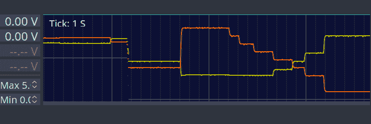
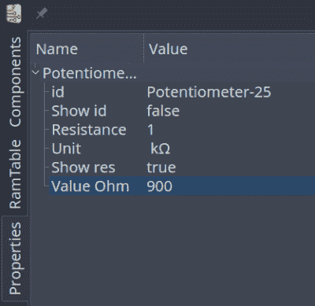
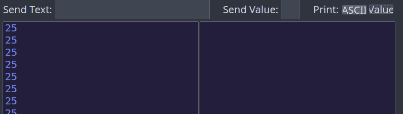
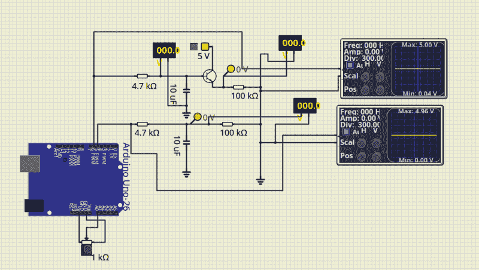

# 模拟没有云的 PIC 和 Arduino/AVR 设计

> 原文：<https://hackaday.com/2018/08/22/simulate-pic-and-arduino-avr-designs-with-no-cloud/>

我一直很欣赏模拟工具。当然，没有什么可以替代实际构建一个电路，但如果你能在开始焊接和制作 PCB 之前解决许多简单的问题，这肯定会很方便。我在 LTSpice 上发了不少帖子，我也是浏览器中法尔斯塔德模拟器的忠实粉丝。然而，如果微控制器是设计的主要部分，这两者都没什么用。我最近发现了一个名为 [Simulide](https://simulide.blogspot.com/p/blog-page.html) 的开源项目，它有一些问题，但在混合仿真方面做得很好。它允许您模拟模拟电路，液晶显示器，步进电机和伺服电机，并可以包括可编程 PIC 或 AVR(包括 Arduino)处理器在您的模拟。

该软件可用于 Windows 或 Linux，并内置了 AVR/Arduino 仿真。对于 Linux 上的 PIC，您需要一个易于安装的外部软件模拟器。这是 Windows 版本提供的。您可以在下面看到几个关于该工具旧版本的视频之一。还有一个窗口可以编译你的 Arduino 代码，甚至可以调试它，尽管这几乎总是在我工作几分钟后崩溃。正如你在上面的图片中所看到的，只要你不调试，它就能够运行一些非常严重的 Arduino 代码。

看起来和听起来都很刺激，对吧？是的，但是一定要经常存钱。在 Linux 下，即使你没有调试，它似乎也经常崩溃。它还存在其他小问题，比如有时会忘记如何移动组件。保存、关闭应用程序并重新打开它似乎可以解决这个问题。此外，我们假设他们会在报告错误时将其粉碎。我的一个主要问题是通过移除默认的(旧的)Arduino IDE 并确保最新的在路径上解决的。但是崩溃是频繁的，似乎多少有些随机性。似乎我在 Linux 上经常死机，偶尔会死机，但在 Windows 上它会死机，但不会完全死机。

## 基本操作

基本的操作和你预期的差不多。该窗口大致分为三个窗格。默认情况下，最左边的窗格显示组件面板。您还可以使用左侧的垂直标签条来选择内存查看器、属性检查器或文件浏览器。

中间的窗格是你可以画电路的地方，它看起来像一张带网格的黄色工程纸。顶部是文件按钮，可以保存和加载文件。

您将在最右边的面板上方看到一行类似的按钮。这是一个代码编辑器和调试窗口，可以与 Arduino IDE 接口。看起来它也可以与 PIC 的 GCBasic 接口，虽然我没有尝试过。

将元件从左侧拖动到线路上。接线不是一个独特的操作。您只需让鼠标在连接上浮动，直到光标画十字。单击并拖动到连接点，然后再次单击。有时程序忘记做十字光标，然后我不得不保存并重启。

 [https://www.youtube.com/embed/G0RmrOge6tY?version=3&rel=1&showsearch=0&showinfo=1&iv_load_policy=1&fs=1&hl=en-US&autohide=2&wmode=transparent](https://www.youtube.com/embed/G0RmrOge6tY?version=3&rel=1&showsearch=0&showinfo=1&iv_load_policy=1&fs=1&hl=en-US&autohide=2&wmode=transparent)


大多数组件都是您认为的那样。有一些有趣的包括键盘，LED 矩阵，文本和图形液晶显示器，甚至步进电机和伺服电机。你还会发现几个逻辑功能，7400 系列集成电路，还有注释工具，如文本和底部的方框。你可以右击一个类别，隐藏你不想看到的组件。

在顶部，您可以在电路中添加电压表、电流表或示波器。示波器没那么有用，因为它很小。你真正想做的是使用探针。这只是显示某一点的电压，但您可以右键单击它，并将探针添加到屏幕底部显示的绘图仪。这是一个更有用的范围选项。

[](https://hackaday.com/wp-content/uploads/2018/08/scope.png)

 [https://www.youtube.com/embed/4RwjZUXs9YU?version=3&rel=1&showsearch=0&showinfo=1&iv_load_policy=1&fs=1&hl=en-US&autohide=2&wmode=transparent](https://www.youtube.com/embed/4RwjZUXs9YU?version=3&rel=1&showsearch=0&showinfo=1&iv_load_policy=1&fs=1&hl=en-US&autohide=2&wmode=transparent)


[](https://hackaday.com/wp-content/uploads/2018/08/pot.png) 有几个怪癖的成分。电压源有一个默认关闭的按钮。你必须记得打开它，否则事情不会很好地工作。电位计尤其令人沮丧。旧版本的视频显示了一个漂亮的小电位计旋钮，它也出现在我的 Windows 笔记本电脑上。在 Linux 上，电位计(和示波器控件)看起来像一个小小的操纵杆，很难设置一个值。右键单击并选择 properties 并在那里调整值更容易。请注意，在您离开该字段之前，该值不会改变。

## 微控制器特性

如果只是这样，你最好使用我们之前讨论过的模拟器。但这里最大的吸引力是能够在电路中放置一个微控制器。系统提供 PIC 和 AVR CPUs，这些 CPU 受到它所使用的模拟器代码的支持。Arduinos 也有四种变体:Uno、Nano、Duemilanove 和 Leonardo。

你可以使用内置的 Arduino IDE——只要确保你的路径上有真正的 Arduino 软件并且是最新版本。此外，与真正的 IDE 不同，似乎您必须在下载或调试注意到更改之前保存文件。换句话说，如果你做了一个修改并下载，如果你没有先保存文件，你将在修改前编译代码。你不必使用内置的 IDE。你只需右击处理器并上传一个十六进制文件。最近的 Arduino IDEs 有一个导出十六进制文件的选项，并且没有任何问题。

当您的设计中有一个 CPU 时，您可以右键单击它并打开一个串行监控端口，它会在屏幕底部显示虚拟串行输出，并让您提供输入。

[](https://hackaday.com/wp-content/uploads/2018/08/term.png)

调试模式很简单，但是一直工作到崩溃。即使没有调试，在屏幕的左边也有一个选项来观察 CPU 内部的内存位置和寄存器。

总的来说，Arduino 模拟似乎工作得很好。在某些规模下，连接 Uno 引脚有点困难，我不止一次不小心连接错了引脚。我觉得奇怪的一点是，你不需要把电压接到 Arduino 上。即使你不连接它，它也是通电的。

除了崩溃，我遇到的另一个问题是模拟速度相当慢。屏幕顶部有一个计量器，显示模拟与实时相比有多慢，我的大部分时间都很低(10%左右)。有一个帮助主题解释说，这取决于您是否有某些电路元件和方法来提高运行时间，但这还不够糟糕，我懒得去探索它。

我的第一个想法是，由于调试和串行监视器都是为单个 CPU 设置的，所以很难处理一个有多个 CPU 的电路。然而，正如下面的视频所示，您可以运行该程序的多个实例，并通过串行端口连接它们。唯一的问题是，如果您有一个电路，其中两个 CPU 都与相关电路接口(例如，一个运算放大器将两个信号相加，每个信号来自一个 CPU)。

 [https://www.youtube.com/embed/WVBgmah6gE0?version=3&rel=1&showsearch=0&showinfo=1&iv_load_policy=1&fs=1&hl=en-US&autohide=2&wmode=transparent](https://www.youtube.com/embed/WVBgmah6gE0?version=3&rel=1&showsearch=0&showinfo=1&iv_load_policy=1&fs=1&hl=en-US&autohide=2&wmode=transparent)


## 简单的例子

作为实验，我创建了一个使用 Uno 的简单电路。它产生两个 PWM 信号，将它们与 RC 电路集成，然后驱动负载或通过双极射极跟随器驱动负载。pot 可让您设置互补的 PWM 百分比(即，当一个百分比为 10%时，另一个百分比为 90%)。电路是这样的:

[](https://hackaday.com/wp-content/uploads/2018/08/cir.png)

以及非常简单的代码:

```

int v;

const int potpin=0;
const int led0=5;
const int led1=6;

void setup() {
Serial.begin(9600);
Serial.println(&quot;Here we go!&quot;);
}

void loop() {
int v=analogRead(potpin)/4;
Serial.println(v);
analogWrite(led0,v);
analogWrite(led1,255-v);
delay(250);
}

```

请注意，如果驱动晶体管的 PWM 输出降至 0.7V 左右以下，晶体管将关闭。我故意不围绕这一点进行设计，因为我想看看模拟器会有什么反应。它正确地模拟了这种行为。

除了我想要一个既能模拟电路又能模拟 Arduino 的东西之外，这真的没有什么意义。你可以从 [GitHub](https://github.com/wd5gnr/simuide-demo) 下载所有文件，如果你想跳过编译步骤，包括 hex 文件。

如果使用屏幕右侧的内置 IDE，那么事情就非常简单了。你只需下载你的代码。如果你建立自己的十六进制文件，只需右击 Arduino，你会发现一个选项来加载一个十六进制文件。它似乎记住了十六进制文件，因此如果您稍后再次运行模拟，您不必重复该步骤，除非您移动了十六进制文件。

但是，IDE 不会记住绘图仪、电压开关或串行终端的设置。你尤其需要确保晶体管上方的 5V 电源开关是打开的，否则那部分电路将无法正常工作。您可以右键单击 Arduino 以打开串行监视器，右键单击探针以返回绘图仪窗格。

窗口顶部的红色电源开关将启动您的模拟。上面的截图显示了绘图窗格和串行监视器的特写。

## 经验教训

这可能是一个真正伟大的工具，如果它不会崩溃这么多。平心而论，这可能与我的电脑有关，但我认为这并不能完全解释所有的问题。然而，该软件仍处于相当早期的开发阶段，所以也许它会变得更好。也有很多适合和完成的问题。例如，在我的大显示器上，许多字体对于它们的容器来说太大了，这并不奇怪。

用户界面似乎有点笨拙，尤其是当你不得不操纵电位计和开关的时候。此外，请记住，您不能右键单击控件，而必须单击底层组件。换句话说，这个锅看起来就像电阻上的一个旋钮。右键需要点击电阻部分，而不是旋钮。我还对不能在组件值中直接输入乘数后缀感到有些不快。也就是不能输入一个电阻值为 1K 的。您可以输入 1000，也可以输入 1，然后在单独的字段中将单位更改为 Kohms。但这没什么大不了的。如果它不再崩溃，你会习惯这一切的。

我真的希望调试功能能够工作。虽然您可以直接使用 simuavr 或其他工具进行调试，但您无法像使用该工具那样轻松模拟所有 I/O 设备。我希望未来会变得更加强大。在 Linux 下，它可以工作一会儿，然后崩溃。在 Windows 上，我从来没有让它工作过。

正如我经常说的，虽然模拟很棒，但真实世界经常会带来模拟中没有出现的惊喜。尽管如此，在你着手加热烙铁或拉出试验板之前，模拟可以帮助你解决许多问题。Simuide 有潜力成为一个伟大的工具，来模拟我们在 Hackaday 上最常见的那种设计。

如果你想探索其他模拟选项，我们已经谈论了很多关于 [LTSpice](https://hackaday.com/2016/02/26/adding-spice-to-your-workbench/) 的内容，包括我们的 [Circuit VR](https://hackaday.com/2018/05/03/circuit-vr-sink-or-swim-with-current-sources/) 系列。还有优秀的基于浏览器的[法尔斯塔德](https://hackaday.com/2015/07/20/a-breadboard-in-a-browser/)模拟器。