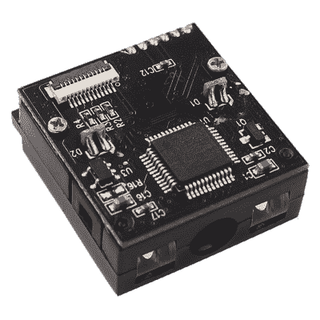
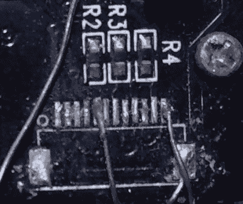
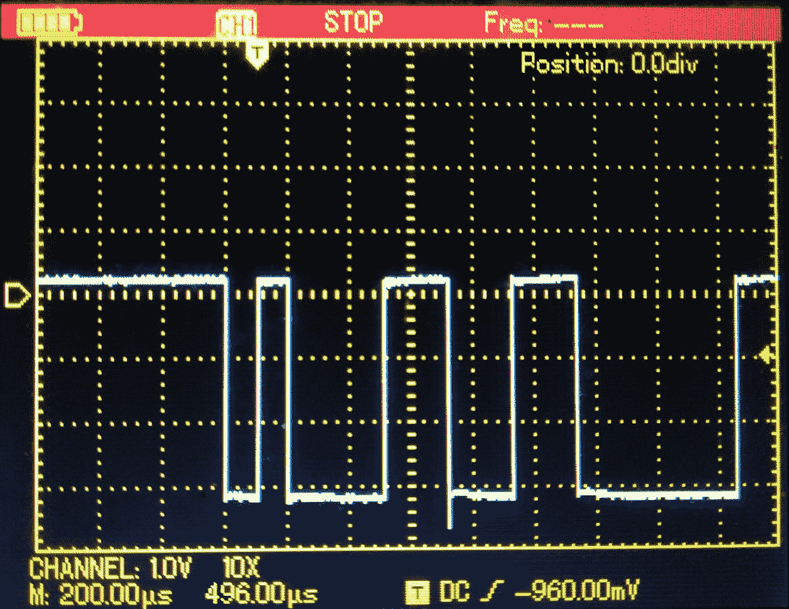
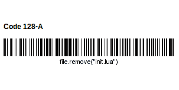
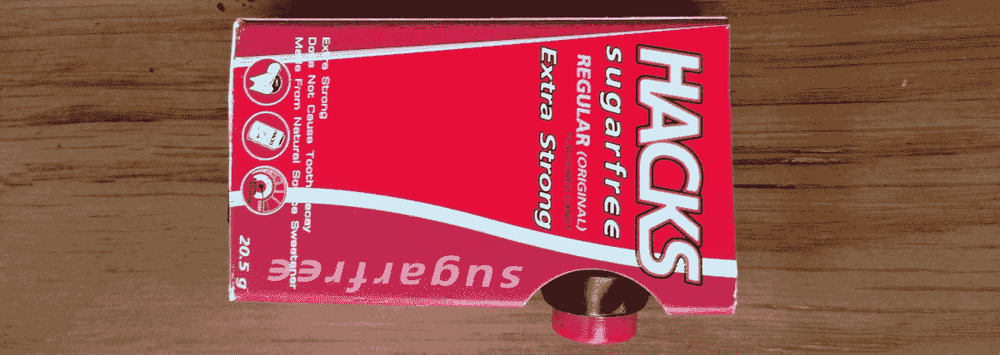

# 使用物联网条形码扫描仪随时随地跟踪一切

> 原文：<https://hackaday.com/2018/08/15/track-everything-everywhere-with-an-iot-barcode-scanner/>

我一直认为条形码是那些深刻改变世界的无形创新之一。我们可能认识到的现代条形码最初是作为铁路和零售行业的一种节省劳动力的设备而设计的，但很快被工厂用于自动化，医院用于防止用药错误，以及各种其他行业用于跟踪商品的流动。


Medication errors in hospitals are serious and scary: enter the humble barcode to save lives. Source: [The State and Trends of Barcode, RFID, Biometric and Pharmacy Automation Technologies in US Hospitals](https://www.ncbi.nlm.nih.gov/pmc/articles/PMC4765644/)

这项技术是可行的，因为你真正需要的是一台打印机来制作条形码。如果你已经在为一个产品印刷包装，只需要花费你的墨水，或者一个小标签。条形码无处不在，以至于我们不再注意它们；作为一个实验，我花了一点时间在我的(杂乱的)桌子上数了数它们——我找到了 43 个，可能没有全部找到。

尽管如此，我只在一个项目中使用过它们:我的一个顾问兼朋友让我从他相当丰富的库中建立一个参考数据库。2011 年，我有一台带摄像头的平板电脑，用它把 ISBN 条形码扫描成一份清单。该列表用于获取自动输入对简单数据库的引用所需的信息，我所要做的就是快速验证它是否正确。

虽然这节省了我很多时间，但我了解到，当你有很多条形码要处理时，使用平板电脑或智能手机摄像头扫描条形码实际上非常麻烦。因此，我研究了如何在不倾家荡产的情况下构建一个强大的条形码系统。



Source: [IoTMaker.vn](https://iotmaker.vn)

## 让黑客骄傲的条形码阅读器

banggood 或 DX 的专用条形码扫描仪价格约为 20 美元，是一个显而易见的解决方案，但那会很无聊。我还想要一个更强大的设备:一个可以直接连接到互联网的条形码扫描仪，这样我就可以在没有任何其他硬件的情况下集中在线跟踪事情。虽然这个想法并不是独一无二的，但它仍然困扰着我。最近，我看到一个微型条形码扫描模块(优酷 E1005)以 17 美元出售，没有数据表，我知道游戏开始了。

扫描仪模块本身非常紧凑，非常适合制作方便的设备。它有一个通用的无标签 MCU 和一个 12 针带状电缆连接器。供应商告诉我它支持 Code 39 条形码(没错，但它实际上支持更多！)，并有 USB 和 TTL 输出。是时候解开这个模块了！

## 剖析条形码硬件



Not my finest soldering job.

从逻辑上讲，12 个引脚中的一些将是电源、接地、USB 数据线和 TTL 串行输出。通常，这些模块用于构建手持式条形码扫描仪，因此也需要按下触发器来激活扫描仪。第一步是拆下连接器，这样我就可以接触到下面的焊盘。

下一步是确定电源和接地。接地非常容易，因为有几个元件连接到明显是接地层的地方。电源引脚更硬，但有一个 IC 看起来像 SOT-753 封装的稳压器。给定公共引脚排列，使能和电压输入引脚都连接到一个焊盘。

有可能的电源和接地输入，我连接 3.3v 的电路。什么都没发生，这是意料之中的，因为我还没有找到触发装置的触发销。最简单的方法是快速将每个剩余的焊盘接地，并查看触发器是否属于“低电平有效”类型。事实证明是这样的，设备的 LED 灯亮起，表示可以扫描了。

## 理解这一切

| 别针 | 功能 |
| Two | VCC |
| three | GND |
| five | 谢谢 |
| Twelve | 引发 |

最后一步是找到 TTL 输出。事实证明这非常简单，因为我可以强制设备扫描条形码。我拿了一个任意的条形码，一边看着示波器上不同的引脚一边扫描。当我找到输出时，我捕获了它，以便以后可以确定波特率。我找到的最后一个引脚在右边。扁平电缆连接器焊盘相当密集，所以我尽可能将电线焊接到与相关焊盘相连的元件上，而不是焊盘本身。

在扫描条形码并在示波器上捕捉输出后，我看到最短峰值的持续时间刚刚超过 100μs。这相当于每秒略低于 10000 位的频率。最接近的普通波特率是 9600 波特，所以这可能是我们的 TTL 波特率。现在，我们已经获得了将条形码扫描仪模块连接到微控制器所需的所有信息，在我们的示例中，微控制器是运行 NodeMCU 的 ESP8266。



The first peak has the shortest duration in the sequence, at about 105μs. A reasonable baud rate to try is the closest common one to 1s/105μs = 9523 baud, which is 9600 baud.

我们的代码非常简单:将 UART 速度更改为 9600 波特，当接收到任何数据时，连接接下来 150 毫秒的数据并将其打印出来。记住将你的开发工具(例如 [ESPlorer](http://esp8266.ru/esplorer/) )的波特率也设置为 9600。

```

-- Setup UART and print something so we know it's working

uart.setup(0, 9600, 8, uart.PARITY_NONE, uart.STOPBITS_1, 0)
print(&quot;Scanning&quot;)

-- Set up a couple of variables so they're not nil

data = &quot;&quot;
datac = &quot;&quot;

-- This function prints out the barcode data and clears all variables so the scanner can read a new barcode. If you wanted to send the data over MQTT, your code would replace the print statement here.

function finish()
    print(datac)
    data = &quot;&quot;
    datac = &quot;&quot;
end

-- This function concatenates all data received over 150 milliseconds into the variable datac. The scanner sends the data in multiple parts to the ESP8266, which needs to be assembled into a single variable.

uart.on(&quot;data&quot;, 0, function(data)
    tmr.alarm(0,150,0,finish)
    datac = datac .. data
end, 0)

```

这工作得很好，能够阅读各种类型的条形码没有问题。将它连接到互联网上的服务器是非常容易的，要么直接通过 MQTT，要么使用物联网仪表板[。如果你需要的话，](http://hackaday.com/2017/10/31/review-iot-data-logging-services-with-mqtt/)[甚至可以实现加密和认证](http://hackaday.com/2017/06/20/practical-iot-cryptography-on-the-espressif-esp8266/)。

## 自定义技巧现在向我们开放



一个有趣的事实是，NodeMCU 能够执行串行输入，因此请确保关闭该功能(uart.setup 行末尾的 0)。否则会有人带着右边的条形码过来。通常的预防措施也适用于后端。你甚至可以在硬件层面过滤掉有问题的字符，这将是很好的。当然，如果你够聪明，这可能是一个特性，而不是一个漏洞。

我对这种条形码扫描仪没有特定的使用案例，但如果能看到有人在云销售点系统中实现它，让亚洲的小商户在主要以现金为基础的经济中跟踪库存，那就太好了。实际上，这与最初使用条形码扫描仪非常相似——只是没有昂贵的 POS 系统。

最后，在当地的一家便利店，我在货架上看到了这个项目的完美案例。我买的，*里面装的是糖果*！有时我们生活在所有可能的世界中最好的世界:



Fun fact: all my hacks are sugarfree and do not cause tooth decay. The case also comes in an [extra cool](https://www.psangudom.com/candy) variety, but I’m saving that for another day.