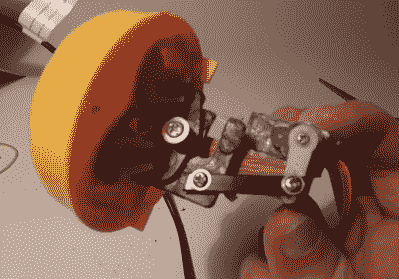

# 可怕的卡拉 ok 机器人托马斯

> 原文：<https://hackaday.com/2018/08/13/thomas-the-terrifying-karaoke-robot/>

垃圾箱可能是灵感的巨大来源，除非你对里面的东西太熟悉而无法想象。但旧货店是另一回事，就像被不被赏识的精灵不断补充的巨大垃圾箱。你永远不知道他们会在货架上堆什么样的好东西，所以很容易成为常客，每周去一次或三次。

[亨特·欧文]经常光顾他家附近的几家精选旧货店，几个月前他发现了一个仿制的托马斯坦克发动机，有一个铰接的脸。它使用一个简单的机制来产生令人印象深刻的运动，特别是对于一个廉价的山寨玩具。它的两只眼睛向旁边滑动，嘴巴张开，从而产生一系列非常生动(也很恐怖)的表情。他感觉到有机会把他的电子机器人梦变成我们其他人唱卡拉 ok 的噩梦燃料，他付了几块钱把它带回家。

 说来也巧，一个 9g 的微型伺服完全贴合在那张吓人的小脸的后面。[亨特]设计了一个轴来转移运动到面部机制，但它几乎立即断裂。不过，我们赞赏他的 B 计划，它包括一个伺服系统的安装块和一个用螺丝连接的扎带电枢。一旦分类完毕，[亨特]在搅拌机里为它设计了一个球状的身体。

这个可怕的火车脸玩具使用 Arduino Leonardo 来读取 MIDI 音符开和关的信息，并在适当的时候张开嘴以流畅的语音合成女低音演唱热门歌曲。休息之后，给自己倒一杯烈酒，欣赏构建/演示视频。

有兴趣自己做吗？[亨特]把所有的文件都放在他的个人主页上。只需 1 美元，您就可以访问代码、synth 文件和 STL 文件。当你在那里的时候，你还可以得到他的[任天堂 LABO 波形卡](https://hackaday.com/2018/04/26/reverse-engineering-nintendo-labo-waveform-cards/)的独家新闻。

 [https://www.youtube.com/embed/IbHfiO7Sy8U?version=3&rel=1&showsearch=0&showinfo=1&iv_load_policy=1&fs=1&hl=en-US&autohide=2&wmode=transparent](https://www.youtube.com/embed/IbHfiO7Sy8U?version=3&rel=1&showsearch=0&showinfo=1&iv_load_policy=1&fs=1&hl=en-US&autohide=2&wmode=transparent)

