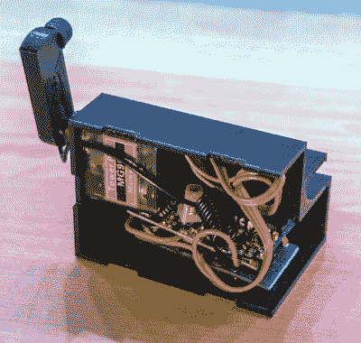

# 一个遥控的 Kindle 翻页器

> 原文：<https://hackaday.com/2018/08/15/a-remotely-controlled-kindle-page-turner/>

Kindle 等电子阅读器的最大优势之一是它没有传统精装书重，更不用说它可以容纳的数千本电子书籍了。如果你在床上看书时把东西掉在脸上，那就更好了。尽管 Kindle 轻巧易用，但你仍然需要把它握在手中，像婴儿玩具一样与它互动。

 为了寻找一种不用举手就能操作 Kindle 的方法，【亚历克斯·迈克斯】设计并制造了一款夹式设备，让使用亚马逊的电子阅读器变得更加简单。按下按钮，[装置敲击屏幕边缘，将书推进到下一页](https://imgur.com/a/tRlvvXg)。后退一页仍然需要你伸出你的手指，但这是你自己的错，因为你阻碍了进步。

3D 打印的外壳装有 Arduino 和 RF 接收器，以及一个小型伺服系统，为空手道斩击动作提供动力。里面没有电池，这意味着该设备需要通过外壳背面的微型 USB 连接保持连接。但是说实话:如果你是那种拥有遥控 Kindle 的人，你可能不会很快离开家。

为了让 Kindle 误以为有人在用手指敲屏幕，翻页机的手臂末端有一个笔尖。3D 打印臂中设计了一个通道，用于将电线从尖端连接到 Arduino 的接地，从而触发电容屏记录触摸。

撇开玩笑不谈，这个想法有望成为一种辅助技术，帮助那些无法举起电子阅读器或操作其触摸屏控制的人。Kindle 放在一个支架上，这个设备夹在侧面，任何可以按下按钮(或以任何他们身体能力范围内的方式触发设备)的人都可以自己看书。对一个通常依赖他人的人来说，这种简单的快乐可以带来巨大的安慰。

在过去，我们已经看到为触摸屏印刷的[物理按钮，以及用于控制触摸屏设备](https://hackaday.com/2018/06/20/print-physical-buttons-for-your-touch-screen/)的 [Arduino。但是这种物理和电子相互作用的特殊组合肯定是一种独特的方式来解决这个问题，而不需要修改目标设备。](https://hackaday.com/2012/05/04/reaching-out-to-a-touch-screen-with-a-microcontroller/)