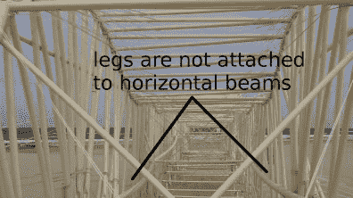
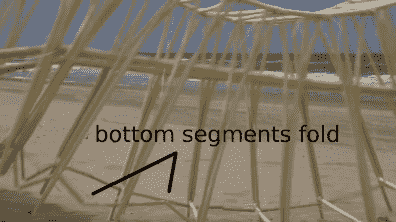

# 西奥·詹森发明了一种更快、更简单、风力驱动的 Strandbeest

> 原文：<https://hackaday.com/2018/08/16/theo-jansen-invents-a-faster-simpler-wind-powered-strandbeest/>

[西奥·詹森]发明了一种有趣的风力驱动的沙滩自行车，它沿着海滩以惊人的速度和优雅奔跑。根据[Jansen]的说法，它“不像经典的 strandbeests 那样有铰接接头，所以它们的接头不会有沙子，你也不必润滑它们。”它被称为 UMINAMI，在日语中[恰当地表示“海洋的波浪”。](https://uminamifarm.wordpress.com/about)

到目前为止，只有一些视频，但从中可以收集到很多信息。为了更容易地跟踪一条腿，我们放慢了速度，并在横幅动画中将其中一条腿涂红。这些腿似乎提供了推力，但向前的运动更可能是由帆提供的。下面的第二个视频显示它被我们更熟悉的那种 strandbeest 拖着走。

以下是对其工作原理的分析和最佳猜测。或者你可以在下面的视频中欣赏它优美的起伏。

这一切是如何联系在一起的？有两组水平梁，横跨 strandbeest 大约一半高度的长度。这些梁的长度是固定的，似乎是为了限制总长度。有两组这样的装置，将波浪从中间分开，这样做可能会使两个部分相互独立地向侧面倾斜

  Interior view  Side view, close-up.

从这里显示的视图中，可以清楚地看到腿可以沿着水平横梁自由滑动。与此同时，顶部的横梁更长，但也更灵活，就像底部两腿之间的小段一样。然而，顶梁保持腿的顶部均匀间隔开，而较小的底部段仅设定相邻腿之间的最大距离，同时折叠起来以允许相邻腿接触。这就是为什么腿只在波浪底部聚在一起。

是什么让它像波浪一样起伏？这是我们从视频中得出的最佳猜测，没有经过实验。当一条腿的底部陷入沙滩时，它的顶部被船帆拉着，导致它的顶部向前转动。当腿陷入沙子中并被拉动时，它也拉开前面的腿，同时压缩后面的腿。压缩必须存在，因为第一条和最后一条腿似乎受到中间水平梁的约束，防止所有腿同时分开。但这只是基于视频分析，可能是错误的。你怎么想呢?我们很想听听你的建议，甚至想看看你自己的起伏不定的 strandbeests。

我们知道 Hackaday 的读者喜欢 strandbeests，因为它们经常出现。我们已经看到它们被用来代替自行车车轮，被建成可骑行的 13 英尺庞然大物 T2，甚至还有仓鼠动力装置 T4。

 [https://www.youtube.com/embed/AXDAuiknzGY?version=3&rel=1&showsearch=0&showinfo=1&iv_load_policy=1&fs=1&hl=en-US&autohide=2&wmode=transparent](https://www.youtube.com/embed/AXDAuiknzGY?version=3&rel=1&showsearch=0&showinfo=1&iv_load_policy=1&fs=1&hl=en-US&autohide=2&wmode=transparent)

 [https://www.youtube.com/embed/LewVEF2B_pM?version=3&rel=1&showsearch=0&showinfo=1&iv_load_policy=1&fs=1&hl=en-US&autohide=2&start=10&wmode=transparent](https://www.youtube.com/embed/LewVEF2B_pM?version=3&rel=1&showsearch=0&showinfo=1&iv_load_policy=1&fs=1&hl=en-US&autohide=2&start=10&wmode=transparent)

感谢[Jack Buffington]通过我们的提示热线提出这个建议。