# DEF CON 26 (vol 1)的所有徽章

> 原文：<https://hackaday.com/2018/08/14/all-the-badges-of-def-con-26-vol-1/>

两三年前，你会在 DEF CON 上看到一些非常有趣的非官方徽章。现在，有大量聪明、漂亮、执行良好的徽章。上周末，我试图看到每一个徽章，并会见每一个徽章制造商。通常，我会发布一个大帖子来展示我所看到的一切，但今年我将它分成几卷。休息之后，请和我一起上传 DC26 令人难以置信的徽章！

## Telephreak 徽章

 [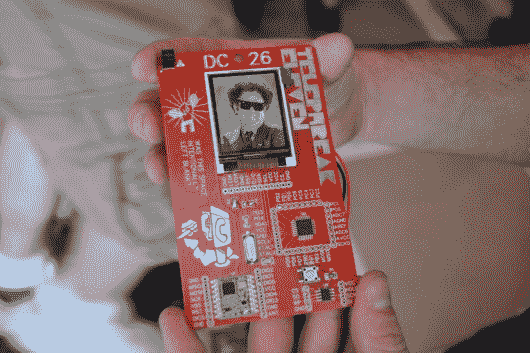](https://hackaday.com/?attachment_id=320487)  [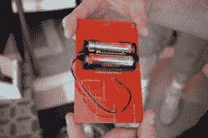](https://hackaday.com/?attachment_id=320489)  [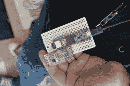](https://hackaday.com/?attachment_id=320488) “Seed” new images wirelessly

DEF CON 上的 Telephreak party 是一个紧密团结的电话通话者团体的聚会，他们在 DC 度过了一个愉快的星期天。你可以通过寻找 Telephreak 徽章在聚会前找到它们，这通常是更有趣的产品之一。今年的徽章也不例外。

这个徽章上的屏幕是我见过的任何徽章上最好看的全彩色屏幕之一。徽章之间可以无线交换照片。一个真正有趣的珍闻是，徽章是通过网状网络交易的(徽章到徽章),随着每次传输，根据邻近程度和信号质量，照片会降级。把它想象成发送传真或传真的传真。非常适合 phreakers！

徽章本身带有 ATmega328 和 915 MHz 分组无线电。其中 140 个都是手工制作的。我认为@dominotree 随身携带的辅助硬件也非常有趣。他用一个天线和一个无线模块来“播种”新图像。阅读更多关于[spin . io](https://spun.io/)上徽章的信息。

## 钢铁兄弟会手表

 [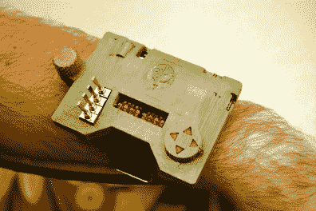](https://hackaday.com/?attachment_id=320615)  [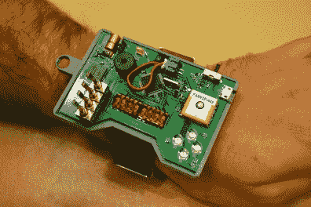](https://hackaday.com/?attachment_id=320617) 

如果你戴着它，它就成了徽章了吗？不管答案如何，这里有一个我在硬件黑客村偶遇的有趣的。它被称为“钢铁兄弟”,因为它是基于辐射中的小男孩。

正如你对腕式多任务器的期望，它能做一点点事情。它有显示信息的红色气泡显示屏，有四个拨动开关和一个数字键盘。关闭外壳后，您可以看到激光二极管、Adafruit GPS 和霍尼韦尔指南针。它运行在恩智浦 ARM 控制器上，由 400 mAh LiPo 供电，位于 PCB 和外壳下部之间。

## 汽车黑客村徽章

[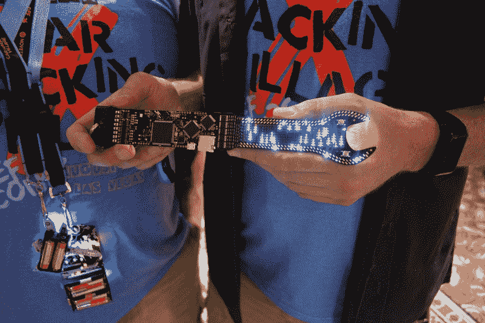](https://hackaday.com/wp-content/uploads/2018/08/26-car-hacking-village-badge.jpg)

[汽车黑客村徽章](https://twitter.com/CarHackVillage)因最不友好的美国运输安全管理局而获得大声疾呼。我在看了一些推特后检查了我的行李，这个徽章看起来像一个扳手，超出了机场安检允许的尺寸。至少有一个被拿出来在机场炫耀过！

[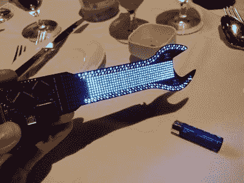](https://hackaday.com/wp-content/uploads/2018/08/img_20180810_213024.jpg) 一端是密不可分的 led 矩阵。环绕棋盘外侧的两行是紫色的。但内部研磨是 RGB——在标准 4 层板上布局 320 个共 0404 个器件！令我特别感兴趣的是，扫描是用五个 595 移位寄存器完成的，你可以在发光二极管的左侧看到一排。板上有三个微控制器，都是恩智浦的；s32、k22 和 s99。除了闪烁之外，你还可以获得 ODB-II，它可以让你使用脚本语言、USB 和 SD 卡来入侵 CAN 总线。

这是他们第四年做汽车黑客村徽章。今年发生了一些不幸，因为他们原来的 PCB 供应商放弃了工作，只在交货前三天告诉他们。看起来一切都很好！

## TwinkleTwinkie 的附加产品

这无疑是徽章拥有自己徽章的一年。2×2 引脚附加标准的引入意味着有大量的人制作简单而有趣的东西挂在引脚插座上。TwinkleTwinkie 无疑是最多产的附加产品生产商。你绝对应该看看[的 Hackaday.io 页面](https://hackaday.io/twinkletwinkie)，但是在上面你可以看到一些我最喜欢的，比如《大绿》、《It 的 Krusty》和《疯狂的猫》。我还听说过一个故事，Twinkle 曾经在印刷行业工作，这就是半色调艺术看起来如此伟大的原因。

## DeLorean 附加产品

[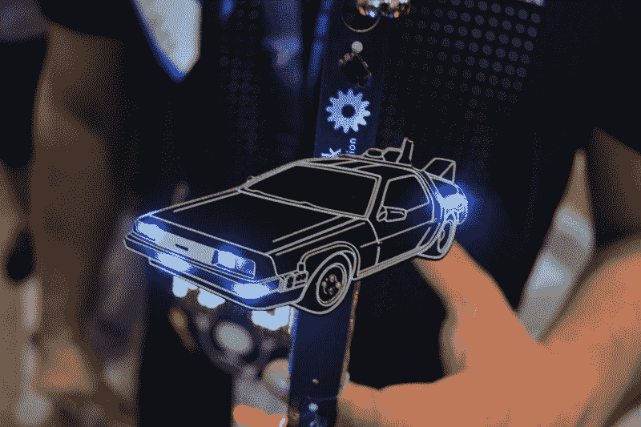](https://hackaday.com/wp-content/uploads/2018/08/08-delorean-sao.jpg)

谁能抗拒抓拍一张德罗宁附加产品的照片呢？这个 DeLorean 附加组件是由@reanimationxp、@tr_h 和@ssldemon 设计的。这也展示了以前用来展示没有徽章的附加品的附加图腾。他们只是通过一对电池提供大约 3 V 的电力。

## lineone 徽章

 [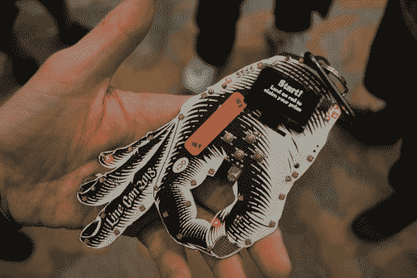](https://hackaday.com/?attachment_id=320590)  [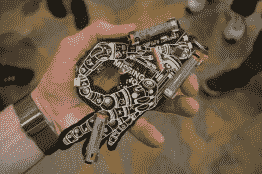](https://hackaday.com/?attachment_id=320592)  [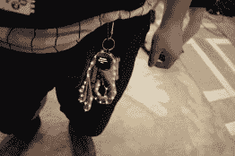](https://hackaday.com/?attachment_id=320589) 

Linecon 徽章是 PCB 上半色调艺术的绝佳范例。尽管 PCB 丝网印刷经常面临相当低的质量/分辨率，但这种技术可以提供美观的电路板。

该板由一个 STM32 驱动，使用一个红外传感器来计算你的手指进入板孔的次数。是的，就像 linecon 一样有趣——排队等待官方 DEF CON 徽章的艺术。还有一个 USB 可用于串行拼图和解锁。

真的很喜欢后面三块电池的定位。通常你只会看到一个 3 芯支架，但这种技术分散了重量和体积。板上的有机发光二极管屏幕是典型的 64×128，围绕徽章的边缘有 30 个 APA102 RGB LEDs 灯。

## 标记

 [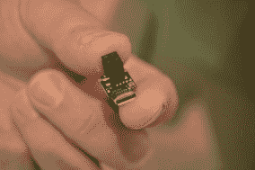](https://hackaday.com/?attachment_id=320605)  [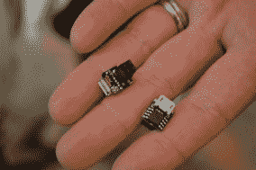](https://hackaday.com/?attachment_id=320604)  [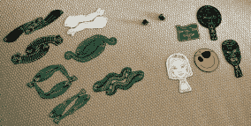](https://hackaday.com/?attachment_id=320606)  [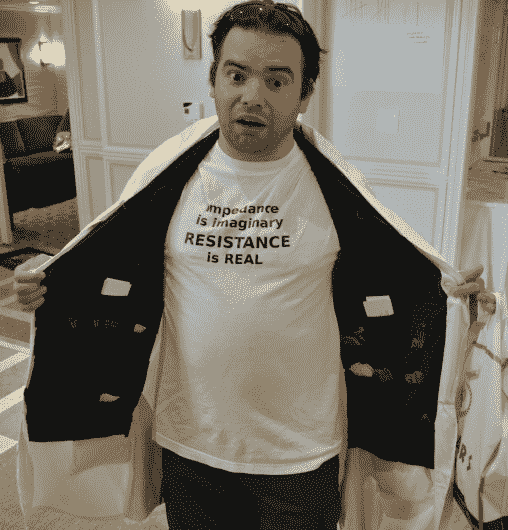](https://hackaday.com/?attachment_id=320607) 

我会称之为“微型”徽章，但我认为乔·菲茨实际上是在说“你”徽章。无论如何，字母 u 表示这是一个小徽章，我可以确认这是最好的。Joe 的徽章基于 Digispark，提供一个 ATtiny85，您可以将其插入 USB 线并自行编程。“徽章”的主体是附加标题本身。

说到附加组件，Joe 用一组令人印象深刻的“手臂”弥补了徽章的拖拉，这些手臂扩展了附加组件标题，并允许多个由 uBadge 供电。Joe 将这些放在 10×10 的网格中，并填充了 11 个面板。那有很多徽章，所以下次你见到他时一定要问他要一个。

## 马内基·猫

 [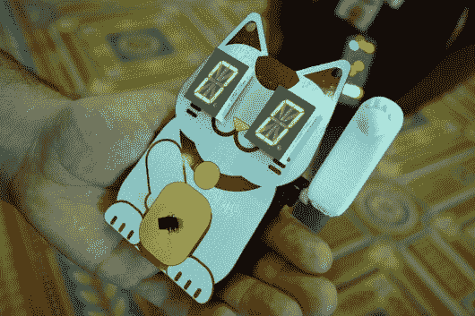](https://hackaday.com/?attachment_id=320661)  [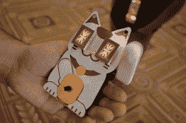](https://hackaday.com/?attachment_id=320662)  [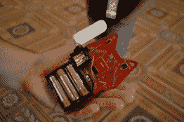](https://hackaday.com/?attachment_id=320677) 

这是我今年看到的两个包含发动机的徽章之一。名木猫徽章的名字包括日语中的招财猫。它会挂在挂绳上，使用 12 段显示屏看着你并眨眼。该挥手的时候，眼睛变成星号，左爪挥几下。

STM32 控制徽章，驱动眼睛和马达。有一个用于 ESP8266 的连接器，但这取决于用户来实现。

## 续第二卷

我们暂时都穿好了衣服。请尽快加入我们的第 2 卷！