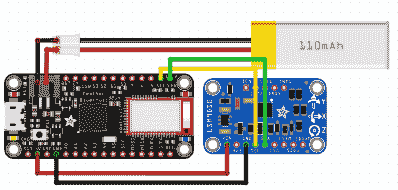

# 欢迎来到剑之网

> 原文：<https://hackaday.com/2018/08/16/welcome-to-the-internet-of-swords/>

这个星球上几乎所有消费电子产品制造商的广告部门都非常清楚地表明:*通过增加传感器和智能手机配套应用程序，一切都得到改善。不管是你的恒温器还是你的马桶，你绝对必须时刻知道它在以最高效率运行。但是，为什么要止步于家用电器呢？有什么比 600 年前的武士武器更适合加入物联网呢？*

 介绍叶卡坦(eKatana)作者【Carlos Justiniano】:[通过在练习剑](https://hackernoon.com/iot-for-ninjas-902c65854ab4)的剑柄上添加微控制器和加速度计，它可以提供剑刃摆动时的运动数据。当准确度和精确度在竞技武士刀表演中很重要时，一把能给你实时反馈的剑可能是一个有价值的训练辅助工具。

eKatana 由 Adafruit Feather 32u4 Bluefruit LE 和 LSM9DS0 加速度计模块以及一个微型 110 mAh LiPo 电池供电。捆绑在一起，它在剑柄的底部形成了一个小而不显眼的包裹。[Carlos]提到某种类型的 3D 打印外壳将是未来合乎逻辑的改进，尽管具有中空手柄以固定电子设备的练习剑可能是最理想的解决方案。

BLE 上空的 Adafruit Feather 实时输出剑的旋转、俯仰和航向，供配套的智能手机应用程序进行分析。目前他只有原始数据的运行输出，但[Carlos]设想了一个完全实现的应用程序，可以为用户提供动作来执行表单并给出反馈。

顺便说一句，这不是我们曾经报道过的第一把[运动检测剑，但是我们认为这个概念的特殊化身可能有更多的实际应用。](https://hackaday.com/2017/02/14/gesture-controlled-sword-of-omens-gives-sight-beyond-sight/)