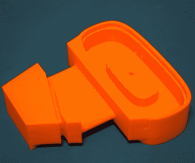
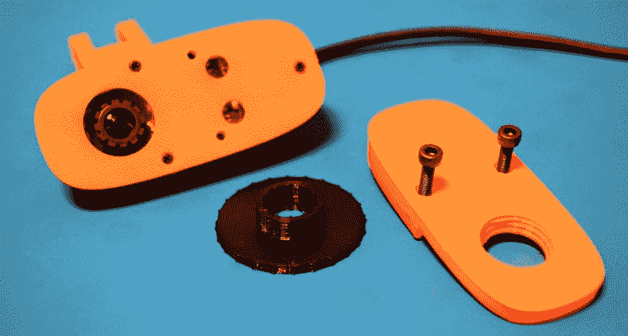
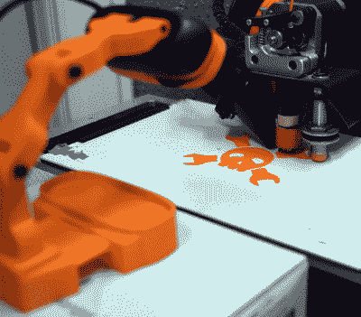

# 打印出来:罗技 C270 转换

> 原文：<https://hackaday.com/2018/09/04/printed-it-logitech-c270-conversion/>

家用 3D 打印机最实际的应用之一是生产替换零件的能力；当你有一台机器可以在几个小时内制造出一个塑料部件的复制品时，为什么要等一个星期才有人给你送来呢？但是如果你的技能和对 PLA 融化气味的热情把你推得更远呢？你可能会从打印替换零件转向设计和制造全新的设备和组件。有争议的是，这可以被认为是“峰值”3D 打印:使用打印机来创建新的设备，否则对于个人来说，通过更传统的方式来制造将是困难的或不切实际的。

一个完美的例子是由[Luc Eeckelaert] 设计的罗技 C270 网络摄像头的奇妙的[整体转换。官方上他称之为“三脚架”，也许这就是设计的开始，但最终产品显然不止于此。它将通常安装在显示器上的罗技相机放在铰接臂上，大大提高了设备的可用性。这种转换甚至包括手动调整焦距的能力，这是原始硬件所不具备的功能。它将价格实惠、随处可得的罗技 C270 变成了一台出色的相机，放在工作台上记录项目，或者指向 3D 打印机的底座。](https://www.thingiverse.com/thing:1228521)

## 比看起来容易

Plenty of support needed for base.

打印 C270 转换中使用的臂段相当容易。这些片段是相当基本的形状，不需要支撑，可以以较厚的层高度印刷，以节省时间，而不会损害任何东西。鉴于每张照片都很小，它们也是相当快的照片。[Luc]将相机支架的设计分解成单独的部分，然后用螺栓固定在一起，使我们避免了打印的潜在噩梦。

另一方面，基地有点棘手。这个想法是让底部中空，这样就可以填充一些东西来增加重量，这意味着需要很多支撑。基座相对较紧的限制也使得移除支撑材料有点痛苦；当我能够在不破坏印刷品本身的情况下将它们全部取出时，我有点惊讶。一个坚固的底座变体将会是当前 STLs 的一个很好的补充，尽管你自然会失去增加额外重量的能力。

[Luc]建议所有部件都填充 20%,考虑到相机相对较轻的重量，这似乎更加合理。就我个人而言，我把它提高到了 35%，因为它对打印时间的影响可以忽略不计，但我不会再提高了。

## 臂组件

 正如我之前提到的，[Luc]明智地利用印后组装使各个部分更容易打印。如果你想设计实用的 3D 打印设备，这是一项需要掌握的优秀技能，但它需要你的打印机校准得相当好。一些零件是摩擦配合的，你可能需要做一点锉削，以确保所有零件配合在一起并平稳移动，特别是如果你的打印机容易过度挤压。

这也意味着你需要一些硬件来把所有的东西放在一起。该设计使用 M3x20 螺钉和匹配的螺母将臂的各个部分固定在一起，并连接实际相机支架的两个独立部分。从技术上来说，你可以打印并拧紧尽可能多的手臂段，以便获得更长的范围，因此相应地扩大硬件要求。

我个人发现，螺丝必须非常用力地拧下来，才能让手臂在相机的重量下保持不动。假设你已经在 PLA 中打印，而不是在过高的填充中打印，这应该不是问题，但是延展性较差的部分可能会折断，所以要小心。

## 焦点调节

如果你只是想要铰接式安装，你可以从技术上跳过这一步，但手动对焦的增加允许你比普通的固定对焦更接近你的目标。你将需要打印额外的部分，以及拆卸相机来完成这一阶段的修改，但如果你已经走到这一步，为什么不呢？

当您从 C270 上取下库存前面板时，三个小十字头螺钉将重新用于印刷更换，因此不要丢失它们。您还需要提供两个 M3x12 螺丝来固定第二个前面板。这两个印刷面板限制了与相机镜头上的齿相匹配的调节轮。

有一点胶水将镜头锁定在适当的位置，但一旦你打破它，它可以自由旋转，所以你可以手动调整焦距。顺便说一下，[Luc]实际上[推荐你使用 Cristiano Gariboldo](https://www.thingiverse.com/thing:1734837)设计的对焦环，因为用户报告说它比他的原始设计更适合镜头。这是我打印的一个，可以确认它工作得很好，虽然它可能会稍微缩小，因为它有点摇晃。

## 对其进行测试

Using the modded C270 with Octolapse

通常当我们做这些“打印出来”的作品时，我们会发现一个有趣的设计，将其打印出来，然后对最终产品进行审查。但在这个案例中，我有点倒退了。我需要一个网络摄像头来写我之前关于 Octolapse 的文章，在研究过程中，我不仅找到了强烈推荐的罗技 C270，还找到了 Luc 的可打印转换套件。它表现得如此之好，以至于我觉得它应该有一个自己的帖子，老实说，我无法想象如果没有它，我将如何使用相机。

以一种奇怪的方式，[Luc]提出的设计让我想起了第一次在 Linksys wrt 54g 上安装 DD-WRT 的时候。它可以让你把一个相对便宜的消费电子产品变成一个功能更强的设备，只需要很少的费用。即使是小的铰接式相机支架的成本也和 C270 一样高，你仍然需要想办法把相机固定在上面。

简而言之:如果你有一台 3D 打印机和一台罗技 C270，这应该是你打印队列中的下一件东西。虽然有几个设计元素我可能会以不同的方式处理，[Luc]为一个已经非常受欢迎的硬件创造了一个绝对必须拥有的配件。