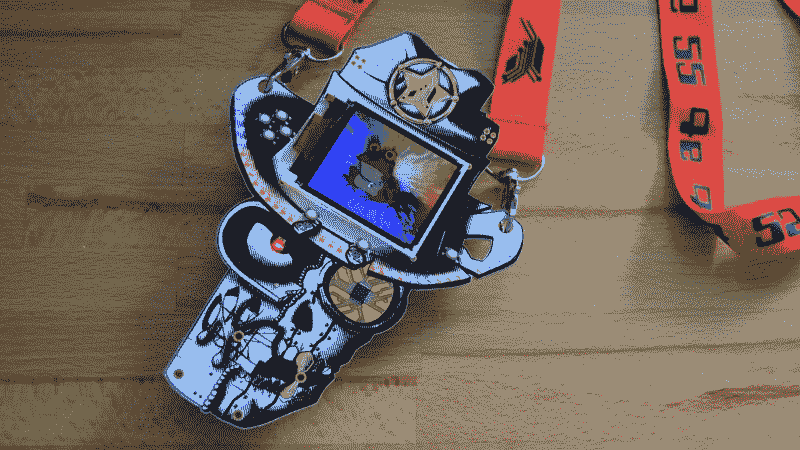
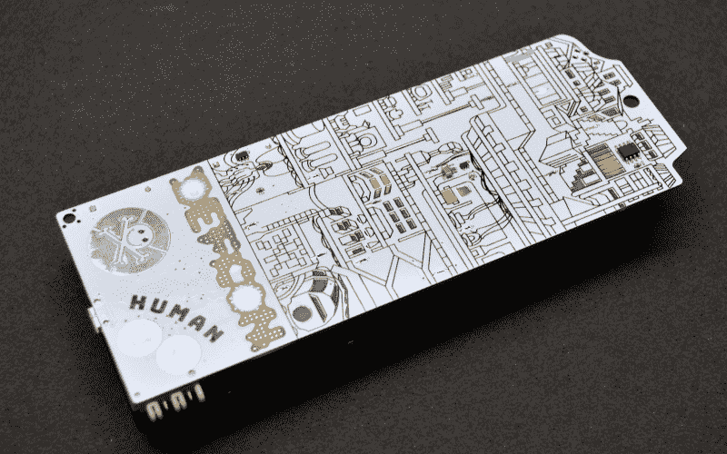
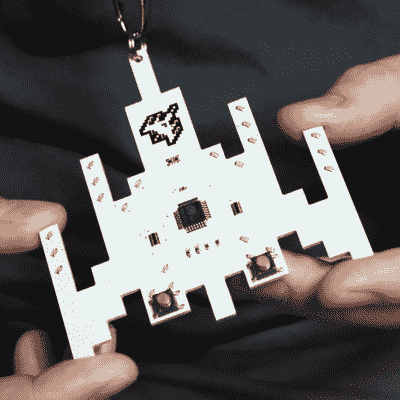

# 硬件演示纪录片 Badgelife

> 原文：<https://hackaday.com/2018/08/20/badgelife-the-hardware-demoscene/>

 [https://www.youtube.com/embed/G2fHKRONc6U?version=3&rel=1&showsearch=0&showinfo=1&iv_load_policy=1&fs=1&hl=en-US&autohide=2&wmode=transparent](https://www.youtube.com/embed/G2fHKRONc6U?version=3&rel=1&showsearch=0&showinfo=1&iv_load_policy=1&fs=1&hl=en-US&autohide=2&wmode=transparent)

上周，成千上万的人从拉斯维加斯回家，刚刚参加完今年的 DEF CON。这是 DEF CON 的伟大一年，尤其是在硬件方面。这是独立徽章接管的一年，这要归功于一个致力于为成千上万的与会者创造小型硬件、拼图和 PCB 艺术的小型社区。这是 badgelife，一个硬件的演示，这仅仅是个开始。从现在开始只会越来越大。

我们有幸与今年 DEF CON 徽章背后的几位创作者坐在一起，采访非常精彩。这是一堂关于电子设计、制造和物流的课。如果你曾经想成为一名运送产品的工程师，而不是运送产品的卑微的制造商，这是世界上最伟大的教室。

虽然 badgelife 看起来像是一群硬件工程师坐在一台取放机器后面，享受一个周末的 lulz，但这是产品设计和制造的大师级产品。Badgelife 是产品开发，与许多其他硬件设计工作不同，发货日期不会因为任何原因而推迟。硬件必须按时完成，如果你不能提供你承诺的所有功能，每个人都会不高兴。Badgelife 是你在生产工程、产品设计和制造领域获得的最佳体验。

## 最伟大，最令人垂涎的徽章

今年 DEF CON 上最令人垂涎的徽章之一是来自和的徽章！异或。这个由[zapp]、[Hyr0n]、[Bitstr3m]、[8bit]和其他一些人组成的工程师团队已经创建独立徽章三年了。他们的 Bender 徽章一直被奉为 badgelife 的典范:在紧张的生产进度下，定制硬件变成了艺术品。他们是怎么做到的？实际上，它们是反向工作的。他们不是把一个微控制器和一些艺术品扔在一块板上，而是首先弄清楚他们希望徽章做什么，并从那里选择他们的零件。原型制作的成本、预期失败的次数以及售出商品的总成本在设计最终确定之前都要考虑进去。只有到那时，他们才制作原型，并联系 Kickstarter 为剩余的生产运作提供资金。今年在这方面是个例外:而且！XOR 一夜之间卖出了 300 个神奇的狂欢徽章。数百件在展会上售出。

## 官方徽章

谈到制造挑战，没有什么比得上主 DEF CON 徽章。今年，官方徽章由一个名为 Tymkrs 的硬件集体赋予了生命。DEF CON 在去年的 Cyphercon 上看到他们令人难以置信的立方体徽章[后联系了 Tymkrs，经过几个月的工作，Tymkrs 成功为今年的 DEF CON 运送了超过 28000 个徽章](https://hackaday.com/2017/04/09/the-cubic-cyphercon-badge/)

今年 DEF CON 的主题，以及今年 DEF CON 的徽章，是 1983 年，1984 年奥威尔式地狱景象的前一年。今年仍然有可能改变一些事情，尽管大洋国一直在和东亚国打仗。这个想法给了 Tymkrs 一个徽章游戏的想法，你的选择会影响你周围的人。这是通过雌雄同体连接器将不同徽章“配对”在一起来实现的。将两个徽章互相插入，会影响每个徽章的状态。

如果制造 28，000 个东西有一个问题，那就是对每块板上的微控制器进行编程。对数以千计的芯片进行编程的最佳方式是让它们在生产线上被编程。对于任何一个生产时间只有几个月的 DEF CON 徽章来说，根本就没有时间。下一个选择是在芯片放在卷轴上之前对其进行编程。这是 Tymkrs 计划要做的，但在骗局开始前三周，他们的供应商找到他们，告诉他们不知道如何给这些微控制器编程。没有多余的时间，Tymkrs 说要把它们运到中国的工厂，要求工厂雇佣一些临时工，并让几十个人在从回流焊炉出来时编写徽章。如果你想知道一个人的血压能有多高，就去问 Tymkrs。

## 没人说你需要运送成千上万

 

这款精致的投币徽章是由 badgemaker extra ordinaire【Mike Szczys】

开发的，但当然，并不是每个人都适合运送一个相当于囚犯价值的徽章。有时候你不需要做大就能对 badgelife 产生巨大影响。有时你只需要运送几十个单位。

今年 DEF CON 的突出徽章之一是来自 Hackaday 主编和 Hackaday 先生本人的投币徽章。

[Mike]之前已经参与了许多徽章项目，从 [2017 年超级大会“相机”徽章](https://hackaday.com/2017/10/11/building-the-hackaday-superconference-badge/)到 [2018 年 Belgrade retrocomputer 徽章](https://hackaday.com/2018/05/15/retro-computer-badge-for-hackaday-belgrade-has-everything-you-wished-for-back-in-the-day/)，但他之前没有深入并完全自己制作徽章。硬币徽章改变了这一点，这个徽章的灵感来自有史以来最伟大的视频游戏 *Galaga* 。

投币徽章的设计始于 7 月 1 日，由一个装有 led 和微控制器的 *Galaga* 船形板组成。到月底，[Mike]在他的地下室手工组装了近 60 个这样的徽章，正好赶上 DEF CON。这是今年最棒的徽章之一，如果[Mike]不是因为他作为 Badgelife 竞赛评委的专业知识而被选中，它可能会参加 badgelife 竞赛。这表明你不需要制作数百个徽章——有时几十个就能产生巨大的影响。

## 这是硬件的演示

badgelife 的兴起是 DIY 硬件最大的进步之一。这是唯一一个你会发现人们在一个极其浓缩的时间尺度上设计和制造物品的地方，都是靠他们自己。这是一个硬件演示，几十个小组展示了他们在有限的资源和有限的时间内可以做什么。如果说 Commodore 和 Amiga 演示秀是软件开发人员的顶级舞台，那么 badgelife 就是硬件工程师的奥林匹克。就是这样，从现在开始只会越来越好。