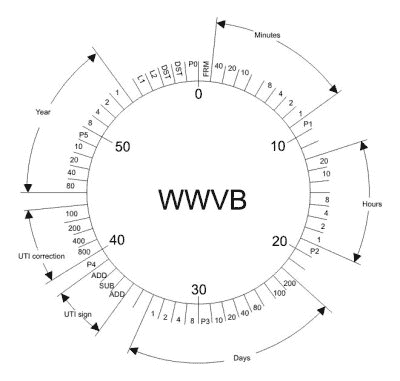

# 如果 WWVB 沉默了，你会怎么做？

> 原文：<https://hackaday.com/2018/08/20/what-will-you-do-if-wwvb-goes-silent/>

在国家标准与技术研究所(NIST)2019 年预算提案的第 25 页上，在“基础测量、量子科学和测量传播”的标题下，有一个简短的条目引起了业余无线电爱好者的大量辩论，甚至相当愤怒:

> NIST 将停止通过 NIST 广播电台传播美国时间和频率。这些无线电台发射的信号用于同步消费电子产品，如挂钟、时钟收音机和手表，也可用于其他应用，如电器、相机和灌溉控制器。

夏威夷州和科罗拉多州的 NIST 站是 WWV、WWVH 和 WWVB 的家乡。这些电台中最古老的是 WWV 电台，自 1920 年以来一直以某种形式进行广播；使其成为美国持续运营时间最长的广播电台。然而，为了节省大约 630 万美元，这些时间和频率标准站可能会被搁置。

 这对那些不生活和呼吸无线电的人来说意味着什么？对于业余无线电爱好者之外的任何人来说，WWV 和 WWVH 的离去可能都不是什么大事。事实上，大多数人可能甚至不知道它们的存在。今天，它们主要用作校准目的的频率标准，但近年来已经被低成本振荡器所取代。

但另一方面，WWVB 每天都被数百万美国人使用。据 NIST 自己估计，自 1963 年以来，有超过 5000 万块各种形式的钟表使用数字信号自动同步时间。这就是争论所在:许多人只是不相信 NIST 会关闭一项仍被许多普通美国人积极使用的服务。

问题在于声明的模糊性。老旧且大部分过时的电视台将被关闭并不奇怪，但是因为 NIST 的预算没有明确说明是否包括更现代的 WWVB，所以有解释的余地。尤其是因为 WWVB 和 WWV 都是从 Ft 播出的。科罗拉多州柯林斯。

Hackaday 的好读者怎么说？你认为 NIST 会搞垮相对受欢迎的 WWVB 吗？你还在使用与 WWVB 同步的设备吗，还是它们都已经转而通过互联网来节省时间了？如果 WWVB 真的停播了，你准备好[建立你自己的盗版时间站](https://hackaday.com/2014/03/22/build-your-own-radio-clock-transmitter/)了吗？

【感谢 AG6QR 的提示。]