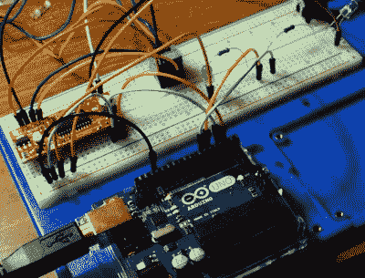

# 用于 3D 扫描的自动转台

> 原文：<https://hackaday.com/2018/08/21/automated-turntable-for-3d-scanning/>

那些刚刚开始 3D 打印的人通常认为，继打印机之后，他们的下一个主要购买品将是 3D 扫描仪。如果你想得到一个可以打印三维模型的东西，为什么不能得到一个可以从现实世界的物体中创造出所述模型的东西呢？但事实是，只有一小部分人会坚持购买扫描仪；主要是因为它们是出了名的昂贵，但也因为扫描的模型通常需要大量的清理工作才能使用。

 虽然【Travis Antoniello】的这个项目不会让利用扫描的 3D 模型变得更容易，但它肯定会让它们的获取成本更低。所以至少这是成功的一半。[主要由一个步进电机、一个 Arduino 和一个 EasyDriver 控制器](https://github.com/Snowblxnd/AutomatedTurntable)组成，这是一个你可以从零件箱组装的项目。假设你有一个相当不错的相机，无论如何…

总的想法是在步进电机上放置一个平台，让 Arduino 在三脚架上的摄像机前一次旋转 10 度。相机由 Arduino 的一个数字引脚上的红外 LED 触发，因此平台每次旋转时都会拍摄一张照片。有一些可配置的值，让物体在旋转后有时间稳定下来，还有一个延迟，让相机有时间拍摄照片，并为下一张照片做好准备。

一旦所有的照片都被拍摄下来，它们就会被加载到特殊的软件中进行所谓的摄影测量。通过将所有图像编辑在一起，该软件能够生成相当精确的 3D 图像。它可能没有 1:1 的分辨率来制作破损零件的副本，但在处理复杂对象时，它可以帮助节省一些建模时间。

我们之前已经介绍过[使用摄影测量学来设计 3D 打印配件](https://hackaday.com/2016/02/12/using-photogrammetry-to-design-3d-printed-parts/)，以及几年前在自动转盘上的[略有不同。这一过程还不太常见，但你自己尝试一下的障碍至少正在降低。](https://hackaday.com/2016/02/03/super-detailed-3d-scans-with-photogrammetry/)

 [https://www.youtube.com/embed/s2mI0JuVWBc?version=3&rel=1&showsearch=0&showinfo=1&iv_load_policy=1&fs=1&hl=en-US&autohide=2&wmode=transparent](https://www.youtube.com/embed/s2mI0JuVWBc?version=3&rel=1&showsearch=0&showinfo=1&iv_load_policy=1&fs=1&hl=en-US&autohide=2&wmode=transparent)

