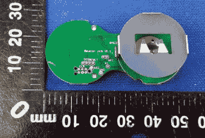

# FCC 文件揭示美味的硬件秘密

> 原文：<https://hackaday.com/2018/08/22/fcc-filing-reveals-tasty-hardware-mcsecrets/>

如果你最近去过麦当劳，你可能会注意到一些色调的变化。越来越多的麦当劳门店开始使用自助服务亭，而不是依赖焦虑的青少年来接受顾客订单。你走上前去，在一个巨大的触摸屏上输入你的订单，然后带着一个电子记号笔来到一张开放的桌子前。短短几分钟内，你那盘营养丰富、T2 美味、价格低廉的食物就送到了你的面前……那很可能还是一个焦虑的青少年。

 多亏了一位匿名举报人最近向我们指出的一份 FCC 文件，[我们现在知道 Ronald 在电子桌面标记](https://fccid.io/2ABYU-RBT003)(在麦当劳的说法中被称为“帐篷”)里装了什么样的技术。原来它们是由 Nordic nRF52832 芯片组驱动的蓝牙低能量信标，包括一些意想不到的功能，如检测跌倒的加速度计。

[Nordic nRF52832](https://www.nordicsemi.com/eng/Products/Bluetooth-low-energy/nRF52832) 采用 32 位 ARM Cortex M4F 处理器，64 MHz，512 KB 闪存和 64 KB SRAM。对一个记号笔来说很有冲击力。顺便说一下，这是 Adafruit Feather nRF52 Pro 中使用的同一芯片，因此已经有一个容易获得的开发工具链。

PCB 背面的图像显示了大量贴有标签的测试点，我们认为弄清楚如何让这些表标记中的一个完成自己的投标不会太困难。并不是说我们宽恕你把这些东西和你的奶酪汉堡一起偷走。虽然我们很想知道为什么他们需要这么多的硬件来指示特定的订单要送到哪张桌子；看起来印在设备主体上的数字足以做到这一点。

这不是我们第一次偷看金色拱门后面了。从逆向工程他们著名的薯条到[破解他们用快乐套餐分发的玩具](https://hackaday.com/2013/08/23/hacking-mcdonalds-minion-toy-to-be-an-electric-slidewhistle/)，在当地的麦当劳，除了再次被扔出球坑*之外，还有更多事情要做。*