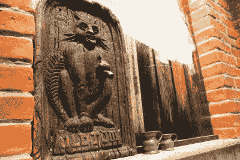

# 第一台自动售货机破解了酒类法律:猫和喵

> 原文：<https://hackaday.com/2018/08/23/the-first-vending-machine-hacked-liquor-laws-the-puss-and-mew/>

公平地说，许多技术都受到了人类恶习的影响。你可能没有意识到的是，自动售货机以这种方式看到了自己的曙光，第一台自动售货机是为提供酒类服务而创建的。具体来说，它是为了供应杜松子酒而创立的，杜松子酒是 18 世纪早期的首选酒。它的创建是为了规避一项增加酒精饮料销售难度的法律。这是第一台自动售货机:猫和喵。

18 世纪早期的英国是一个醉酒的地方。因为几乎没有可靠的安全水源，几乎每个人都喝酒精饮料——喝多了可能会生病，但不会致命。就连儿童也喝小杯啤酒 T2，这是在酿造过程最后制成的最淡的一批啤酒。

然而，当时社会上的一些人对杜松子酒等烈性酒越来越受欢迎感到担忧。像礼仪改革协会这样的团体宣扬烈性酒正在摧毁工人阶级的生活。为了限制杜松子酒的销售，1736 年英国议会通过了《杜松子酒法案》。这要求任何出售少量杜松子酒的人都需要一个许可证，费用为 50 英镑(按今天的价值计算超过 7000/9000 美元)。受雇的告密者被招募来抓犯法的人。他们会购买非法杜松子酒，向警方报告，然后将卖家支付的罚款收入囊中。

## 破解酒类法律

A replica Puss and Mew on Puss and Mew is located at Beefeater Gin Distillery in Kennington, London

为了解决这个问题，一个名叫达德利·布拉德斯特里特船长的有进取心的杜松子酒贩想出了一个卖杜松子酒的窍门:猫和喵，也被称为布拉德斯特里特的猫。

Bradstreet 是一名陷入困境的士兵兼间谍。他仔细阅读了《杜松子酒法》,意识到它并没有赋予警察进入建筑物的权力。相反，他们不得不依靠告密者来抓住一个卖杜松子酒的人。于是，他说服一位律师朋友租了一间房子，并在外墙上安装了一尊猫的雕像。一个想喝酒的人会走到雕像前问:“猫，你有杜松子酒吗？”雕像会喵喵叫，一个小抽屉会在它的嘴里打开。饮者将硬币投入抽屉，抽屉就会关上。接下来，杜松子酒会从猫爪里的管子里流出来。

这不是因为一种机制，而是因为 Bradstreet 在猫的后面，拿着钱，把杜松子酒倒进管子里。因为他藏在房子里，告密者不能告诉警察是谁卖给他们杜松子酒。警察无权进入房子并逮捕他，因为租户是一名律师，他拒绝透露住户的姓名，声称这是正在进行的法庭案件的一部分。

它非常有效。正如 Bradstreet 自己在他自吹自擂的回忆录 *[中所说的，Dudley Bradstreet](https://books.google.com/books?id=H6MxAQAAIAAJ&printsec=frontcover&source=gbs_ge_summary_r&cad=0#v=onepage&q&f=false) :* 上尉的生活和不寻常的冒险经历

> 这群乌合之众非常吵闹，叫嚷着要他们心爱的酒……我很快就想到要从事这一行业。我买了这份法令，读了好几遍，发现它并没有授权破门而入，而且告发者必须知道出租房子的人的名字。为了逃避这一点，我找了一个熟人，在蓝锚巷租了一栋房子……并在摩尔菲尔德买了一个猫的标志，把它钉在一扇临街的窗户上。然后，我把一个铅管……放在猫的爪子下……当酒被妥善处理后，我让一个人通知几个暴徒，如果他们把钱放进猫的嘴里，第二天猫会在我的窗口卖杜松子酒……我听到钱的叮当声，一个舒适的声音说，“猫，给我两便士的杜松子酒。”我立刻把嘴放在管子上，让他们从她爪子下的管子里接受。从伦敦的各个地方，人们过去常常来找我，数量如此之多，以至于我的邻居很难进出他们的房子。就这样，我坚持了一个月，在这段时间里，我赚了 20 多英镑

## 像蘑菇一样，好主意到处冒出来

Bradstreet 是第一个使用这种合法手段的人，但其他人很快就发现了这一点，类似的卖家很快出现在整个伦敦。尽管有《杜松子酒法》,整个伦敦的杜松子酒消费量增加了，随后法律的变化使得获得出售杜松子酒的许可证变得更加容易。到 1750 年，全英格兰大约有 29，000 名有执照的杜松子酒销售商，更多的仍在非法销售。

虽然这只猫和喵与现代自动售货机没有什么共同之处，但它是同类产品中的第一台。值得注意的是，它们的出现是因为伦敦工人阶级对酒的渴望，以及一个人对零售的创造性方法。

Bradstreet 本人在该计划不再有利可图时就放弃了，并转向其他计划。1745 年，他成为了詹姆斯二世党人叛乱阵营中的一名政府间谍，并让他们相信前方有一支假军队。这说服了苏格兰军队在进攻北安普顿之前返回，有效地结束了叛乱。

猫咪和水电部的原址已经不存在了:蓝锚巷在 20 世纪 60 年代被摧毁，取而代之的是一座看起来很脏的塔楼。最初的标志也不复存在，但是伦敦的[牛肉酒厂](https://beefeaterdistillery.com/)确实有一个复制品，可以在他们的旅游中观看。唉，它不再供应杜松子酒了。