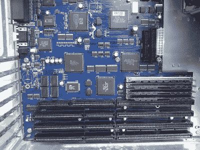

# 令人难以置信的 ATX Amiga 4000 主板

> 原文：<https://hackaday.com/2018/08/22/an-incredible-atx-amiga-4000-motherboard/>

无论现代计算机硬件发展到什么程度，仍然有相当多的人渴望早期的桌面计算。不可否认，这些早期系统有一些吸引人的地方，虽然即使是最铁杆的老式电脑爱好者可能也不会再将它们作为日常电脑使用，但偶尔能够重新使用它们还是很好的。当然，使用可能比操作者更老的电脑的缺点是，它们通常很脆弱，更换零件不一定容易得到。

 但是由于像[这样的项目，这个令人印象深刻的 ATX Amiga 4000 主板由【hese】在 Amibay 论坛](http://www.amibay.com/showthread.php?101477-A4000TX-ATX-Amiga-motherboard)上展示，获得经典计算的第一手经验并不一定意味着依赖老式硬件。通过制作一个与标准 ATX 电脑机箱和电源兼容的 Amiga，重温准将的光辉岁月变得更加实际。现在它主要是一个个人项目，但如果有足够的兴趣，这听起来可能会改变。

该主板可以被视为 Amiga 4000T 的现代版，它是 Commodore 在 1994 年发布的标准 Amiga 4000 的正式塔式版本。它采用 68030 CPU，16 MB 快速 RAM 和 2 MB 芯片 RAM。为了扩展，有四个全长 Zorro III 插槽和三个 ISA 插槽，以及用于软盘和硬盘驱动器的 IDE 端口。

这种主板看起来确实像是 20 世纪 90 年代后期专业制造的计算机主板的一部分，这不仅表明了对其设计细节的关注，还表明了现在个人可以获得的制造能力。有这样热情的人参与，老式计算机领域如此活跃就不足为奇了。

当然，这并不是我们在 Hackaday 看到的第一台新造的“老式”电脑。从最少的 8085 计算机到相对奢侈的 6502 驱动的仙人掌，似乎旧的又变成了新的。

【感谢劳伦斯的提示。]