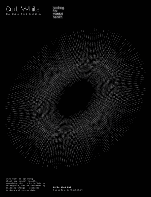

# 周五黑客聊天:黑客精神健康

> 原文：<https://hackaday.com/2018/08/22/friday-hack-chat-hacking-for-mental-health/>

我们经常看到黑客和 DIY 在医疗领域的应用。从 3D 打印假肢到被黑掉的胰岛素泵，你可以做的事情多种多样，但心理学呢？这就是我们本周五的聊天内容。

 我们本周黑客聊天的嘉宾是科特·怀特。他多年来一直在制造医疗设备，当他不做这个的时候，他就创作互动装置艺术和服装。在工作中，他是[儿童心理研究所物质实验室](https://matter.childmind.org/)的一名设备和传感器开发人员，在那里他为有心理健康问题的儿童设计和研究可穿戴医疗设备。他目前正在研究使用可穿戴设备进行手势检测，针对微控制器进行优化的机器学习，以及构建和修复原型。

在这次聊天中，我们将讨论如何通过构建专注于可穿戴设备和传感器数据的东西来解决精神健康问题。可穿戴设备如何挑战过时和武断的精神疾病分类，音频、脑电图和功能性磁共振成像在帮助我们超越清单诊断方面有什么潜力？我们还将讨论:

*   黑客精神健康
*   用有形之物解决无形之物
*   与医学研究人员一起工作
*   事实上，如果你不接受联邦资助，或者在伯利兹工作，你不需要 IRB。

当然，我们鼓励你在讨论中提出自己的问题。你可以在[精神健康黑客活动页面](https://hackaday.io/event/160158-hacking-for-mental-health-hack-chat)上发表评论，我们会把它放在黑客聊天讨论的队列中。【T2

我们的 Hack Chat 是在 [Hackaday.io Hack Chat 群发消息](https://hackaday.io/messages/room/2369)上的实时社区活动。本周和以往一样，我们将在太平洋时间 8 月 24 日星期五中午聚集在我们的视频终端前。需要倒计时器吗？[走走走](https://www.timeanddate.com/countdown/generic?iso=20180824T12&p0=137&font=cursive)

点击右边的语音气泡，你会被直接带到 Hackaday.io 上的黑客聊天群。

你不必等到星期五；随时加入，你可以看到社区在谈论什么。