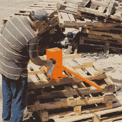

# UnMaker 2.0 是 Wile Coyote 的死锤

> 原文：<https://hackaday.com/2018/08/25/unmaker-2-0-is-wile-e-coyotes-dead-blow-hammer/>

锤子！如果你有心情的话，它们可以用来敲钉子，打碎东西，通常还可以砸碎关节。通常，它们由铁或钢制成，根据用途有各种尺寸——从用于精细雕塑工作的小型凿锤到用于撕裂建筑材料的重型雪橇。但是如果你自己做一个滑稽的大木槌会怎么样呢？进入 UnMaker 2.0。

The hammer receiving an eye-catching lick of paint.

基本上是真的大锤。它隐约让人想起一种死吹式设计，因为它由一个填充有较重材料的适度减震外壳组成。在这种情况下，钢球轴承在枫木制成的外壳内找到了归宿，并配有传统的锥形手柄。从很多方面来看，它都是一个非常典型的体型——除了它巨大的体型和 34 磅的头部重量。这两者都使它成为 ACME 目录的一部分。那只走鹃不知道是什么撞了他。

[Kevin]报道说，由于其令人印象深刻的重量，与其说它是“摆动的”，不如说它是“举起并允许落下的”。很明显，它很有力。这是该团队之前作品的坚实延续——[一把真正巨大的美工刀。](https://hackaday.com/2018/08/15/every-shop-needs-a-giant-wooden-utility-knife/)