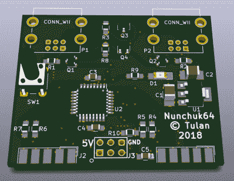

# 在 C64 上使用现代任天堂控制器

> 原文：<https://hackaday.com/2018/08/23/using-modern-nintendo-controllers-on-the-c64/>

有很多人仍然喜欢在像 Commodore 64 这样的老式电脑上玩游戏。但是，虽然他们可能出于怀旧之情回到这些经典游戏，但这种感觉并不总是延伸到硬件本身。例如，一个人可以享受玩*不可能的任务*而不必使用当代 C64 操纵杆。

 多亏了[Robert grasbck]开发的一个开源项目，那些想要利用自系统发布以来近 40 年来对游戏控制器所做改进的 C64 用户现在有了另一个选择。名为 Nunchuk64，它[允许你使用各种任天堂控制器，这些控制器在原始 C64 硬件](https://github.com/djtulan/nunchuk64/)上使用 Wii“Nunchuk”接口。这包括控制器从最近的“经典版”NES 和 SNES 系统，提供了一个明显的复古感觉与现代技术和建筑技术的所有好处。

Nunchuck64 的硬件和软件都是开源的，构建自己的版本所需的一切都在项目的资源库中。[Robert]甚至有装配说明，配有完整的图像，引导您构建自己的硬件副本，并在其上刷新固件。即使在开源项目中，我们也很少看到这种美妙的感觉。该板由一个 ATmega328P 微控制器和一些无源元件组成，如果你熟悉 SMD 工作，组装相当简单。

最近，将更多现代控制器引入经典系统似乎越来越受欢迎，在过去的几个月里，我们已经看到了任天堂 64 上的 [Xbox 360 控制器，以及为雅达利 5200](http://hackaday.com/2018/07/31/add-on-board-brings-xbox-360-controllers-to-n64/) 新制造的[手柄。](http://hackaday.com/2018/08/08/thumbs-up-for-this-custom-atari-5200-controller/)

 [https://www.youtube.com/embed/LK__4W44_HA?version=3&rel=1&showsearch=0&showinfo=1&iv_load_policy=1&fs=1&hl=en-US&autohide=2&wmode=transparent](https://www.youtube.com/embed/LK__4W44_HA?version=3&rel=1&showsearch=0&showinfo=1&iv_load_policy=1&fs=1&hl=en-US&autohide=2&wmode=transparent)

