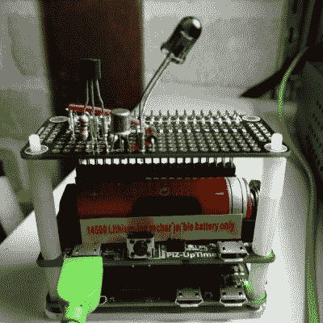

# 空调远程逆向工程，尽管深奥的协议

> 原文：<https://hackaday.com/2018/08/25/air-conditioner-remote-reverse-engineered-despite-esoteric-protocol/>

红外线远程控制是一个现成的交易，当谈到硬件黑客，它已经全面逆向工程，并有图书馆和软件包无缝照顾所有的怪癖。只是偶尔会出现一个红外遥控器，它的协议并不遵循那条老路

[William Dudley]发现自己在这个位置上拿着一个空调遥控器。他发现它发送的是带有机器所有设置的数据流，而不是你可能从熟悉的电视遥控器上看到的单一命令代码。解决方案是[逆向工程并重新实现 IR 代码](https://www.dudley.nu/projects/heatpump-control/)。

他的逆向工程依赖于 Arduino 和 IR 接收器，他用它来嗅探来自遥控器的数据包。最终，他能够识别遥控器的一些功能，并创建了自己的协议，可以重现遥控器的大部分功能。这被推到了一个使用红外 LED 控制空调的 Raspberry Pi Zero，加入了他越来越多的家庭自动化设置的行列。

这篇文章是对晦涩的红外协议进行分析的引人入胜的初级读本，对任何对这个主题感兴趣的人来说都值得一读。同时，如果你想要更多的逆向工程故事，试试这个浴室秤的故事。