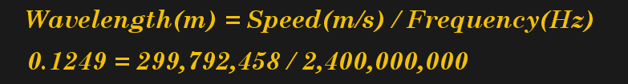
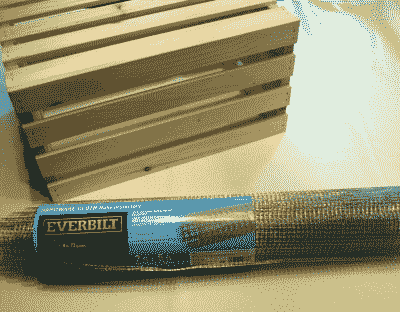
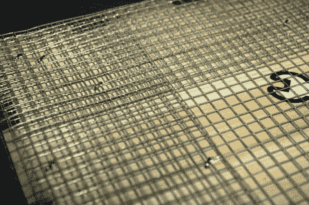
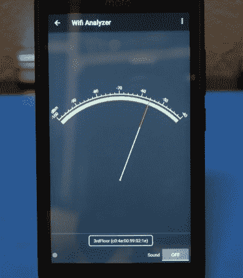
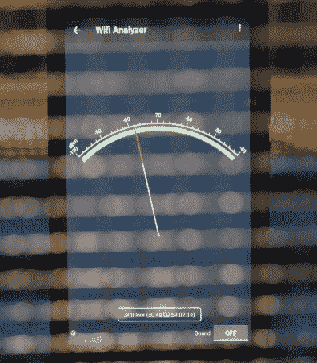

# 建一个五金店法拉第笼

> 原文：<https://hackaday.com/2018/09/26/building-a-hardware-store-faraday-cage/>

大多数 Hackaday 读者无疑都熟悉法拉第笼，至少在名义上是这样，而且几乎每个人都有一个:如果你曾经站着看一袋爆米花在微波炉里慢慢旋转，你会看到迈克尔·法拉第 1836 年的发明在发挥作用。然而，尽管这是一个众所周知的设备，普通黑客仍然没有一个在他们的军火库。但是为什么呢？

这可能是关于法拉第笼的某种神秘性，假设它们的建造需要家庭黑客领域之外的技术或材料。诚然，为给定频率构建一个完美的法拉第笼需要数学和对细节的仔细关注，但构建一个简单的通用模型和实验证明是快速而简单的。

作为极简黑客的一个练习，我最近用家得宝的材料做了一个基本的法拉第笼，我认为不仅描述它的构造，而且给出一些如何在家庭实验室中实际使用它的想法会很有趣。虽然它不是一个完美的样本，但它显然是有效的，而且它没有采用任何不能在世界任何地方就地取材的东西。

## 法拉第笼设计

在最基本的层面上，法拉第笼是一个由导电材料制成的外壳，可以阻挡电磁场。与法拉第*屏蔽*相比，笼式变体不是实心物体，而是金属网。在其他优点中，这允许观察笼子内部的对象。简而言之:如果你只是想保护一个设备免受干扰(或防止它造成干扰)，那么把它封在一个金属盒子里就足够了；但是如果你想要可以实验的东西，你可能会想要一个笼子。

诀窍是确保笼子材料上的孔小于你想要阻挡的波长。[同样的原理也允许你使用标准的鸡线作为射频反射器](https://hackaday.com/2018/07/17/the-biggest-corner-antenna-weve-ever-seen/)，只要你工作的频率相对较低。但是随着目标频率的增加，波长变得足够小，它可以偷偷穿过铁丝网，所以你需要使用更紧的东西。但是多小才算够小呢？

首先，我们需要找到想要阻止的频率的波长。这可以通过将波的速度(以米/秒为单位)除以其频率(以赫兹为单位)得到。当我们处理无线电波时，我们知道它将以光速传播，对于该频率，假设我们想要阻挡 2.4GHz。因此，数学结果如下:

法拉第笼的经验法则是开口不应大于波长的 1/10，在我们的例子中是 12.5 毫米(约 1/2 英寸)。幸运的是，网目尺寸为 1/2”和 1/4”的钢制“五金布”随处可见。理论上这两种方式都可以，但为了安全起见，我最终还是选择了 1/4 英寸。

## 建筑

 有了网格在手，下一步就是为它构建某种框架。碰巧的是，家得宝的储藏室里有结实且相对便宜的木箱。你也可以用木头或 PVC 管做一个框架，如果你不介意花时间做的话，这可能会更便宜。

我从板条箱的一侧弹出了几个板条，这样更容易看到里面，但除此之外，结构只是用硬件布包裹板条箱。我做了一个长片，从前面开始，一直绕到后面，然后两个小片“盖住”两边。最后，它并不完全不同于礼品包装；如果礼物包装是金属的，而且有割伤你的危险。

需要密切注意的一点是网格的重叠部分。你想保持良好的电气连接，避免任何间隙，所以为了安全起见，你应该至少重叠几英寸。我用一个强力订书机将硬件布固定在板条箱上，所以我还确保在网格重叠的区域多钉几个钉子，以确保它们紧紧地固定在一起。

  Mission critical sticker  Generous overlap in corners

## 测试

作为一个简单的测试，我把我的手机放在工作台上，运行 Android“WiFi 分析器”应用程序的信号强度功能，选择一层以上的接入点作为目标。在下面的两张图片中，从一个镜头到另一个镜头的唯一变化是将 DIY 法拉第笼放置在手机上。

    

正如你所看到的，手机最初的信号强度约为-55dBm，在笼子里时下降到近-80dBm。当手机在笼子里时，较弱的 Wi-Fi 网络变得无法检测，这对手机的 LTE 接收有明显的不利影响。

## 有缺陷的设计

在下面的评论者有机会为我这么做之前，我应该说，这确实不是一个很好的法拉第笼。首先，它不是完全封闭的。由于没有底部信号仍然能够从下面进入，大大降低了它的有效性。钢网也不是理想的导体，铜可能会更好。但是在当地找到一个紧密缠绕的铜网被证明是棘手的。

还有一些关于法拉第笼是否必须接地的争论。值得一提的是，在我的测试中，当笼子接地时，性能没有明显变化。尽管更传统的法拉第笼可能会有不同的表现。

话虽如此，我还是觉得这个设计阻挡射频足够有用。它永远不会将内部设备与电磁干扰完全隔离(反之亦然)，但它会显著衰减信号，足以清晰可见。这是我最初的抱负，所以我对结果很满意。

## 可能的应用

假设您正在开发或测试一个遥控设备，并想看看它在信号强度很弱时的表现。把笼子扔过去会让你的信号强度瞬间下降。或者也许[你正在观察一个设备](https://hackaday.com/2017/01/26/pcb-design-guidelines-to-minimize-rf-transmissions/)的射频辐射，但是想要减少多余的背景噪声。将测试中的设备和 SDR 硬件放在笼子里是在一个不那么“嘈杂”的环境中研究它的一种简单方法。

这只是两种可能性。这个演示表明，没有什么好的理由让*不*拥有一个简单的 RF 阻塞设备供您使用。它很便宜，很有效，可以成为你下一个周末的项目。你该怎么做由你决定，只要确保你[想出办法后给我们写信](https://hackaday.com/submit-a-tip/)。你会用法拉第笼做什么？