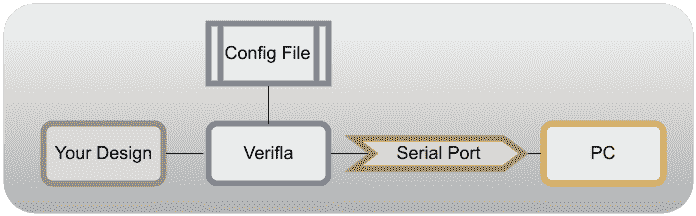
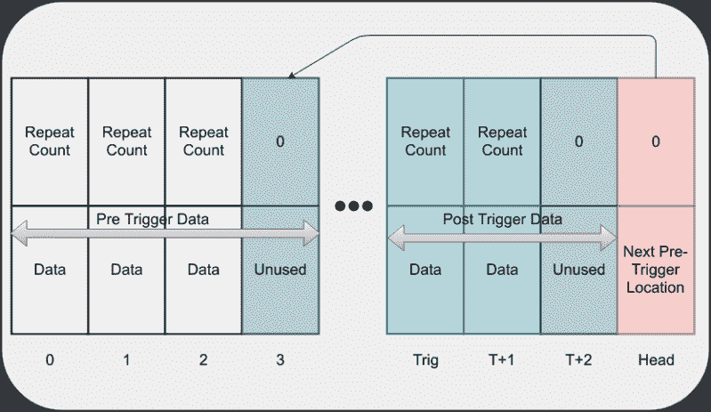
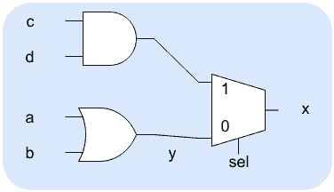

# FPGAs 逻辑分析仪:Verilog Odyssey

> 原文：<https://hackaday.com/2018/10/12/logic-analyzers-for-fpgas-a-verilog-odyssey/>

有时候你从一件简单的事情开始，然后它会导致事情的连锁反应。我想写一篇关于在 Verilog 中使用状态机的文章，目标是我们经常用于快速 FPGA 项目的 Lattice iCEstick 板。这就引出了一个小问题:如何展示内部的情况？在这一系列的文章中，我们将着眼于在 FPGA 中构建一个逻辑分析器来帮助调试自身、实例化内存以及状态机。

逻辑分析是 FPGA 开发中的常用工具。如果您使用 Altera，他们提供信号抽头，允许您在 FPGA 中构建一个简单的逻辑分析仪，与您的 PC 进行反馈。Xilinx 有 ChipScope 也差不多。有时候，这些工具要么需要花钱，要么在免费版本中受到某种限制。我的目标是一个可以用于网格架构的工具。

当然，你可以通过 I/O 引脚输出数据，然后用一个常规的逻辑分析仪来拾取数据。但是这并不方便。所以我考虑写一个通用的逻辑分析器组件。但在此之前，我决定查看是否有人已经这样做了。

剧透:是的，但是我想要一点不同的东西，所以我大大扩展了这个程序。我最终得到的是一个相当便携的 Verilog 逻辑分析仪，它可以产生这样的轨迹:

[](https://hackaday.com/wp-content/uploads/2018/08/trace.png)

请记住，这不是模拟。这是来自实际 FPGA 的真实数据。是的，这是 gtkwave 产生的图，但输入数据是从 FPGA 内部采集的样本生成的 VCD 文件。

## 好消息和坏消息

好消息是，我在 OpenCores 上找到了名为 OpenVeriFla 的冗长代码。坏消息是它已经用了大约 11 年了，看起来不太好用。其中一部分是我的配置问题，但是如果您对快速变化的数据进行采样，至少会出现一个 bug。很自然地，在我花了几天时间修复 bug 之后，一个新的更新出现了。所以我必须找出原作者修改了什么，并在我的分支中进行修改。我最终做了足够多的改变，以至于我简单地分叉了它，并决定做重大的改进，让事情变得更有用。然而，经过通信，作者确实在原始版本中进行了平行的更改，以挤压相同的 bug，因此任何一个分支都应该没有让我开始这段旅程的原始 bug。

OpenVeriFla 其实是两个部分。你的项目中必须包含一组 Verilog 文件。您用头文件设置了[通用配置。还有一个读取数据的 Java 程序。这需要脆弱的 Java 串行 I/O，它在我的系统上找到端口时遇到了一些麻烦。当然，真正的问题是，如果在设计中使用串行端口，您可能必须在一对未使用的引脚上连接一个临时串行端口，以供逻辑分析仪使用。在某些情况下，你可以禁用你的串口只是为了调试，但是如果你的问题涉及到串口，那就不行了。](https://github.com/wd5gnr/verifla/blob/master/demos/ice40/demo3/config_verifla.v)

[](https://hackaday.com/wp-content/uploads/2018/08/flow.png)

您可能会认为 Java 程序会显示捕获的数据或创建一个波形查看器可以使用的 VCD 文件。但事实并非如此。它创建了记录数据的 Verilog 模型。然后，您必须模拟该模型以获得 VCD 文件。有时这可能是有用的，但我会修复它，这样你就可以直接生成一个 VCD 文件，如果你使用我的 fork。

## 内存不足

我遇到的第一个问题是 iCEstick 板上似乎没有足够的内存来捕捉许多样本。我怀疑我知道这个问题，但目前，我只是将样本量减少到非常低的水平。我不想修复内存问题，直到我确定这个错误是我想花时间修复的。

我想如果它适用于 16 个样本，我总是可以修复内存并添加更多。正如我所怀疑的，内存组件的编写方式使得 Lattice FPGA 无法使用其板载内存，而是必须从常规触发器中构建所有内存。稍后我会有更多的话要说。

原始代码的配置都是在 config_of_verifla.v 文件中完成的，您可以更改许多参数，尽管原始代码中还有一些地方需要更改。正如您将看到的，在我的重写中，我稍微改变了配置的工作方式，以使事情变得更简单。

## 虫子挤压

我的第一次尝试是简单地读取一个切换输出线。这似乎失败了。经过一番调查，我发现如果信号在每个时钟周期都发生变化，代码就会漏掉它。这很容易解决，上游也做了类似的解决。

从那以后，事情似乎进展顺利。配置有点麻烦，我想要一些额外的功能，比如时钟限定符和输出，显示分析器是否启动或触发。

可能还有其他一些奇怪的错误。我注意到使用 Icestorm，将内存设置为 256，触发点设置为 128 会导致挂起。这可能是由于奇怪的内存架构(见下一节)。然而，使用 127 或 129 的触发点效果很好。

## 关于原始代码的注释

原程序附带的 PDF 文件非常有指导意义。想法是实例化逻辑分析仪内核，向其发送想要捕获的数据，并使用配置文件来设置诸如内存深度和触发条件之类的东西。

第一次阅读时，有两件事没有引起我的注意。首先，如果您不断地断言 run，并且您的触发器快速发生，那么 Java 程序将不能可靠地找到数据的开始。除非你有一个罕见的触发器或外部输入，如按钮，你通常会设置运行为零。这使得核心处于未武装状态，直到 Java 程序向它发送命令来武装它。

另一件奇怪的事情是系统如何管理内存。假设您为逻辑分析仪分配了 256 个字。我假设字宽是 8 位，所以它们实际上是字节。您还可以选择重复计数宽度，所以我们假设也是 8 位。这意味着你的缓冲区看起来像这样:

[](https://hackaday.com/wp-content/uploads/2018/08/memory1.png)

看到触发点(底部的触发标签)了吗？这也是在头文件中配置的。当有东西启动模块时——无论是运行输入还是软件发送命令，它都开始在内存起始处收集数据，直到但不包括触发点。当内存满时，它开始将内存视为循环缓冲区。在触发之前，它从不在触发点或其上方(数值上高于)的区域存储数据，除非最后一个字用于管理循环缓冲区的头。

当触发发生时，系统将事件存储在触发位置，然后开始使用存储器的其余部分存储数据。当内存不足或读取了配置的最大样本数时，它将退出。该缓冲区从最后一个字(FILO)开始，通过 UART 发送到 PC。顺便说一下，最后一个词不会包含您的数据，所以一定要考虑到这种损失。

这里有一些奇怪的情况需要考虑。首先，如果触发发生在循环缓冲区填满之前，您将在没有记录的地方得到空白。您将会看到有一个计数机制会给出这方面的指示，但是仍然值得注意的是，根据您的配置，您可能会浪费内存。例如，在上图中，当触发发生时，只有前三个内存插槽在使用中。注意，这并不意味着只有三个时钟周期，因为一些或所有数据时间的计数可能大于 1。如果存储器填满，则头指针回绕，并且所有预触发存储器都将被使用，随着新样本被读取，最旧的样本减少。

事实上，计数导致了另一个问题:触发后使用了多少内存？假设你有一个字节的单词和一个字节范围的重复计数。为了节省空间，分析仪只存储与前一个样本不同的样本，只要它能计数。换句话说，如果有一个信号在 300 个时钟周期内为 00000000，则存储器布局应该是:

```
254 00000000
46  00000000
```

在这种情况下，计数只能达到 254。零表示该槽中根本没有数据。然而，假设你有一个 16 字的缓冲区，触发点在 8。这意味着你有 0-15 个存储单元。最后一个是缓冲区指针，因此您的数据位于位置 0-14，0-7 是循环缓冲区，8-14 是触发数据和后触发数据。

你会认为这意味着触发后只能存储 6 个样本，对吗？不，由于计数机制，你可以存储更多。然而，如果您将限制设置为 6，并且您的信号与时钟相比变化缓慢，则您可能只能获得计数为 6 的触发，或者计数为 5 的触发和另一个样本。和你预想的不太一样。在实践中，我发现最好将计数设置得很高，让它耗尽内存。唯一需要设置显式计数的时候是，如果信号非常慢或者重复计数很大，并且不想花时间等待存储器填满。

## 提高

最后，我做了九项改进:

1.  更好地记录一些设置
2.  修正了在一个时钟上改变的样本没有被正确处理的错误
3.  添加一些工具更容易推断的同步内存(见下文)
4.  根据规范进行小规模清理
5.  读取输出并直接生成 VCD 的 c 工具(我们下次会谈到这一点)
6.  添加时钟使能/限定符(默认为 1，因此如果不使用它就不需要指定它)
7.  增加装备和触发输出
8.  添加触发器限定符(必须为 1-默认设置-内部触发器才能工作)
9.  如果您想要自己的触发器逻辑，则添加 exttrig(默认值为 0)

有两点需要注意。首先，exttrig 输入不考虑触发器限定符。我假设如果你想限定触发器，你会用你自己的逻辑去做。第二，为了正确操作，许多这些输入需要默认设置。在大多数 Verilog 工具中，您可以设置输入的默认值，但至少 Intel Quartus 似乎不能做到这一点，即使在系统 Verilog 模式下。如果您正在使用这样的工具，您可能必须使用 top_of_verilfa_nodef.v，然后在实例化分析器时确保设置正确的默认值。

## 休斯顿，我们需要更多内存

一旦我把事情做得相当好，我就想看看为什么内存如此有限。要理解为什么了解一点 Verilog 的幕后工作方式会有所帮助。

在 C 语言程序中，编译器可以查看一行代码，然后——通常——创建一些与代码相对应的机器语言。在某些情况下，Verilog 也是如此。一些代码行变成了非常简单的逻辑门。举个例子，

```
assign y=a|b;
assign x=sel?c&amp;d:y;

```

这两条语句都会产生一些简单的逻辑门。第二个实际上会产生一个 mux。实际上，取决于 FPGA 架构，整个事情很可能会变成一个查找表。

[](https://hackaday.com/wp-content/uploads/2018/08/logic1.png)

然而，Verilog 有时不得不东张西望，以弄清楚你想得到什么。例如:

```
always @(posedge clk or negedge reset)
begin
   if (~reset) q&lt;=1'b0; else q&lt;=d;
end
```

综合工具应该意识到这是一个带异步复位的 D 触发器。即使逻辑稍微复杂一点(比如说 q<=d^inv4|force)，它也应该意识到它的核心是一个 d 触发器，而不是试图构建一些定制的逻辑。我们说编译器推断出一个 D 触发器。另一方面，如果你说:

```
always @(posedge clk)
begin
  q&lt;=d;
  if (~reset) q&lt;=1'b0;
end
```

这意味着 D 触发器具有同步复位功能。

在原始代码中，内存模块意味着具有异步读取能力的双端口 RAM。也就是说，RAM 只是一直显示被寻址单元的内容，而不是与时钟同步。一些 FPGAs 可以模拟这种情况，但我使用的 Lattice 芯片不能。合成工具 Yosys 知道这一点，所以它用触发器创建了内存。

很好，对吧？嗯，问题是，芯片上有一个很好的专用内存，你可以使用，但触发器的需求很高，会吃掉逻辑单元，以完成更复杂的任务。这就是为什么我几乎没有任何记忆。

答案当然是重写内存，这样它就能在这个架构上正确地推断。你可以在这里看到文件[。](https://github.com/wd5gnr/verifla/blob/master/verilog/verifla/memory_of_verifla.v)

```
`default_nettype none
`include &quot;config_verifla.v&quot;
module memory_of_verifla (input clka, input rst_l, input [LA_MEM_ADDRESS_BITS-1:0] addra,
   input wea, input [LA_MEM_WORDLEN_BITS-1:0] dina,
   input [LA_MEM_ADDRESS_BITS-1:0] addrb,
   output reg [LA_MEM_WORDLEN_BITS-1:0] doutb);

reg [LA_MEM_WORDLEN_BITS-1:0] mem[LA_MEM_LAST_ADDR:0];

always @(posedge clka)
begin
   if (wea) mem[addra]&lt;=dina;
end
always @(posedge clka)
begin
   doutb&lt;=mem[addrb];
end

endmodule
```

请注意，doutb 在时钟边沿接收数据并保持。这使得 yosys 可以推断这是芯片 RAM 资源中的内存。

## 下次

下次我将向您展示一个如何使用它的示例，并讨论可以简化数据收集的 C 程序。我还会给你展示一些 gtkwave 的技巧。同时，如果您研究 GitHub 站点，会发现有很多文档和示例。您可能还想将我的代码与最初的进行比较。我原封不动地保留了大部分原始文档和示例，尽管我做了很多修改。

现在的例子包括冰棍和 Arrow MAX1000 板。然而，你应该能够适应任何事情。如果您想提前了解，自述文件中的快速入门部分可能会有所帮助。