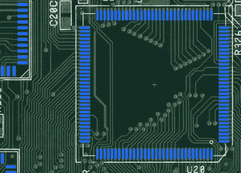

# 从图片中重现 Amiga 1200 PCB

> 原文：<https://hackaday.com/2018/08/28/recreating-the-amiga-1200-pcb-from-pictures/>

过去，我们讨论过使用老式计算机硬件的一个主要缺点，那就是你正在使用老式计算机硬件。事实是，这些机器从未被设计成在制造后 20 年、30 年甚至 40 多年还能运行。组件降级和故障，最终你将需要找到一些方法来保持你最喜爱的经典计算机运行，或者将其降级为货架上的展品。

 如果你像【约翰·赫特尔】一样，你会选择前者。得知许多 Amiga 1200 由于腐蚀的印刷电路板而被送进了天空中伟大的逆向计算博物馆，他决定通过扫描一个无人居住的电路板来重建设计。在此期间，他添加了一些现代的修复和增强功能，[为他的新项目赢得了一个绰号:“Re-Amiga 1200”](http://wordpress.hertell.nu/?p=587)。

为了创建这个更新的 PCB，[John]对原始电路板进行了高质量的扫描，并将其加载到 Sprint Layout 中，这使您可以在现有图像的顶部自由绘制 PCB 设计。虽然他承认该软件对新设计来说并不理想，但他可以准确跟踪原始电路板的扫描结果，这一事实使其成为这项特殊任务的理想选择。

在以数字形式重新创建了基板之后，下一步就是对其进行改进。现在已经停产且很难获得的部件被删除，取而代之的是现代替代品，电源走线变得更粗，增加了额外的风扇连接器，当然，他不能错过添加一些额外状态闪光灯的机会。[John]已经发布了他的 Gerber 文件以及完整的 BOM，如果你想制作自己的 Re-Amiga，他还说如果你不想麻烦地制作 PCB，他也会出售 PCB。

似乎 Amiga 的粉丝从来不会说永远，因为这不是我们第一次看到通过现代化的主板将一个[从灭绝的边缘带回来。无论如何都要让](https://hackaday.com/2018/08/22/an-incredible-atx-amiga-4000-motherboard/)[保持老式计算梦想的活力](https://hackaday.com/2018/06/22/vcf-east-xiii-another-day-in-retro-paradise/)。

感谢安德斯的提示。]

 [https://www.youtube.com/embed/PlxLs2KYNKw?version=3&rel=1&showsearch=0&showinfo=1&iv_load_policy=1&fs=1&hl=en-US&autohide=2&wmode=transparent](https://www.youtube.com/embed/PlxLs2KYNKw?version=3&rel=1&showsearch=0&showinfo=1&iv_load_policy=1&fs=1&hl=en-US&autohide=2&wmode=transparent)

