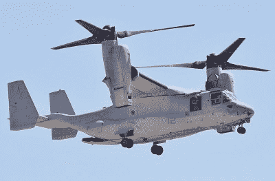

# 最好的新型四轴飞行器是一架双翼飞机

> 原文：<https://hackaday.com/2018/08/27/the-best-new-quad-is-a-bicopter/>

RCExplorer，或[David]，或只是“瑞典人”，[已经提出了一个双旋翼套件](https://rcexplorer.se/product/bicopter-kit-with-f3fc-racing-and-pdb/)。是的，有很多人为四轴飞行器、多翼飞行器、无人驾驶飞机等等制造框架和套件，但[大卫]确实是*怪异*多翼飞行器的领导者。现在，我们有了一个可以想象的最奇怪的多机套件，包括可以工作的固件。

[大卫]是无人驾驶飞机和多机世界的伟大无名英雄之一。[他因火箭刀](https://hackaday.com/2017/08/15/swedish-rocket-knives/)而出名，尽管那真的与无人机没有任何关系，[他为他的前院买了一架飞机](https://rcexplorer.se/blog/2015/12/pimp-my-yard/)(同样，与无人机没什么关系)，[他是第一个用气球将滑翔机升到 100，000 英尺高度的人](https://hackaday.com/2013/03/10/launching-a-glider-from-space/)，他是三架直升机的主要推动者之一，作为一个上级——或者至少是更酷的——空中杂技和摄像工作的平台。为了支持三翼飞机，我们对各种固件做了大量的工作，这要感谢大卫。

像[大卫]早期的三翼机套件一样，这个框架完全由碳纤维板、方管和螺纹支架制成。它看起来也像蝙蝠侠的无人机。固件——双旋翼飞机的真正诀窍——是股票 betaflight，股票固件有一些问题。双翼飞机不喜欢向后飞行，调谐很复杂，而且比四翼飞机在轨道上飞行更难。对于像 bicopter 这样怪异的平台来说，这是可以预料的，但这个工具包确实为固件开发人员破解和改进 bicopter 功能打开了大门。

This is what delivery drones will look like, once the people who think delivery drones are a good idea learn physics.

虽然纯双翼飞机很棒，但随着固件开发人员社区的发展，这种肯定会受欢迎的双翼飞机的发布意味着简单的垂直起降固定翼飞机的大门是敞开的，这与 V-22 鱼鹰没有什么不同。

记住，旧金山科技兄弟，如果你需要一架送货无人机，你需要三样东西:远程，垂直起降能力和有效载荷能力。四轴或六轴直升机不会带你去那里，固定翼会免费给你提供升力。电池不存在摩尔定律，现在如果你想在 30 分钟内将一瓶洗发水运送 20 英里，那么就需要一架看起来像 V-22 鱼鹰的无人机。拜托，送货无人机兄弟，学物理，用倾转旋翼，学把电池*放到*机翼里。这就是你如何找到一家估值将轻松达到 1 亿美元的公司。

 [https://www.youtube.com/embed/Ot3Em2lI9y8?version=3&rel=1&showsearch=0&showinfo=1&iv_load_policy=1&fs=1&hl=en-US&autohide=2&wmode=transparent](https://www.youtube.com/embed/Ot3Em2lI9y8?version=3&rel=1&showsearch=0&showinfo=1&iv_load_policy=1&fs=1&hl=en-US&autohide=2&wmode=transparent)

