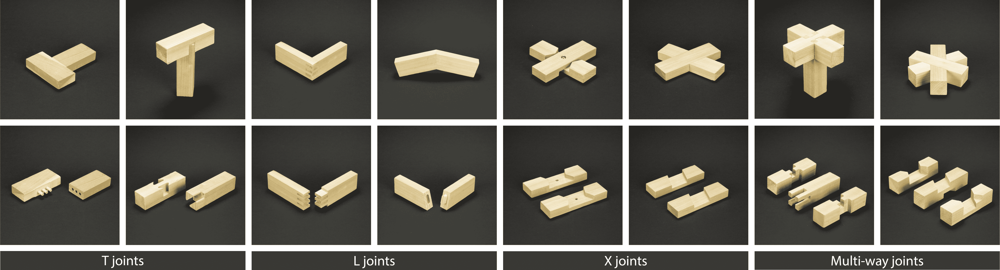

# 一个数控木工工具，做难的部分

> 原文：<https://hackaday.com/2018/08/28/a-cnc-woodworking-tool-that-does-the-hard-parts/>

随着 3d 打印/家庭商店革命的到来，传统的减法 CNC 设备，尤其是刳刨机和铣床变得容易使用。说到这个，想要一个台式磨吗？试试 Bantam Tools (née Othermachine)台式铣床或 Carvey 或 Carbide 3D Nomad。微型多轴通用铣床？也许是袖珍数控。商店的路由器？也许是一个 Shapeoko，或者一个 X-Carve，或者一个商店机器人，或者一个……你明白了。[东润]的[火柴棍装置](https://rutian.github.io/projects/MS/) *是*车间的数控工具，它*可能*被归类为铣床，但它的工作方式不太像更传统的 机床。电脑也控制木工。

Sample joints the MatchSticks can cut

乍看之下，火柴棍可能看起来最像是侧面伸出一个大牧田路由器的袖珍 NC。有一个明显的 X 轴滑板，带有用于固定材料的孔，安装在 Z 轴移动的龙门架上。在顶部友好的大把手下面是连接到自己的 Y 轴托架的路由器。唯一奇怪的是平板电脑被栓在了另一边。想想看，对于这样一台过度建造的机器来说，它的尺寸小得惊人。它有什么用？火柴棍并不是通过一次加工一整块木头来工作的(这正是你所需要的，适应性强的人类木工),它实际上是一种工具，用于完成工作的复杂部分——细木工——并向人类解释如何完成剩下的工作。

完整的火柴棍制作流程如下:

1.  选择要在包含的界面上制作的设计，并指定您想要的参数(大小等)。
2.  火柴杆工具会建议你需要什么原料，然后让你用其他工具把它们切成合适的大小并准备好。
3.  对于任何需要 CNC 工作的零件，该工具将帮助指导用户将原料固定到其床上，然后自己进行切割。
4.  一旦最终组装的一切准备就绪，火柴棍将再次提供友好的指示，告诉你在哪里敲打木槌。

这样，[东润]、[莎拉]、[杰瑞米]、[伊森]和[埃里克]就能够在不牺牲太多实用功能的情况下制造出一台小得多的机床。它几乎像软件一样专注于一个单一的目的。当用户可能已经有了可以更好地切割原料的台锯时，为什么还要重新发明台锯呢？火柴杆是围绕一个目标弯曲的整个机器，使困难的事情变得更容易。

值得注意的是，MatchSticks 是为 ACM 关于计算机系统中人的因素的会议而设计的，所以它还不是一个商业产品(我们热切地等待着！).要更深入地了解这个项目及其目标和经验，请点击这里的[查看完整的研究报告。他们的介绍视频在休息之后被关闭了。](https://dl.acm.org/citation.cfm?doid=3173574.3173723)

谢谢[伊森]的提示！

 [https://www.youtube.com/embed/vAWo4dwNecA?version=3&rel=1&showsearch=0&showinfo=1&iv_load_policy=1&fs=1&hl=en-US&autohide=2&wmode=transparent](https://www.youtube.com/embed/vAWo4dwNecA?version=3&rel=1&showsearch=0&showinfo=1&iv_load_policy=1&fs=1&hl=en-US&autohide=2&wmode=transparent)

